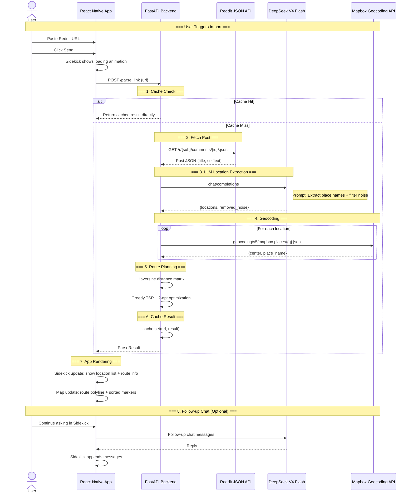

# OurAtlas — Mobile

Now, our MVP is a React Native (Expo) mobile app for collaboratively mapping and exploring places, powered by **Mapbox**.

## Prerequisites

- **Node.js** >= 18
- **Xcode** >= 16 (for iOS development)
- **CocoaPods** >= 1.16 (for iOS dependencies)
- **Expo CLI** (install globally: `npm install -g expo-cli`)

## Getting Started

### 1. Clone & Install Dependencies

```bash
git clone <repo-url>
cd atlas-mobile
npm install
```

### 2. Set Up the Mapbox Access Token

This project uses [Mapbox](https://www.mapbox.com/) for map rendering. A public access token (`pk.`) is required.

1. Create a `.env` file in the project root:
   ```
   MAPBOX_ACCESS_TOKEN=pk.eyJ...your-token-here (will be shared in our WeChat group)
   ```
2. The token will be auto-loaded by Expo and injected into the app at build time.

> The access token is shared in the team group chat. It is already listed in `.env` for existing team members.

### 3. Start the Backend

```bash
cd backend
pip install -r requirements.txt
uvicorn backend.main:app --reload --port 8000
```

### 4. Start the Frontend

```bash
# Development build (required for Mapbox)
npx expo run:ios
```

For subsequent runs after the initial build:
```bash
npx expo start --dev-client
```

> **First launch**: The Dev Client downloads the JS bundle from Metro. This is a development-only step — production builds have the bundle compiled into the app binary.

### 5. Start Developing

Once the app is running, Metro Bundler will watch for file changes and hot-reload automatically.

- **Press `r`** in the terminal to reload the JS bundle
- **Press `d`** to open the developer menu on device/simulator
- **Press `i`** to open in iOS simulator (if using `expo start`)

## Production Build

To build a standalone IPA for App Store distribution:

```bash
npm install -g eas-cli
eas build --platform ios
```

## Project Structure

```
atlas-mobile/
├── app.config.js              # Expo configuration (plugins, env vars)
├── App.tsx                    # Root component with error boundary
├── backend/                   # FastAPI parse/fetch backend
│   ├── main.py                # FastAPI app entry point (POST /parse_link)
│   ├── requirements.txt       # Python dependencies
│   └── services/
│       ├── cache.py           # In-memory TTL cache (1 hour)
│       ├── reddit_fetcher.py  # Reddit post fetcher (JSON API + HTML fallback)
│       ├── llm_client.py      # DeepSeek V4 Flash for location extraction
│       ├── geocoder.py        # Mapbox Geocoding API client
│       └── route_planner.py   # TSP route planner (Haversine + Greedy + 2-opt)
├── src/
│   ├── features/
│   │   ├── map/
│   │   │   ├── MapboxMap.tsx       # Mapbox map component (with route polyline support)
│   │   │   └── MAP.md              # Mapbox integration & design guide
│   │   ├── home/
│   │   │   ├── HomeScreen.tsx      # Main screen with map + search + sidekick
│   │   │   ├── SearchBar.tsx       # Search bar with Reddit clipboard detection
│   │   │   └── Sidekick.tsx        # Bottom-sheet panel with chat interface
│   │   ├── fetchParse/
│   │   │   └── FETCHPARSE.md       # Reddit parse/fetch feature documentation
│   │   ├── collections/
│   │   ├── import/
│   │   └── place/
│   ├── data/
│   │   └── mockPlaces.ts           # Placeholder place data
│   ├── services/
│   │   ├── apiService.ts           # Backend API client (parseLink)
│   │   └── ...
│   ├── types/
│   │   ├── route.ts                # Types: ParseResult, RouteResult, ChatMessage
│   │   └── ...
│   └── utils/
│       └── constants.ts            # API URL, map defaults, route styling
├── .env                       # Local environment variables (gitignored)
├── assets/
├── docs/
├── parseAndFecthPlanning/     # Planning docs for the parse/fetch feature
└── plans/                     # Implementation plans
```

## Troubleshooting

### `pod install` fails

If CocoaPods fails during `npx expo run:ios`, try:

```bash
cd ios && pod install --repo-update
```

### Build fails with stale cache errors

If the project directory was moved, clean cached build artifacts:

```bash
rm -rf node_modules/expo-modules-jsi/apple/.DerivedData
rm -rf ~/Library/Developer/Xcode/DerivedData
npx expo run:ios
```

### Map shows a blank or 64×64 area

This indicates the Mapbox `MapView` couldn't measure its container. The component uses `useWindowDimensions` to set explicit dimensions — ensure the parent view has proper layout constraints.

## Usage

### Reddit Link → Route Planning

1. Copy a Reddit post URL (e.g., from r/AskSF, r/travel, or any subreddit discussing places)
2. Tap the search bar at the bottom of the map — the app detects the Reddit link in your clipboard
3. Tap "Paste" when prompted
4. Press the send button (→) on the right side of the search bar
5. Wait 3-8 seconds while the backend:
   - Fetches the Reddit post (title + body + top comments)
   - Extracts location names via DeepSeek V4 Flash LLM
   - Filters out noise addresses (e.g., far-away locations)
   - Geocodes each location to coordinates via Mapbox
   - Plans the shortest route using TSP approximation
6. The Sidekick panel auto-expands from the bottom (~40% screen) showing results
7. The map renders the route polyline + markers for each location
8. Pull the Sidekick up for full-screen details

### Example

**Input URL:** `https://www.reddit.com/r/AskSF/comments/1127auu/what_are_the_best_places_to_visit_in_san_francisco/`

**Expected output:**
- Extracted locations: Golden Gate Park, De Young Museum, Japanese Tea Garden, Alcatraz Island, etc.
- Route: shortest path connecting all locations
- Total distance shown in the Sidekick

> **Note:** The backend must be running on port 8000 for the app to function. See "Getting Started" above.

## Architecture

### High-Level Architecture

```
┌─────────────────────────────────────────────┐
│           React Native App (Expo)           │
│                                             │
│  ┌───────────────────────────────────────┐  │
│  │  HomeScreen                           │  │
│  │                                       │  │
│  │  ┌─────────────────────────────────┐  │  │
│  │  │ SearchBar                       │  │  │
│  │  │ [History] [Input/Paste] [Send]  │  │  │
│  │  └─────────────────────────────────┘  │  │
│  │                                       │  │
│  │  ┌─────────────────────────────────┐  │  │
│  │  │ MapboxMap + RouteLayer          │  │  │
│  │  │  (Map base + Route polyline     │  │  │
│  │  │   + Annotated markers)          │  │  │
│  │  └─────────────────────────────────┘  │  │
│  │                                       │  │
│  │  ┌─────────────────────────────────┐  │  │
│  │  │ Sidekick (BottomSheet)          │  │  │
│  │  │  snapPoints: [40%, 100%]        │  │  │
│  │  │  [Loading spinner / Result      │  │  │
│  │  │   display / Chat]               │  │  │
│  │  └─────────────────────────────────┘  │  │
│  └───────────────────────────────────────┘  │
│                       │                      │
│              HTTP POST /parse_link           │
│                       │                      │
└───────────────────────┼──────────────────────┘
                        │
                        ▼
┌─────────────────────────────────────────────┐
│              FastAPI Backend                 │
│                                             │
│  POST /parse_link                           │
│  ┌───────────────────────────────────────┐  │
│  │ 1. cache.py                           │  │
│  │    → In-memory dict cache             │  │
│  │      (key = URL MD5)                  │  │
│  │                                       │  │
│  │ 2. reddit_fetcher.py                  │  │
│  │    → Reddit official JSON API         │  │
│  │      (no auth required)               │  │
│  │    → URL: /r/{sub}/comments/{id}/.json│  │
│  │                                       │  │
│  │ 3. llm_client.py                      │  │
│  │    → DeepSeek V4 Flash API            │  │
│  │    → Prompt: Location extraction +    │  │
│  │      noise filtering                  │  │
│  │                                       │  │
│  │ 4. geocoder.py                        │  │
│  │    → Mapbox Geocoding API             │  │
│  │    → Place name → {lat, lng, address} │  │
│  │                                       │  │
│  │ 5. route_planner.py                   │  │
│  │    → Haversine distance formula       │  │
│  │    → Greedy nearest-neighbor          │  │
│  │      + 2-opt optimization             │  │
│  └───────────────────────────────────────┘  │
└─────────────────────────────────────────────┘
```

### Data Flow



### Component Hierarchy

```mermaid
graph TD
    App[App.tsx] --> HOC[GestureHandlerRootView]
    HOC --> SB[StatusBar]
    HOC --> Home[HomeScreen]
    
    subgraph HomeScreen
        SB_COMP[SearchBar]
        Map[MapboxMap]
        SK[Sidekick - BottomSheet]
        
        SB_COMP --> |onSubmit: url| HomeState[HomeScreen State]
        HomeState --> |parseResult| Map
        HomeState --> |parseResult| SK
        HomeState --> |loading| SK
    end
    
    subgraph MapboxMap
        MV[MapboxGL.MapView]
        CAM[MapboxGL.Camera]
        MK[MarkerView[] - Place Markers]
        RL[ShapeSource + LineLayer - Route Polyline]
    end
    
    subgraph Sidekick
        H[Handle / Drag Indicator]
        CL[ChatList - FlatList]
        CI[ChatInput - TextInput]
    end
    
    subgraph SearchBar
        HB[History Button - Left]
        TI[TextInput - Center / Clipboard Detection]
        SendB[Send Button - Right]
    end
    
    Map --> MK
    Map --> RL
    Map --> CAM
```

## Tech Stack

| Component | Library |
|-----------|---------|
| Framework | React Native 0.85 + Expo SDK 56 |
| Map SDK | `@rnmapbox/maps@10.3.1` (Mapbox v11) |
| Navigation | `@react-navigation/native` v7 |
| Gestures | `react-native-gesture-handler` |
| Animations | `react-native-reanimated` |
| Bottom Sheet | `@gorhom/bottom-sheet` |
