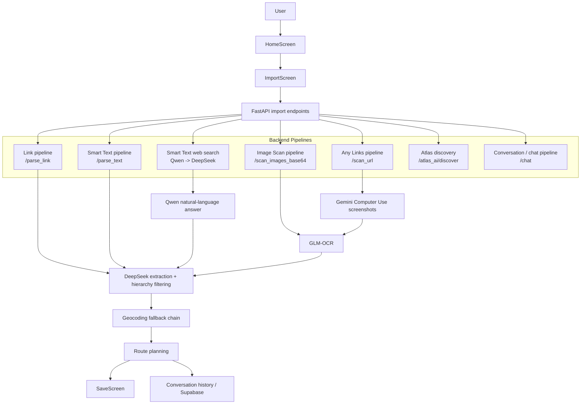
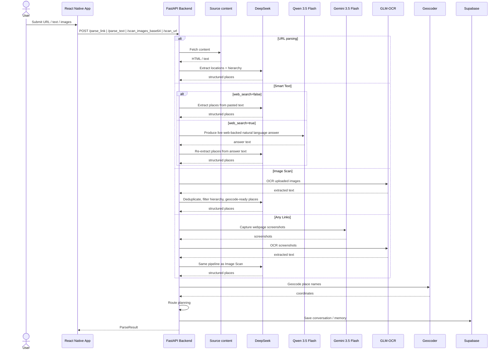

# OurAtlas - AI-Powered Travel Location Extractor

OurAtlas extracts real-world places from Reddit posts, pasted text, web pages, screenshots, and images, then geocodes them and visualizes the result on a map.

Built with **React Native (Expo SDK 56)** + **FastAPI** + **DeepSeek** + **Qwen 3.5 Flash** + **Gemini 3.5 Flash** + **GLM-OCR** + **Mapbox**.

> **Expo SDK v56**: This project targets Expo SDK 56. Consult the [official Expo v56 docs](https://docs.expo.dev/versions/v56.0.0/) before making build or config changes.

---

## Overview

The app centers on a single home screen with a map, a bottom-sheet side panel, and an import flow that can ingest several source types:

- URL parsing for Reddit and general webpages
- Smart text parsing for pasted itineraries, notes, and prompts
- Smart text with live web search
- Image Scan for uploaded screenshots or images
- Any Links for vision-based webpage capture followed by OCR

Each import mode eventually produces the same output shape: a title, a list of geocoded locations, a route, and metadata about removed noise or hierarchy.

---

## Multi-Agent Workflow


```mermaid
graph TD
    User[User] --> Home[HomeScreen]
    Home --> Import[ImportScreen]
    Import --> Backend[FastAPI import endpoints]

    subgraph Backend Pipelines
        Link[Link pipeline<br/>/parse_link]
        Text[Smart Text pipeline<br/>/parse_text]
        WebText[Smart Text web search<br/>Qwen -> DeepSeek]
        Image[Image Scan pipeline<br/>/scan_images_base64]
        Any[Any Links pipeline<br/>/scan_url]
        Discover[Atlas discovery<br/>/atlas_ai/discover]
        Chat[Conversation / chat pipeline<br/>/chat]
    end

    Backend --> Link
    Backend --> Text
    Backend --> WebText
    Backend --> Image
    Backend --> Any
    Backend --> Discover
    Backend --> Chat

    Link --> Extract[DeepSeek extraction + hierarchy filtering]
    Text --> Extract
    WebText --> Qwen[Qwen natural-language answer]
    Qwen --> Extract
    Image --> OCR[GLM-OCR]
    OCR --> Extract
    Any --> Gemini[Gemini Computer Use screenshots]
    Gemini --> OCR
    Extract --> Geo[Geocoding fallback chain]
    Geo --> Route[Route planning]
    Route --> Save[SaveScreen]
    Route --> History[Conversation history / Supabase]
```

The current backend uses several specialized paths rather than one monolithic parser:

- `parse_link` handles normal URL parsing and route generation.
- `parse_text` handles pasted text and optionally enables live web search.
- `scan_images_base64` and `scan_images` turn images into OCR text and then into places.
- `scan_url` uses Gemini Computer Use to capture a webpage as screenshots, OCRs those screenshots with GLM-OCR, and then reuses the Image Scan parsing path.
- `atlas_ai/discover` researches exact addresses and geocodes them directly.

---

## Architecture Overview

```text
┌────────────────────────────────────────────────────────────┐
│ React Native App (Expo)                                     │
│                                                            │
│  HomeScreen                                                │
│   ├─ MapboxMap                                             │
│   ├─ Search / clipboard entry                              │
│   ├─ Sidekick bottom sheet                                 │
│   └─ Import flow                                            │
│      ├─ ImportScreen                                        │
│      ├─ AnalyzingScreen                                     │
│      └─ SaveScreen                                          │
│                                                            │
│  Import modes                                               │
│   ├─ Smart Text                                             │
│   ├─ Image Scan                                             │
│   ├─ Reddit Links                                           │
│   └─ Any Links                                              │
└──────────────────────────────┬─────────────────────────────┘
                               │ HTTP
┌──────────────────────────────┴─────────────────────────────┐
│ FastAPI Backend                                             │
│                                                            │
│  Import services                                            │
│   ├─ agent_orchestrator.py                                 │
│   ├─ smart_text_service.py                                 │
│   ├─ image_scanner.py                                      │
│   ├─ gemini_computer_use.py                                │
│   ├─ glm_ocr.py                                            │
│   ├─ web_search_router.py                                  │
│   ├─ content_classifier.py                                 │
│   └─ atlas_ai_discovery.py                                 │
│                                                            │
│  Core services                                              │
│   ├─ extraction_pipeline.py                                │
│   ├─ geocoder.py                                           │
│   ├─ route_planner.py                                      │
│   ├─ conversation_manager.py                               │
│   ├─ supabase_service.py                                   │
│   ├─ cache.py                                              │
│   └─ llm_client.py                                         │
└────────────────────────────────────────────────────────────┘
```

The app keeps the import flow visually simple while the backend chooses the best pipeline based on input type and mode.

---

## Data Flow


```mermaid
sequenceDiagram
    actor User
    participant App as React Native App
    participant Backend as FastAPI Backend
    participant Source as Source content
    participant DeepSeek as DeepSeek
    participant Qwen as Qwen 3.5 Flash
    participant Gemini as Gemini 3.5 Flash
    participant OCR as GLM-OCR
    participant Geo as Geocoder
    participant DB as Supabase

    User->>App: Submit URL / text / images
    App->>Backend: POST /parse_link | /parse_text | /scan_images_base64 | /scan_url

    alt URL parsing
        Backend->>Source: Fetch content
        Source-->>Backend: HTML / text
        Backend->>DeepSeek: Extract locations + hierarchy
        DeepSeek-->>Backend: structured places
    else Smart Text
        alt web_search=false
            Backend->>DeepSeek: Extract places from pasted text
            DeepSeek-->>Backend: structured places
        else web_search=true
            Backend->>Qwen: Produce live web-backed natural language answer
            Qwen-->>Backend: answer text
            Backend->>DeepSeek: Re-extract places from answer text
            DeepSeek-->>Backend: structured places
        end
    else Image Scan
        Backend->>OCR: OCR uploaded images
        OCR-->>Backend: extracted text
        Backend->>DeepSeek: Deduplicate, filter hierarchy, geocode-ready places
        DeepSeek-->>Backend: structured places
    else Any Links
        Backend->>Gemini: Capture webpage screenshots
        Gemini-->>Backend: screenshots
        Backend->>OCR: OCR screenshots
        OCR-->>Backend: extracted text
        Backend->>DeepSeek: Same pipeline as Image Scan
        DeepSeek-->>Backend: structured places
    end

    Backend->>Geo: Geocode place names
    Geo-->>Backend: coordinates
    Backend->>Backend: Route planning
    Backend->>DB: Save conversation / memory
    Backend-->>App: ParseResult
```

The important current behavior is:

- Smart Text and Smart Text web search now share a consistent cleanup path.
- Any Links is intentionally vision-first and runs through screenshots and OCR before place extraction.
- Image Scan and Any Links converge on the same OCR-driven parsing logic before geocoding.
- Geocoding happens after dedupe and hierarchy cleanup, not before.

---

## Multi-Agent AI Pipeline

| Component | Responsibility | Implementation |
|---|---|---|
| Supervisor | Orchestrates imports, chat, session state, and persistence | `agent_orchestrator.py`, `conversation_manager.py` |
| URL Scraper | Reads webpage / Reddit source content | `web_scraper.py`, Reddit JSON fetchers |
| Smart Text | Parses freeform text into places | `smart_text_service.py` + DeepSeek |
| Smart Text Web | Generates live-web natural language, then re-parses it into structured places | Qwen + DeepSeek |
| Image Scan | OCRs images, classifies text, and routes to extraction / discovery | `image_scanner.py` + `glm_ocr.py` + `content_classifier.py` |
| Any Links | Captures screenshots from webpages with Gemini Computer Use, then OCRs them | `gemini_computer_use.py` + `glm_ocr.py` |
| Extraction | Produces place candidates and removes noise / hierarchy residues | `extraction_pipeline.py` |
| Entity Linking | Disambiguates place names and adds geographic context when needed | `agent_orchestrator.py` |
| Geocoding | Converts place names to coordinates with fallback coverage | `geocoder.py` |
| Route Planning | Orders locations into a visitable route | `route_planner.py` |
| Memory | Saves long-term preferences and interests | `conversation_manager.py` + Supabase |
| Chat | Handles follow-up map refinement | `agent_orchestrator.py` chat loop |

### Smart Text

- DeepSeek returns structured JSON for places.
- The backend then applies raw dedupe, hierarchy filtering, and geocoding.
- `use_web_search=false` keeps the flow fully text-based.

### Smart Text with Web Search

- Qwen first produces a natural-language answer using live web evidence.
- That answer is then treated as normal smart text.
- DeepSeek performs the same extraction, dedupe, hierarchy cleanup, and geocoding as the non-web path.

### Image Scan

- Uploaded images are OCRed with GLM-OCR.
- OCR text is classified so address-heavy text can be routed correctly.
- The parsing path then produces structured places, geocodes them, and renders the Save screen.

### Any Links

- Gemini Computer Use opens the webpage and collects screenshots with a capped top-to-bottom pass.
- Screenshots are saved locally for debugging and then OCRed with GLM-OCR.
- The OCR text then goes through the same place parsing path as Image Scan.

---

## Import Pipelines

### 1. URL parse

`POST /parse_link` handles normal webpage parsing:

- Cache lookup
- Source fetching
- LLM extraction
- Entity linking
- Geocoding
- Route planning
- Conversation and memory persistence

### 2. Smart Text

`POST /parse_text` supports pasted travel notes or prompts.

- `web_search=false`: DeepSeek parses the text directly.
- `web_search=true`: Qwen answers first, then DeepSeek re-parses the answer.

### 3. Image Scan

`POST /scan_images_base64` and `POST /scan_images` support image-based import.

- OCR with GLM-OCR
- Route based on content type
- Structured place extraction
- Geocoding and route planning

### 4. Any Links

`POST /scan_url` supports vision-based webpage parsing.

- Gemini Computer Use captures screenshots
- GLM-OCR reads the screenshots
- The same Image Scan extraction path is reused downstream

### 5. Atlas Discovery

`POST /atlas_ai/discover` is for queries that need direct place research and exact addresses.

---

## Map And UI

- Home screen: map + sidekick + search bar
- Import screen: Smart Text, Image Scan, Reddit Links, Any Links
- Analyzing screen: shared waiting state for all import flows
- Save screen: review, deselect, save, or add to plan

The current import UX keeps the user in the waiting state immediately after submission, especially for Image Scan and Any Links, so the app does not fall back to the home screen while work is in flight.

---

## API Endpoints

| Method | Endpoint | Description |
|---|---|---|
| POST | `/parse_link` | Parse a URL into locations and route data |
| POST | `/parse_text` | Parse pasted text, with optional `web_search` |
| POST | `/scan_images_base64` | Parse base64 image payloads |
| POST | `/scan_images` | Parse uploaded image files |
| POST | `/scan_url` | Capture webpage screenshots, OCR them, and parse them |
| GET | `/parse_progress/{request_id}` | Read live progress events |
| POST | `/atlas_ai/discover` | Research exact addresses and geocode them |
| POST | `/chat` | Continue a map/session conversation |
| GET | `/sessions` | List active sessions |
| POST | `/sessions` | Create a session |
| POST | `/sessions/{id}/save` | Persist session to Supabase |
| GET | `/conversations` | List saved conversations |
| GET | `/conversations/{id}` | Load one conversation |
| DELETE | `/conversations/{id}` | Delete a conversation |
| GET | `/memories` | List long-term memories |
| POST | `/memories` | Add a memory item |
| GET | `/health` | Health check |

---

## Project Structure

```text
atlas-mobile/
├── App.tsx
├── backend/
│   ├── main.py
│   └── services/
│       ├── agent_orchestrator.py
│       ├── atlas_ai_discovery.py
│       ├── cache.py
│       ├── content_classifier.py
│       ├── conversation_manager.py
│       ├── extraction_pipeline.py
│       ├── geocoder.py
│       ├── gemini_computer_use.py
│       ├── glm_ocr.py
│       ├── image_scanner.py
│       ├── llm_client.py
│       ├── progress.py
│       ├── route_planner.py
│       ├── smart_text_service.py
│       ├── supabase_service.py
│       ├── web_search_router.py
│       └── ...
├── src/
│   ├── features/
│   │   ├── home/
│   │   ├── import-places/
│   │   ├── map/
│   │   ├── my-places/
│   │   ├── my-plan/
│   │   └── place-detail/
│   ├── services/
│   │   ├── api/
│   │   ├── import/
│   │   └── place/
│   ├── types/
│   └── utils/
├── docs/
└── .env
```

---

## Tech Stack

| Layer | Stack |
|---|---|
| Mobile | React Native + Expo SDK 56 |
| Backend | FastAPI (Python) |
| Primary LLM | DeepSeek |
| Web search answer model | Qwen 3.5 Flash |
| Vision browser model | Gemini 3.5 Flash |
| OCR | GLM-OCR |
| Maps | Mapbox |
| Persistence | Supabase |
| Geocoding | Google Maps / Geoapify / LocationIQ / Nominatim / Photon |

---

## Getting Started

### Prerequisites

- Python 3.10+
- Node.js 18+
- Xcode 16+ for iOS development
- CocoaPods
- API keys for the services configured in `.env`

### Installation

```bash
cd backend
pip install -r requirements.txt
cd ..
npm install
cp .env.example .env
```

### Start the app

Backend:

```bash
uvicorn backend.main:app --reload --reload-dir backend --port 8000
```

Frontend:

```bash
npx expo run:ios
```

For subsequent runs:

```bash
npx expo start --dev-client
```

### Typical usage

1. Paste a URL, image set, or travel note into Import Places
2. Choose Smart Text, Image Scan, Reddit Links, or Any Links
3. Wait for the analyzing screen
4. Review extracted places in Save Screen
5. Save selected places or add them to a plan

---

## Troubleshooting

### Backend not responding

```bash
curl http://localhost:8000/health
```

### Mapbox rendering issues

If the map appears blank or clipped, ensure the parent view has dimensions and the native dependencies were rebuilt after config changes.

### OCR or vision parsing fails

Check that the relevant environment variables are set:

- `GLM_API_KEY`
- `GEMINI_API_KEY` or `GOOGLE_API_KEY`
- `GEMINI_COMPUTER_USE_MODEL`
- `GEMINI_COMPUTER_USE_IMAGE_SIZE`

---

## License

MIT
