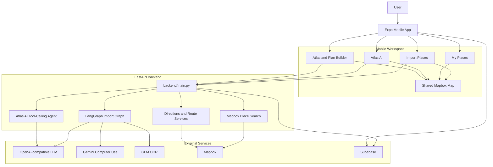
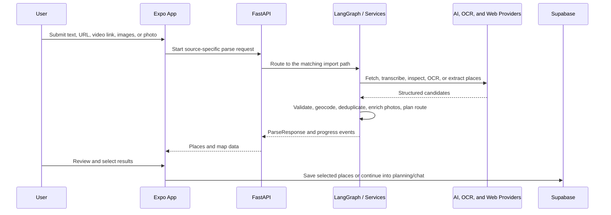
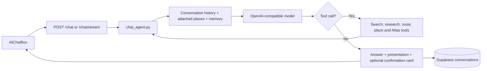

# OurAtlas - AI-Powered Place Discovery and Trip Planning

OurAtlas is a mobile map workspace for turning travel content into places you can save, organize, discuss, and revisit. Import a link, pasted notes, a social video, screenshots, or a photo; review the extracted places on a map; then save them to My Places, build an Atlas itinerary, or continue with Atlas AI.

Built with **React Native (Expo SDK 56)**, **FastAPI**, **Supabase**, **LangChain / LangGraph**, **OpenAI-compatible models**, **Gemini**, **GLM OCR**, and **Mapbox**.

> **Expo SDK 56**: This project targets Expo SDK 56. Consult the [official Expo SDK 56 documentation](https://docs.expo.dev/versions/v56.0.0/) before changing native configuration, Expo packages, or build tooling.

---

## Product Overview

OurAtlas combines place import, personal map storage, trip building, and conversational planning in one shared map experience.

| Area | What it does |
|------|---------------|
| **Import Places** | Extracts places from pasted text, URLs, Reddit, YouTube, TikTok, Instagram Reels, Facebook Reels, screenshots, and photos. |
| **My Places** | Stores saved places with deduplication, notes, photos, categories, map markers, and offline-first synchronization. |
| **Atlas AI** | Supports multi-turn place research, map results, place-save confirmations, Home / Office / School management, and persisted conversation history. |
| **Atlases** | Groups saved places into named, map-first itineraries with routes, ordering, sharing, and editing. |
| **Planning** | Lets users create plans, search for places, add recommendations, and build itineraries on the shared map. |
| **Map Workspace** | Keeps one Mapbox map alive beneath panels and overlays, with saved markers, Atlas pins, routes, selection, and device location. |

---

## Architecture Overview

| Layer | Technology | Purpose |
|-------|------------|---------|
| **Mobile App** | Expo SDK 56, React Native 0.85 | Native iOS and Android application with a shared map workspace. |
| **Backend API** | FastAPI, Uvicorn | Import, chat, search, route, image, progress, and persistence endpoints. |
| **Agent Runtime** | LangChain 1.0, LangGraph 1.0 | Deterministic import graph plus a tool-calling Atlas AI conversation agent. |
| **Primary LLM Runtime** | OpenAI-compatible Mango configuration | Chat, structured extraction, translation, and place-card generation through `OPENAI_*_MANGO` settings. |
| **Vision and OCR** | Gemini Computer Use, GLM OCR, OpenAI vision | Webpage capture, screenshot text extraction, and photo place recognition. |
| **Search and Maps** | Mapbox Search Box, Mapbox GL | Place suggestions, place retrieval, directions, routes, markers, and map camera control. |
| **Persistence** | Supabase PostgreSQL, AsyncStorage | User-scoped remote data with cached, offline-first mobile reads and queued writes. |
| **Observability** | LangSmith, backend logging | Optional LLM traces and backend request/performance logs. |


```mermaid
graph TD
    U[User] --> M[Expo Mobile App]

    subgraph "Mobile Workspace"
        IMP[Import Places]
        MP[My Places]
        AI[Atlas AI]
        AT[Atlas and Plan Builder]
        MAP[Shared Mapbox Map]
    end

    M --> IMP
    M --> MP
    M --> AI
    M --> AT
    IMP --> MAP
    MP --> MAP
    AI --> MAP
    AT --> MAP

    subgraph "FastAPI Backend"
        API[backend/main.py]
        GRAPH[LangGraph Import Graph]
        CHAT[Atlas AI Tool-Calling Agent]
        SEARCH[Mapbox Place Search]
        ROUTE[Directions and Route Services]
    end

    IMP --> API
    AI --> API
    AT --> API
    API --> GRAPH
    API --> CHAT
    API --> SEARCH
    API --> ROUTE

    subgraph "External Services"
        LLM[OpenAI-compatible LLM]
        GEM[Gemini Computer Use]
        OCR[GLM OCR]
        MB[Mapbox]
        DB[Supabase]
    end

    GRAPH --> LLM
    GRAPH --> GEM
    GRAPH --> OCR
    CHAT --> LLM
    SEARCH --> MB
    ROUTE --> MB
    API --> DB
    M --> DB
```

---

## Core Workflows

### 1. Import Places

The import flow is a review-first pipeline. It does not automatically save results: users select the places they want on the Save screen, then explicitly save them to My Places or use them to start planning.


```mermaid
sequenceDiagram
    participant U as User
    participant A as Expo App
    participant API as FastAPI
    participant G as LangGraph / Services
    participant X as AI, OCR, and Web Providers
    participant DB as Supabase

    U->>A: Submit text, URL, video link, images, or photo
    A->>API: Start source-specific parse request
    API->>G: Route to the matching import path
    G->>X: Fetch, transcribe, inspect, OCR, or extract places
    X-->>G: Structured candidates
    G->>G: Validate, geocode, deduplicate, enrich photos, plan route
    G-->>API: ParseResponse and progress events
    API-->>A: Places and map data
    U->>A: Review and select results
    A->>DB: Save selected places or continue into planning/chat
```

Supported source types:

| Source | Endpoint | Main path |
|--------|----------|-----------|
| **Smart text** | `POST /parse_text` | Extracts place references from notes, lists, itineraries, and natural-language prompts. |
| **Generic and Reddit links** | `POST /parse_link` | Fetches page content or Reddit post data, extracts places, then geocodes and enriches results. |
| **Any link / visual page scan** | `POST /scan_url` or `POST /scrape_url` | Uses browser capture and OCR for pages whose text is not directly available. |
| **YouTube** | `POST /parse_youtube` | Uses video metadata, transcript, captions, and contextual extraction. |
| **TikTok** | `POST /parse_tiktok` | Uses video metadata and available captions/transcript context. |
| **Instagram Reels** | `POST /parse_instagram_reel` | Uses Reel metadata and available transcript/caption context. |
| **Facebook Reels** | `POST /parse_facebook_reel` | Uses public Reel metadata and captions when available. |
| **Screenshots / text images** | `POST /scan_images_base64` or `POST /scan_images` | Reads text with GLM OCR and sends it through the same place extraction path. |
| **Single-photo place recognition** | `POST /find_image_places` | Identifies a landmark or place from a photo and returns a map-ready candidate. |

The mobile flow is implemented in [`src/features/import-places/`](src/features/import-places/):

```text
ImportScreen -> AnalyzingScreen -> SaveScreen
       |                |               |
       |                |               +-> Save to My Places
       |                |               +-> Add to a plan or Atlas
       |                |               +-> Start an Atlas AI conversation
       |                +-> Live progress polling and cancellation
       +-> Text, links, images, and source-specific import modes
```

### 2. My Places and Special Places

My Places is the durable, user-owned place collection. Saved places are cached locally, synchronized to Supabase, deduplicated by provider identity where available, and rendered as persistent map markers.

- Place search uses Mapbox Search Box suggestions followed by retrieval of a saveable place record.
- Imports, search results, chat recommendations, and manual additions all use the same place persistence layer.
- Offline writes are queued and flushed when the app becomes active again.
- Each user may designate one **Home**, **Office**, and **School** place. These are explicitly confirmed in Atlas AI before the client writes them.
- Places can carry notes, categories, source information, provider identifiers, photos, and map-derived fallback thumbnails.

Key files: [`src/services/place/placeService.ts`](src/services/place/placeService.ts), [`src/services/local/syncQueue.ts`](src/services/local/syncQueue.ts), [`src/features/my-places/`](src/features/my-places/).

### 3. Atlas AI and Conversation History

Atlas AI is a full-screen, session-based assistant. It can discuss the current import or selected places, research relevant locations, propose additions, open a map presentation, create or update special places, and preserve a conversation for later.


```mermaid
graph LR
    UI[AIChatBox] --> API[POST /chat or /chat/stream]
    API --> AGENT[chat_agent.py]
    AGENT --> CONTEXT[Conversation history + attached places + memory]
    CONTEXT --> MODEL[OpenAI-compatible model]
    MODEL --> TOOLS{Tool call?}
    TOOLS -->|Yes| TOOLSET[Search, research, route, place and Atlas tools]
    TOOLSET --> AGENT
    TOOLS -->|No| RESPONSE[Answer + presentation + optional confirmation card]
    RESPONSE --> UI
    RESPONSE --> DB[(Supabase conversations)]
```

The client owns any irreversible change. For example, the agent can propose saving Home, Office, or School, but the mobile app performs the actual saved-place write only after the user confirms the result card.

Conversation data includes the session, messages, attached locations, titles, summaries, and optional long-term memory. The mobile history screen can restore a persisted conversation and its associated map context.

Key files: [`backend/langgraph/chat_agent.py`](backend/langgraph/chat_agent.py), [`backend/services/conversation_manager.py`](backend/services/conversation_manager.py), [`src/features/atlas-ai/`](src/features/atlas-ai/).

### 4. Atlases and Plans

An **Atlas** is a named collection of saved places presented as a map itinerary. Users can create an Atlas, add or remove places, reorder stops, show routes, share an image, and continue researching inside Atlas AI.

The **My Plan** area supports plan creation and plan details alongside the Atlas builder. Both experiences use the same shared map and the same place-search and saved-place services.

Key files: [`src/features/my-places/atlas/`](src/features/my-places/atlas/), [`src/features/my-plan/`](src/features/my-plan/), [`src/services/atlas/`](src/services/atlas/), [`src/services/plan/`](src/services/plan/).

### 5. Shared Map Workspace

`HomeScreen` owns one full-screen `MapboxMap` beneath the app's bottom panels and full-screen overlays. The map can switch among saved-place markers, Atlas itinerary markers, chat presentations, route lines, search results, and the device location without remounting the main map surface.

The camera accounts for the active panel height so selected places remain visible above the sheet. Marker selection, route display, map popups, and Atlas-specific controls are coordinated through `HomeContext` and `AtlasMapState`.

Key files: [`src/features/home/HomeScreen.tsx`](src/features/home/HomeScreen.tsx), [`src/features/home/HomeContext.tsx`](src/features/home/HomeContext.tsx), [`src/features/map/MapboxMap.tsx`](src/features/map/MapboxMap.tsx).

---

## AI and Service Architecture

### Import and Agent Runtime

`backend/langgraph/atlas_graph.py` provides the import graph used by the FastAPI compatibility layer. Source-specific services fetch or inspect source content, while shared extraction, geocoding, route, image, and progress services normalize the final response.

`backend/langgraph/chat_agent.py` is the conversational runtime. It uses tool calling for bounded operations and returns structured presentation data to the mobile app rather than relying on hidden text markers.

### LLM Configuration

The primary OpenAI-compatible runtime reads these backend-only environment variables:

```text
OPENAI_API_KEY_MANGO=
OPENAI_MODEL_MANGO=
OPENAI_BASE_URL_MANGO=
```

The repository also supports optional provider-specific configuration for vision, OCR, web capture, search, transcription, and geocoding. Do not expose secret backend keys with an `EXPO_PUBLIC_` prefix.

### Geocoding and Place Enrichment

Geocoding uses multiple services where configured, with validation and fallback behavior. Mapbox Search Box handles interactive place search and retrieval; geocoded results can be enriched with place images before the response reaches the app.

### Progress, Caching, and Observability

- Long-running imports publish progress events that the mobile app polls through `/parse_progress/{request_id}`.
- Active import requests can be cancelled through `/parse_progress/{request_id}/cancel`.
- The backend keeps bounded caches for source parsing and related data.
- LangSmith tracing is optional and controlled through environment configuration.
- The backend writes standard logs to the terminal and `atlas-backend.log`.

---

## API Endpoints

### Import and Discovery

| Method | Endpoint | Description |
|--------|----------|-------------|
| `POST` | `/parse_text` | Extract places from pasted text. |
| `POST` | `/parse_link` | Parse a supported URL, including Reddit and general web content. |
| `POST` | `/scrape_url` | Extract text from a web page for downstream parsing. |
| `POST` | `/scan_url` | Visually inspect a web page, OCR it, and parse places. |
| `POST` | `/parse_youtube` | Parse a YouTube video into places. |
| `POST` | `/parse_tiktok` | Parse a TikTok video into places. |
| `POST` | `/parse_instagram_reel` | Parse an Instagram Reel into places. |
| `POST` | `/parse_facebook_reel` | Parse a Facebook Reel into places. |
| `POST` | `/scan_images_base64` | Parse base64-encoded screenshots or text images. |
| `POST` | `/scan_images` | Parse uploaded screenshot or text image files. |
| `POST` | `/find_image_places` | Identify a place from a photo. |
| `POST` | `/atlas_ai/discover` | Research and geocode places for Atlas planning. |
| `POST` | `/link_preview` | Return preview metadata for a submitted link. |

### Chat, Sessions, and Memory

| Method | Endpoint | Description |
|--------|----------|-------------|
| `POST` | `/chat` | Run one Atlas AI turn. |
| `POST` | `/chat/stream` | Stream one Atlas AI turn. |
| `POST` | `/chat/actions/confirm` | Confirm or reject a pending chat action. |
| `GET` | `/sessions` | List active backend sessions. |
| `POST` | `/sessions` | Create a chat session. |
| `POST` | `/sessions/{session_id}/save` | Persist a session. |
| `POST` | `/sessions/{session_id}/import-welcome` | Generate or save an import welcome context. |
| `POST` | `/sessions/{session_id}/atlas-welcome` | Generate or save an Atlas welcome context. |
| `GET` | `/conversations` | List persisted conversations. |
| `GET` | `/conversations/{conversation_id}` | Load one conversation with its locations. |
| `DELETE` | `/conversations/{conversation_id}` | Delete a persisted conversation. |
| `GET` | `/memories` | List persisted memory records. |
| `POST` | `/memories` | Create a memory record. |

### Maps, Routes, and Supporting Services

| Method | Endpoint | Description |
|--------|----------|-------------|
| `GET` | `/places/search` | Return Mapbox Search Box suggestions. |
| `GET` | `/places/retrieve/{mapbox_id}` | Resolve a suggestion into saveable place details. |
| `POST` | `/atlas/route` | Request a route for supplied coordinates. |
| `POST` | `/speech/transcribe` | Transcribe supported voice input. |
| `GET` | `/region_photo` | Retrieve an image for a region. |
| `GET` | `/place_photo` | Retrieve an image for a place. |
| `GET` | `/parse_progress/{request_id}` | Read import progress events. |
| `POST` | `/parse_progress/{request_id}/cancel` | Cancel an active import request. |
| `GET` | `/health` | Health check. |
| `GET` | `/cache/status` | Inspect backend cache state. |
| `POST` | `/cache/invalidate` | Invalidate a cache entry. |
| `GET` | `/api/performance` | Inspect available pipeline metrics. |

---

## Getting Started

### Prerequisites

- Python 3.10+
- Node.js 18+
- Xcode 16+ for iOS development, or Android Studio for Android development
- CocoaPods 1.16+ for iOS native dependencies
- A Supabase project, a Mapbox token, and the API credentials required by the features you intend to run

### Installation and Setup

```bash
# 1. Install backend dependencies
cd backend
pip install -r requirements.txt
playwright install chromium
cd ..

# 2. Install mobile dependencies
npm install

# 3. Create and configure .env at the repository root
```

At minimum, configure the shared mobile/backend services:

```dotenv
EXPO_PUBLIC_SUPABASE_URL=
EXPO_PUBLIC_SUPABASE_ANON_KEY=
SUPABASE_URL=
SUPABASE_ANON_KEY=
MAPBOX_ACCESS_TOKEN=
EXPO_PUBLIC_API_BASE_URL=http://localhost:8000

OPENAI_API_KEY_MANGO=
OPENAI_MODEL_MANGO=
OPENAI_BASE_URL_MANGO=
```

Depending on the enabled import modes, also configure the relevant keys such as `GLM_API_KEY`, `GEMINI_API_KEY`, `OPENAI_API_KEY` for the photo-vision service, `APIFY_TOKEN`, `GROQ_API_KEY`, `TAVILY_API_KEY`, and geocoding-provider keys.

Discover's local events need `USDA_API_KEY` and `NPS_API_KEY`, both free self-service signups. Neither is required to boot: `GET /events` still answers without them and reports the missing source as `not_configured` rather than failing.

[`.env.example`](.env.example) lists every variable the project reads, grouped by the feature that needs it — copy it to `.env` as a starting point.

### Database Setup

Run the base Supabase schema before using persistence features:

```text
docs/schema.sql
docs/schema-auth.sql
```

Then apply every migration in `docs/migrations/`. In particular, the Home / Office / School feature requires:

```text
docs/migrations/20260812_special_places.sql
```

Without that migration, reads that request `places.special_role` will fail.

### Start the App

Start the backend from the repository root:

```bash
uvicorn backend.main:app --reload --reload-dir backend --port 8000
```

Start the Expo development server in another terminal:

```bash
npx expo start --dev-client
```

For a first native iOS build:

```bash
npx expo run:ios
```

If native configuration changed, regenerate the native project and reinstall Pods:

```bash
npx expo prebuild --clean
cd ios
pod install
cd ..
npx expo run:ios
```

### Verify

```bash
curl http://localhost:8000/health
# {"status":"ok"}
```

Run the available backend chat tests from the repository root:

```bash
PYTHONPATH=. PYTEST_DISABLE_PLUGIN_AUTOLOAD=1 pytest -q \
  backend/tests/test_chat_baseline.py \
  backend/tests/test_chat_agent_tools.py
```

---

## Project Structure

```text
atlas-mobile/
├── App.tsx                         # Root application and import-flow routing
├── app.config.js                   # Expo configuration and runtime extras
├── package.json                    # Expo / React Native dependencies and scripts
├── assets/                         # App icons and static assets
├── docs/                           # Supabase schemas, migrations, and engineering docs
│   ├── schema.sql
│   ├── schema-auth.sql
│   └── migrations/
│
├── backend/
│   ├── main.py                     # FastAPI application and public endpoints
│   ├── langgraph/
│   │   ├── atlas_graph.py          # Import graph entry point
│   │   └── chat_agent.py           # Atlas AI tool-calling runtime
│   ├── langchain/
│   │   ├── runtime.py              # Chat-model configuration
│   │   └── tools.py                # Agent tools
│   ├── services/
│   │   ├── smart_text_service.py   # Pasted-text place extraction
│   │   ├── image_scanner.py        # Screenshot and OCR import path
│   │   ├── *_places_service.py     # YouTube, TikTok, Instagram, Facebook imports
│   │   ├── atlas_ai_discovery.py   # Atlas planning discovery
│   │   ├── conversation_manager.py # Session and conversation state
│   │   ├── place_search_service/   # Mapbox Search Box integration
│   │   ├── place_image_service/    # Place and region image enrichment
│   │   ├── geocoder.py             # Geocoding and validation
│   │   ├── route_planner.py        # Route planning helpers
│   │   └── progress.py             # Import-progress lifecycle
│   └── tests/                      # Backend unit and integration-style tests
│
└── src/
    ├── components/                 # Reusable UI, sheets, dialogs, and controls
    ├── features/
    │   ├── home/                   # Shared map workspace, panels, and context
    │   ├── import-places/          # Import, analysis, and save screens
    │   ├── atlas-ai/               # Atlas AI chat and conversation history
    │   ├── my-places/              # Saved places, place cards, and Atlases
    │   ├── my-plan/                # Plan creation, details, and Atlas builder
    │   ├── map/                    # Mapbox map, marker, camera, and route rendering
    │   ├── search/                 # Full-screen search experience
    │   ├── add-place/              # Shared place-selection overlay
    │   └── place-detail/           # Place details and related sections
    ├── services/
    │   ├── api/                    # FastAPI client
    │   ├── place/                  # Saved-place CRUD and Mapbox search client
    │   ├── atlas/                  # Atlas persistence and membership
    │   ├── plan/                   # Plan persistence
    │   ├── local/                  # Local cache and queued synchronization
    │   └── supabase/               # Supabase client and conversation access
    ├── theme/                      # Typography and design tokens
    └── types/                      # Shared TypeScript types
```

Feature folders contain focused implementation notes such as [`HOME.md`](src/features/home/HOME.md), [`IMPORT-PLACES.md`](src/features/import-places/IMPORT-PLACES.md), [`AI-CHAT.md`](src/features/atlas-ai/ai-chat/AI-CHAT.md), and [`MAP.md`](src/features/map/MAP.md).

---

## Technical Stack

| Component | Library or Service |
|-----------|--------------------|
| **Mobile Framework** | React Native 0.85, Expo SDK 56 |
| **Navigation and Panels** | React Native, native iOS bottom sheet support, `@gorhom/bottom-sheet` |
| **Maps** | `@rnmapbox/maps`, Mapbox Search Box, Mapbox Directions |
| **Backend** | FastAPI, Uvicorn, Pydantic, HTTPX |
| **Agent Runtime** | LangChain, LangGraph, LangSmith |
| **LLM Providers** | OpenAI-compatible Mango runtime, Gemini, optional Qwen and Hunyuan paths |
| **Vision and OCR** | Gemini Computer Use, GLM OCR, OpenAI vision |
| **Persistence** | Supabase PostgreSQL, AsyncStorage |
| **Media and Device APIs** | Expo Location, Expo Image Picker, Expo Audio, Expo Notifications, Expo Sharing |

---

## Troubleshooting

### Backend is not responding

```bash
curl http://localhost:8000/health
```

If this fails, ensure Uvicorn was started from the repository root and that port `8000` is available.

### The app cannot reach the backend

`http://localhost:8000` works only when the app and backend run in the same simulator environment. For a physical device, set `EXPO_PUBLIC_API_BASE_URL` to your development machine's reachable LAN address, then restart Expo.

### Map is blank, clipped, or lacks markers

Confirm `MAPBOX_ACCESS_TOKEN` is present in `.env`, restart Expo so `app.config.js` receives it, and rebuild native dependencies after changing Mapbox configuration:

```bash
npx expo prebuild --clean
npx expo run:ios
```

### Saved-place refresh fails with `places.special_role does not exist`

Apply [`20260812_special_places.sql`](docs/migrations/20260812_special_places.sql). This migration adds the `special_role` column used by Home, Office, and School places.

### OCR, webpage vision, or photo identification fails

Check the provider credentials required by the source you are testing. Screenshot parsing needs `GLM_API_KEY`; visual webpage capture needs Gemini configuration; single-photo place recognition reads the OpenAI vision configuration; social-video imports require `APIFY_TOKEN` where applicable.

### iOS Pods or native build fails

```bash
cd ios
pod install --repo-update
cd ..
```

If the dependency graph changed, run `npx expo prebuild --clean` before installing Pods again.

### Tests fail before collection because of local pytest plugins

Run the test command with `PYTEST_DISABLE_PLUGIN_AUTOLOAD=1`, as shown in the verification section. This isolates repository tests from globally installed pytest plugins.

---

## License

MIT