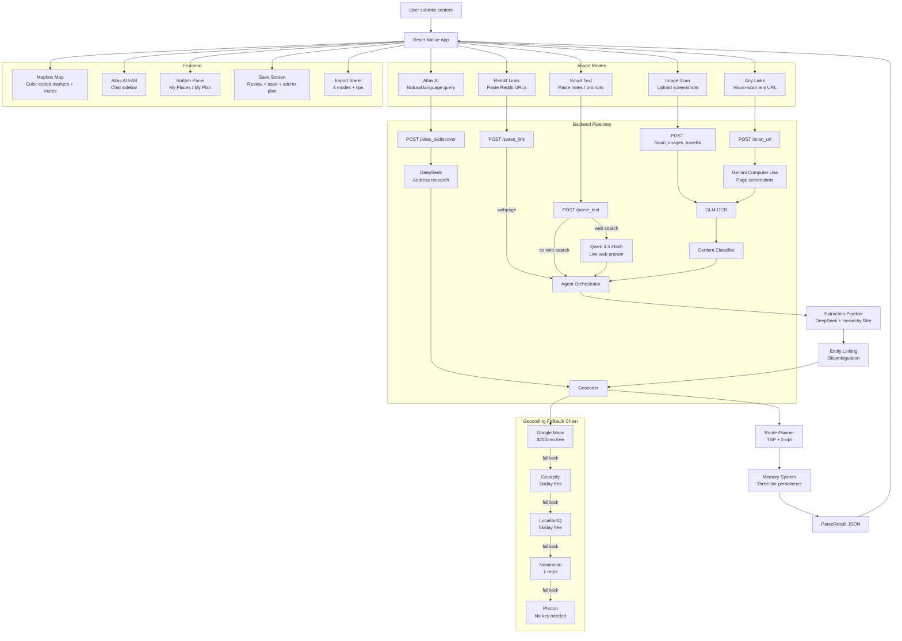
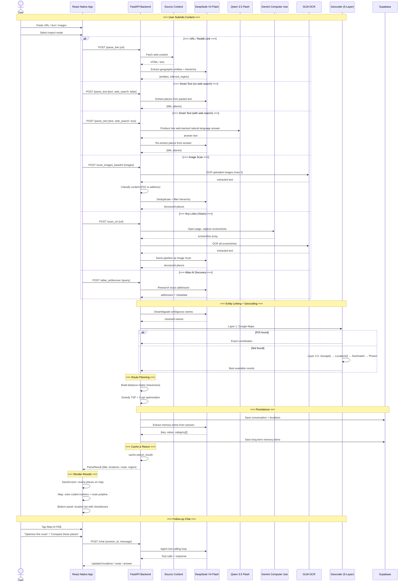

# OurAtlas — AI-Powered Travel Location Extractor

Extract real-world places from Reddit posts, pasted text, web pages, screenshots, and images — then geocode them, plan optimal routes, and visualize them on an interactive Mapbox map.

Built with **React Native (Expo SDK 56)** + **FastAPI (Python)** + **DeepSeek V4 Flash** + **Qwen 3.5 Flash** + **Gemini 3.5 Flash** + **GLM-OCR** + **Mapbox**.

> **Expo SDK v56**: This project targets the latest Expo SDK. Always consult the [official Expo v56 docs](https://docs.expo.dev/versions/v56.0.0/) before making build/config changes.

---

## Multi-Agent Workflow


```mermaid
graph TD
    User[User submits content] --> App[React Native App]

    subgraph "Import Modes"
        ST[Smart Text<br/>Paste notes / prompts]
        IS[Image Scan<br/>Upload screenshots]
        RL[Reddit Links<br/>Paste Reddit URLs]
        AL[Any Links<br/>Vision-scan any URL]
        AD[Atlas AI<br/>Natural language query]
    end

    App --> ST
    App --> IS
    App --> RL
    App --> AL
    App --> AD

    RL --> PL[POST /parse_link]
    ST --> PT[POST /parse_text]
    IS --> SI[POST /scan_images_base64]
    AL --> SU[POST /scan_url]
    AD --> DA[POST /atlas_ai/discover]

    subgraph "Backend Pipelines"
        PL --> |webpage| ORCH[Agent Orchestrator]
        PT --> |no web search| ORCH
        PT --> |web search| QW[Qwen 3.5 Flash<br/>Live web answer]
        QW --> ORCH

        SI --> OCR[GLM-OCR]
        SU --> GCU[Gemini Computer Use<br/>Page screenshots]
        GCU --> OCR
        OCR --> CL[Content Classifier]
        CL --> ORCH

        DA --> DS[DeepSeek<br/>Address research]
        DS --> GEO[Geocoder]
    end

    ORCH --> EX[Extraction Pipeline<br/>DeepSeek + hierarchy filter]
    EX --> EL[Entity Linking<br/>Disambiguation]
    EL --> GEO
    GEO --> RT[Route Planner<br/>TSP + 2-opt]
    RT --> MEM[Memory System<br/>Three-tier persistence]
    MEM --> RESP[ParseResult JSON]

    RESP --> App

    subgraph "Geocoding Fallback Chain"
        G1[Google Maps<br/>$200/mo free]
        G2[Geoapify<br/>3k/day free]
        G3[LocationIQ<br/>5k/day free]
        G4[Nominatim<br/>1 req/s]
        G5[Photon<br/>No key needed]
        G1 -->|fallback| G2 -->|fallback| G3 -->|fallback| G4 -->|fallback| G5
    end

    GEO --> G1

    subgraph "Frontend"
        MAP[Mapbox Map<br/>Color-coded markers + routes]
        FAB[Atlas AI FAB<br/>Chat sidebar]
        BOTTOM[Bottom Panel<br/>My Places / My Plan]
        SAVE[Save Screen<br/>Review + save + add to plan]
        IMPORT[Import Sheet<br/>4 modes + tips]
    end

    App --> IMPORT
    App --> MAP
    App --> SAVE
    App --> FAB
    App --> BOTTOM
```

---

## Architecture Overview

```
┌─────────────────────────────────────────────────────────────────────┐
│                     React Native App (Expo SDK 56)                  │
│                                                                     │
│  ┌─────────────────────────────────────────────────────────────┐   │
│  │  HomeScreen                                                   │   │
│  │  ┌──────────┐  ┌─────────────┐  ┌──────────┐  ┌──────────┐ │   │
│  │  │  TopNav   │  │  MapboxMap  │  │  TopNav  │  │HomeTabBar│ │   │
│  │  │Search/Hst│  │  Markers +  │  │  LeftNav │  │Places/Plan│ │   │
│  │  │          │  │  Routes +   │  │  RightNav │  │  + Add   │ │   │
│  │  │          │  │  Animations │  │          │  │  button  │ │   │
│  │  └──────────┘  └─────────────┘  └──────────┘  └──────────┘ │   │
│  │                                                                 │   │
│  │  ┌──────────────────────────────────────────────────────────┐  │   │
│  │  │  ContentPanel (Bottom Sheet)                              │  │   │
│  │  │  ┌────────────┐  ┌──────────┐  ┌───────────────┐        │  │   │
│  │  │  │  MyPlaces  │  │  MyPlan  │  │ HistoryPlaces │        │  │   │
│  │  │  │ All/Atlas  │  │  Create  │  │ Past imports  │        │  │   │
│  │  │  │            │  │  Detail  │  │               │        │  │   │
│  │  │  └────────────┘  └──────────┘  └───────────────┘        │  │   │
│  │  └──────────────────────────────────────────────────────────┘  │   │
│  │                                                                 │   │
│  │  ┌──────────────────────────────────────────────────────────┐  │   │
│  │  │  Overlays                                                 │  │   │
│  │  │  ImportSheet → AnalyzingScreen → SaveScreen              │  │   │
│  │  │  AIChatBox (Atlas AI sidebar)                            │  │   │
│  │  │  SearchPanel / ChatHistoryPanel / PlaceDetail            │  │   │
│  │  │  CreatePlan / PlanDetail / AddPlaceToPlan                │  │   │
│  │  └──────────────────────────────────────────────────────────┘  │   │
│  └─────────────────────────────────────────────────────────────┘   │
│                        │                                            │
│              HTTP POST / Requests                                   │
│                        │                                            │
└────────────────────────┼────────────────────────────────────────────┘
                         │
┌────────────────────────┼────────────────────────────────────────────┐
│               FastAPI Backend (Python)                              │
│                                                                     │
│  ┌─────────────────────────────────────────────────────────────┐   │
│  │  Services                                                     │   │
│  │                                                               │   │
│  │  1. agent_orchestrator.py — Supervisor coordinates pipeline   │   │
│  │  2. smart_text_service.py — Freeform text → places            │   │
│  │  3. image_scanner.py — Image → OCR → classify → parse        │   │
│  │  4. gemini_computer_use.py — Vision browser automation        │   │
│  │  5. glm_ocr.py — GLM-OCR integration                         │   │
│  │  6. content_classifier.py — POI vs address content routing   │   │
│  │  7. atlas_ai_discovery.py — Address-first research            │   │
│  │  8. web_search_router.py — Web search heuristics             │   │
│  │  9. extraction_pipeline.py — Two-stage LLM + rule filtering  │   │
│  │ 10. geocoder.py — 5-layer fallback geocoding chain           │   │
│  │ 11. route_planner.py — TSP + 2-opt optimization              │   │
│  │ 12. conversation_manager.py — Three-tier memory system       │   │
│  │ 13. supabase_service.py — Supabase persistence               │   │
│  │ 14. llm_client.py — DeepSeek / Qwen / Hunyuan clients        │   │
│  │ 15. cache.py — LRU disk-persistent cache                     │   │
│  │ 16. progress.py — Real-time progress tracking                 │   │
│  │ 17. performance_logger.py — Pipeline timing & token metrics  │   │
│  │ 18. web_scraper.py — Multi-source web scraper                │   │
│  └─────────────────────────────────────────────────────────────┘   │
│                                                                     │
│  API Endpoints:                                                     │
│  POST /parse_link  /parse_text  /scan_images  /scan_url  /scrape_url│
│  POST /atlas_ai/discover  /chat  /sessions  /cache/invalidate      │
│  GET  /sessions  /conversations  /memories  /health  /cache/status │
│  GET  /parse_progress/{id}  /api/performance                       │
│  POST /sessions/{id}/save  /memories                               │
│  DELETE /conversations/{id}                                         │
└─────────────────────────────────────────────────────────────────────┘
```

---

## Data Flow


```mermaid
sequenceDiagram
    actor User
    participant App as React Native App
    participant Backend as FastAPI Backend
    participant Source as Source Content
    participant LLM as DeepSeek V4 Flash
    participant Qwen as Qwen 3.5 Flash
    participant Vision as Gemini Computer Use
    participant OCR as GLM-OCR
    participant Geo as Geocoder (5-Layer)
    participant DB as Supabase

    Note over User,Geo: === User Submits Content ===

    User->>App: Paste URL / text / images
    User->>App: Select import mode

    alt === URL / Reddit Link ===
        App->>Backend: POST /parse_link {url}
        Backend->>Source: Fetch web content
        Source-->>Backend: HTML / text
        Backend->>LLM: Extract geographic entities + hierarchy
        LLM-->>Backend: {entities, inferred_region}

    else === Smart Text (no web search) ===
        App->>Backend: POST /parse_text {text, web_search: false}
        Backend->>LLM: Extract places from pasted text
        LLM-->>Backend: {title, places}

    else === Smart Text (with web search) ===
        App->>Backend: POST /parse_text {text, web_search: true}
        Backend->>Qwen: Produce live web-backed natural language answer
        Qwen-->>Backend: answer text
        Backend->>LLM: Re-extract places from answer
        LLM-->>Backend: {title, places}

    else === Image Scan ===
        App->>Backend: POST /scan_images_base64 {images}
        Backend->>OCR: OCR uploaded images (max 3)
        OCR-->>Backend: extracted text
        Backend->>Backend: Classify content (POI vs address)
        Backend->>LLM: Deduplicate + filter hierarchy
        LLM-->>Backend: structured places

    else === Any Links (Vision) ===
        App->>Backend: POST /scan_url {url}
        Backend->>Vision: Open page, capture screenshots
        Vision-->>Backend: screenshot array
        Backend->>OCR: OCR all screenshots
        OCR-->>Backend: extracted text
        Backend->>LLM: Same pipeline as Image Scan
        LLM-->>Backend: structured places

    else === Atlas AI Discovery ===
        App->>Backend: POST /atlas_ai/discover {query}
        Backend->>LLM: Research exact addresses
        LLM-->>Backend: addresses + metadata
    end

    Note over Backend,Geo: === Entity Linking + Geocoding ===
    Backend->>LLM: Disambiguate ambiguous names
    LLM-->>Backend: resolved names

    Backend->>Geo: Layer 1: Google Maps
    alt POI found
        Geo-->>Backend: Exact coordinates
    else Not found
        Geo->>Geo: Layer 2-5: Geoapify → LocationIQ → Nominatim → Photon
        Geo-->>Backend: Best available coords
    end

    Note over Backend: === Route Planning ===
    Backend->>Backend: Build distance matrix (Haversine)
    Backend->>Backend: Greedy TSP + 2-opt optimization

    Note over Backend,DB: === Persistence ===
    Backend->>DB: Save conversation + locations
    Backend->>LLM: Extract memory items from session
    LLM-->>Backend: {key, value, category}[]
    Backend->>DB: Save long-term memory items

    Note over Backend: === Cache & Return ===
    Backend->>Backend: cache.set(url, result)
    Backend-->>App: ParseResult {title, locations, route, region}

    Note over App: === Render Results ===
    App->>App: SaveScreen: review places on map
    App->>App: Map: color-coded markers + route polyline
    App->>App: Bottom panel: location list with checkboxes

    Note over User,Geo: === Follow-up Chat ===
    User->>App: Tap Atlas AI FAB
    User->>App: "Optimize this route" / "Compare these places"
    App->>Backend: POST /chat {session_id, message}
    Backend->>LLM: Agent tool-calling loop
    LLM-->>Backend: Tool calls + response
    Backend-->>App: Updated locations / route / answer
```

---

## Import Pipelines

### 1. URL / Reddit Links — `POST /parse_link`

Fetches web/Reddit content, extracts geographic entities with two-stage (LLM + rule) hierarchy filtering, resolves ambiguous names via entity linking, geocodes through a 5-layer fallback chain, plans an optimal TSP route, and persists everything to the three-tier memory system. Results are cached in-memory with LRU eviction (100 entries, disk-persisted across restarts).

**Key files**: [`agent_orchestrator.py`](backend/services/agent_orchestrator.py), [`extraction_pipeline.py`](backend/services/extraction_pipeline.py), [`web_scraper.py`](backend/services/web_scraper.py)

### 2. Smart Text — `POST /parse_text`

Two modes:
- **`web_search=false`**: DeepSeek parses pasted text (travel notes, Xiaohongshu, WeChat, copied text) directly into structured places. Covers sources that cannot be scraped.
- **`web_search=true`**: Qwen 3.5 Flash first produces a live web-backed natural-language answer, then DeepSeek re-parses that answer through the same extraction pipeline.

**Key files**: [`smart_text_service.py`](backend/services/smart_text_service.py), [`web_search_router.py`](backend/services/web_search_router.py)

### 3. Image Scan — `POST /scan_images_base64` / `POST /scan_images`

Upload up to 3 images (JPEG/PNG, or HEIC converted to JPEG). GLM-OCR extracts text, then [`content_classifier.py`](backend/services/content_classifier.py) routes the text: named POI → extraction pipeline, address-heavy → address-first geocoding.

**Key files**: [`image_scanner.py`](backend/services/image_scanner.py), [`glm_ocr.py`](backend/services/glm_ocr.py), [`content_classifier.py`](backend/services/content_classifier.py)

### 4. Any Links (Vision) — `POST /scan_url`

For anti-bot, JavaScript-heavy, or login-walled pages: Gemini Computer Use opens the page in a Playwright browser, dismisses interstitials, scrolls top-to-bottom, and captures up to 8 screenshots. GLM-OCR reads the screenshots, then reuses the Image Scan extraction path downstream.

**Key files**: [`gemini_computer_use.py`](backend/services/gemini_computer_use.py), [`glm_ocr.py`](backend/services/glm_ocr.py)

### 5. Atlas AI Discovery — `POST /atlas_ai/discover`

For natural-language queries that need exact addresses: "Where did Taylor Swift get married?" / "Best Game of Thrones filming locations in Croatia". DeepSeek researches addresses directly, then address-first geocoding returns coordinates without the extraction pipeline.

**Key files**: [`atlas_ai_discovery.py`](backend/services/atlas_ai_discovery.py)

---

## Features

### Multi-Agent AI Pipeline

| Agent | Responsibility | Implementation |
|-------|---------------|----------------|
| **Supervisor Orchestrator** | Coordinates all import pipelines, manages session state, handles follow-up chat tool-calling loop | [`agent_orchestrator.py`](backend/services/agent_orchestrator.py) |
| **Content Classifier** | Routes OCR/pasted text to named-POI extraction vs address-first geocoding | [`content_classifier.py`](backend/services/content_classifier.py) |
| **Smart Text** | Parses freeform travel notes, prompts, and itineraries into structured places | [`smart_text_service.py`](backend/services/smart_text_service.py) |
| **Smart Text Web** | Qwen 3.5 live web search → natural-language answer → DeepSeek re-parse | [`web_search_router.py`](backend/services/web_search_router.py) |
| **Extraction** | Two-stage: LLM entity extraction + rule-based hierarchy/noise filtering | [`extraction_pipeline.py`](backend/services/extraction_pipeline.py) |
| **Entity Linking** | Disambiguates names (ROM→Royal Ontario Museum, Suzhou→Suzhou, Jiangsu) | [`agent_orchestrator.py`](backend/services/agent_orchestrator.py) |
| **Geocoding** | 5-layer fallback chain: Google Maps → Geoapify → LocationIQ → Nominatim → Photon | [`geocoder.py`](backend/services/geocoder.py) (1146 lines) |
| **Route Planning** | Haversine distance matrix + greedy TSP + 2-opt local search, zero-cost | [`route_planner.py`](backend/services/route_planner.py) |
| **Memory** | Three-tier: short-term context → in-memory sessions → Supabase persistence | [`conversation_manager.py`](backend/services/conversation_manager.py) |
| **Long-Term Memory** | Auto-extracts user preferences/interests from each session via LLM | `_update_memory` in orchestrator |
| **Chat / Conversation** | Follow-up chat with dynamic tool-calling loop for map/route refinement | [`agent_orchestrator.py`](backend/services/agent_orchestrator.py) |
| **Image OCR** | GLM-OCR integration (Zhipu AI Layout Parsing API, Chinese-capable) | [`glm_ocr.py`](backend/services/glm_ocr.py) |
| **Vision Browser** | Gemini Computer Use for visual page capture — handles anti-bot, JS-heavy pages | [`gemini_computer_use.py`](backend/services/gemini_computer_use.py) |
| **Atlas AI Discovery** | Direct address research for natural-language queries | [`atlas_ai_discovery.py`](backend/services/atlas_ai_discovery.py) |

### Smart Geocoding

| Layer | Service | Free Tier | Coverage |
|-------|---------|-----------|----------|
| 1 | Google Maps Geocoding API | $200/mo free credit | Best global POI |
| 2 | Geoapify | 3,000 req/day | Best supplementary POI |
| 3 | LocationIQ | 5,000 req/day | Excellent OSM-based |
| 4 | Nominatim (OSM) | 1 req/s | Global OSM data |
| 5 | Photon (OSM) | Unlimited | Complementary OSM |

### Map Visualization

- **Color-coded markers**: Green (positive) / Blue (neutral) / Red (negative) based on Reddit comment sentiment
- **Category grouping**: Tourist Attractions, Dining & Drinking, Entertainment, Museums, Transit Hubs, Religious Sites, and more
- **Route polylines**: TSP-optimized route displayed on the map with ordered markers
- **Marker–List linkage**: Tap a map marker → highlights the item in the list; tap a list item → centers map on that marker
- **Smart map padding**: Automatically offsets camera for bottom panel visibility
- **Error boundary**: Mapbox crashes are caught gracefully without crashing the app

### Import UI

- **Single-entry import sheet**: Choose from 4 modes via a 2×2 grid with rotating tip banners
- **Live progress tracking**: Real-time event polling via `/parse_progress/{request_id}` with elapsed time display
- **Analyzing screen**: Shared waiting state for all import flows with step-by-step progress and token usage
- **Save screen**: Map + scrollable place list with checkboxes, dedup detection against already-saved places, save to Supabase or add to a plan
- **Duplicate detection**: Name normalization + coordinate threshold (~100m) against saved places

### Conversational AI (Atlas AI)

- Floating action button opens **AIChatBox** sidebar with contextual awareness of current places
- Follow-up chat: "Compare these places", "Remove the ones in Brooklyn", "Turn this into a road trip"
- Tool-calling loop with dynamic map operations (add/remove pins, reorder/optimize route)
- Session memory persists across messages (in-memory + Supabase)

### Long-Term Memory

- **Auto-extraction**: After each successful parse, the LLK analyzes the session and saves user preferences/interests to Supabase
- **Categories**: `preference`, `visited_place`, `interest`, `disliked`, `plan`
- **Persistence**: Memories survive server restarts (stored in Supabase `long_term_memory` table)

### Chat History

- Auto-saves every import to Supabase with full place list
- History panel: browse past imports, re-view places on map, re-save to My Places
- Soft-delete with undo (deleted items held in memory until app restart)

### My Places

- Two tabs: **All Places** (saved location grid) and **Atlas** (category-organized view)
- Full CRUD: save from import, delete, re-view on map
- Integrated with Place Detail view (hours, address, tags, visit strategy)
- Native iOS segmented control via `@expo/ui`

### Trip Planning (My Plan)

- Create plans with destinations, date ranges, and places
- DnD place ordering (drag-and-drop cards)
- Plan Detail view with compact schedule view
- Add saved places to existing plans
- Supabase persistence in `projects` and `project_places` tables

### Design System

- **SPARC Figma** design foundation: emerald brand (#12C170), 8 atlas category colors
- **Dark mode** support via CSS custom properties
- **NativeWind v5** + Tailwind CSS v4 for utility-first styling
- **shadcn/ui**-inspired primitives: button, card, badge, avatar, input, alert-dialog
- **Expo UI** native components: blurred backgrounds, glass effects, segmented control

---

## Performance Metrics

| Metric | Description |
|--------|-------------|
| **End-to-end time** | ~15-30s per parse (varies by source type, geocoding fallback depth) |
| **LLM calls per parse** | 2-3 (extraction + entity linking + optional memory extraction) |
| **Cache hit time** | ~50ms (in-memory LRU, disk-persisted) |
| **Geocoding success rate** | ~85-95% with 5-layer fallback chain |
| **Pipeline metrics** | Exposed via `GET /api/performance` with per-run token usage and timing |

All pipeline timing and token usage is tracked by [`performance_logger.py`](backend/services/performance_logger.py) and queryable via the performance API endpoint.

---

## Getting Started

### Prerequisites

- **Python 3.10+**
- **Node.js 18+**
- **Xcode 16+** (iOS Simulator) / Android Studio
- **CocoaPods** >= 1.16
- API keys for services configured in `.env`

### Installation & Setup

```bash
# 1. Install backend dependencies
cd backend
pip install -r requirements.txt
playwright install chromium        # For Gemini Computer Use
cd ..

# 2. Install frontend dependencies
npm install

# 3. Configure .env
# Copy from .env.example and fill in your API keys
cp .env.example .env
```

> **Required API keys**: `MAPBOX_ACCESS_TOKEN`, `DEEPSEEK_API_KEY`, `SUPABASE_URL`, `SUPABASE_ANON_KEY`. Optional: `GLM_API_KEY` (OCR), `GEMINI_API_KEY` (vision), `QWEN_API_KEY` (web search), and at least one geocoding key.

### Start the App

**Terminal 1 — Backend:**
```bash
uvicorn backend.main:app --reload --reload-dir backend --port 8000
```

**Terminal 2 — Frontend:**
```bash
npx expo run:ios
```

For subsequent runs after the initial build:
```bash
npx expo start --dev-client
```

### Verify

```bash
curl http://localhost:8000/health
# → {"status": "ok"}
```

### Usage

1. Tap the **+** button → Import Screen opens with 4 modes
2. Choose a mode: **Smart Text**, **Image Scan**, **Reddit Links**, or **Any Links**
3. Paste input (URL / text) or select images
4. Wait for the Analyzing Screen with live progress events
5. Review extracted places on the **Save Screen** (map + list)
6. **Save** selected places to My Places or **Add to Plan**
7. Explore: Atlas AI chat, My Plan, Place Detail, Chat History

---

## API Endpoints

| Method | Endpoint | Description |
|--------|----------|-------------|
| `POST` | `/parse_link` | Parse a URL → extract locations → plan route |
| `POST` | `/parse_text` | Parse pasted text with optional `web_search` |
| `POST` | `/scan_images_base64` | Parse base64 image payloads (max 3) |
| `POST` | `/scan_images` | Parse uploaded image files (max 3) |
| `POST` | `/scan_url` | Gemini vision captures webpage → OCR → parse |
| `POST` | `/scrape_url` | Gemini text extraction from page → parse |
| `POST` | `/atlas_ai/discover` | Research exact addresses → geocode directly |
| `POST` | `/chat` | Continue conversation with AI agent |
| `GET` | `/sessions` | List active sessions |
| `POST` | `/sessions` | Create a session |
| `POST` | `/sessions/{id}/save` | Persist session to Supabase |
| `GET` | `/conversations` | List saved conversations |
| `GET` | `/conversations/{id}` | Load full conversation |
| `DELETE` | `/conversations/{id}` | Delete a conversation |
| `GET` | `/memories` | List long-term memories |
| `POST` | `/memories` | Add a memory item |
| `GET` | `/parse_progress/{request_id}` | Poll live progress events |
| `GET` | `/health` | Health check |
| `GET` | `/api/performance` | Pipeline metrics (token usage, timing) |
| `POST` | `/cache/invalidate` | Invalidate URL cache entry |
| `GET` | `/cache/status` | Cache statistics (hits, misses, size, hit rate) |

---

## Project Structure

```
atlas-mobile/
├── app.config.js                   # Expo configuration (plugins, env)
├── App.tsx                         # Root component with overlay routing
├── App.tsx                         # MapErrorBoundary + HomeProvider
├── package.json                    # Expo SDK 56 + React Native 0.85
├── global.css                      # NativeWind v5 + Tailwind v4
├── components.json                 # shadcn/ui config
│
├── src/
│   ├── components/
│   │   ├── top-nav/                # TopNav, LeftNav, RightNav
│   │   ├── content-panel/          # ContentPanel (unified bottom sheet)
│   │   ├── place-card/             # PlaceCard component
│   │   ├── plan-card/              # PlanCard + usePlanDelete
│   │   ├── search-bar/             # SearchBar component
│   │   └── ui/                     # shadcn/ui primitives (button, card, badge, etc.)
│   │
│   ├── features/
│   │   ├── home/                   # HomeScreen, HomeContext, HomePanel, HomeTabBar
│   │   │   ├── AIChatBox.tsx       # Atlas AI chat sidebar
│   │   │   ├── ChatHistoryPanel.tsx # Past import history
│   │   │   ├── HistoryPlacesPanel.tsx # Re-view past import places
│   │   │   ├── SearchPanel.tsx     # Search overlay
│   │   │   └── ImportNotification.tsx # Post-save notification
│   │   ├── import-places/          # Import → Analyzing → Save flow
│   │   │   ├── import-screen/      # Mode selection + input (ImportScreen)
│   │   │   ├── analyzing-screen/   # Live progress (AnalyzingScreen)
│   │   │   └── save-screen/        # Review + save (SaveScreen)
│   │   ├── map/                    # MapboxMap with markers + routes + padding
│   │   ├── my-places/              # MyPlaces, AllPlaces, Atlas
│   │   ├── my-plan/                # CreatePlan, PlanDetail, AddPlaceToPlan
│   │   │   ├── create-plan/        # Plan creation with DnD ordering
│   │   │   │   ├── plan-destination/ # Destination + date picker
│   │   │   │   ├── plan-place/     # Place list with DnD
│   │   │   │   └── savePlan.ts     # Supabase persistence
│   │   │   └── plan-detail/        # Plan detail + compact view
│   │   └── place-detail/           # PlaceDetail screen (hours, tags, summary)
│   │
│   ├── services/
│   │   ├── api/apiService.ts       # FastAPI client (parse, chat, sessions, memories)
│   │   ├── import/importService.ts # Import orchestration (parseInput, parseText, etc.)
│   │   ├── place/placeService.ts   # Place CRUD (save, fetch, delete)
│   │   ├── ai/aiService.ts         # AI service helpers
│   │   └── supabase/supabaseClient.ts # Supabase client + chat history persistence
│   │
│   ├── types/
│   │   ├── place.ts                # Place, PlaceDetail, DaySchedule, etc.
│   │   ├── route.ts                # GeocodedLocation, RouteResult, ParseResult, etc.
│   │   ├── atlas.ts                # Atlas types
│   │   └── import.ts               # Import types
│   ├── theme/                      # Design tokens + typography
│   │   ├── tokens.css              # CSS custom properties (light + dark)
│   │   └── typography.ts           # Typography scale
│   └── lib/utils.ts                # Utility functions
│
├── backend/
│   ├── main.py                     # FastAPI app entry point
│   ├── requirements.txt            # Python dependencies
│   └── services/
│       ├── agent_orchestrator.py   # Supervisor Agent (992 lines)
│       ├── atlas_ai_discovery.py   # Address-first discovery pipeline
│       ├── cache.py                # LRU disk-persistent cache (parse + geocoding)
│       ├── content_classifier.py   # POI vs address content routing
│       ├── conversation_manager.py # Three-tier memory system (Session dataclass)
│       ├── extraction_pipeline.py  # Two-stage LLM + rule hierarchy filtering
│       ├── geocoder.py             # 5-layer geocoding fallback chain (1146 lines)
│       ├── gemini_computer_use.py  # Gemini Computer Use browser automation
│       ├── glm_ocr.py              # GLM-OCR via Zhipu AI Layout Parsing API
│       ├── image_scanner.py        # Image → OCR → classify → route pipeline
│       ├── llm_client.py           # DeepSeek / Qwen / Hunyuan LLM clients
│       ├── performance_logger.py   # PipelineMetrics dataclass + recording
│       ├── progress.py             # In-memory progress event tracking
│       ├── route_planner.py        # TSP + 2-opt route optimizer
│       ├── smart_text_service.py   # Smart text pipeline with web search routing
│       ├── supabase_service.py     # Supabase persistence layer
│       ├── tool_definitions.py     # Tool schemas + registry for agent loop
│       ├── web_fetch_chain.py      # Chained web fetching strategy
│       ├── web_scraper.py          # Multi-source web scraper
│       └── web_search_router.py    # Web search heuristics + Qwen integration
│
├── docs/                           # Database schema, RLS policies, ERD
│   ├── schema.sql                  # Full database schema
│   ├── schema-conversations.sql    # Conversations + memories schema
│   ├── supabase-rls-policies.sql   # RLS policies for anonymous access
│   └── erd.dbml                    # Entity relationship diagram
│
├── plans/                          # Feature plans & design docs
├── mock-data/                      # Development mock data
├── assets/                         # Icons, splash, tab bar icons
├── .env                            # Environment variables (not committed)
└── atlas-backend.log               # Backend log file
```

---

## Tech Stack

| Component | Library |
|-----------|---------|
| **Mobile Framework** | React Native 0.85 + Expo SDK 56 |
| **Maps** | `@rnmapbox/maps@10.3.1` (Mapbox v11) |
| **Navigation** | `@react-navigation/native` v7 + `native-stack` |
| **Bottom Sheet** | `@gorhom/bottom-sheet` v5 |
| **Gestures** | `react-native-gesture-handler` |
| **Animations** | `react-native-reanimated` v4 |
| **Styling** | NativeWind v5 + Tailwind CSS v4 |
| **UI Primitives** | shadcn/ui (adapted) + `@expo/ui` |
| **Icons** | `@expo/vector-icons` (Ionicons) |
| **Blur / Glass** | `expo-blur` + `expo-glass-effect` |
| **Backend** | FastAPI (Python 3.10+) |
| **HTTP Client** | httpx |
| **Browser Automation** | Playwright |
| **Primary LLM** | DeepSeek V4 Flash (`deepseek-chat`) |
| **Web Search** | Qwen 3.5 Flash (`qwen3.5-flash`) |
| **Vision** | Gemini 3.5 Flash (`gemini-3.5-flash`) |
| **OCR** | GLM-OCR (Zhipu AI Layout Parsing) |
| **Database** | Supabase (PostgreSQL) |
| **Geocoding** | Google Maps / Geoapify / LocationIQ / Nominatim / Photon |

---

## Changelog

### v2.0+ — Multi-Model Pipelines & Enhanced UX

#### New Import Modes

| Change | Description |
|--------|-------------|
| **Smart Text** | [`smart_text_service.py`](backend/services/smart_text_service.py) — parse freeform travel notes, prompts, and itineraries via DeepSeek with optional Qwen web search toggle |
| **Image Scan** | [`image_scanner.py`](backend/services/image_scanner.py) + [`glm_ocr.py`](backend/services/glm_ocr.py) — upload screenshots, OCR with GLM-OCR, classify content, route to extraction or address-first discovery |
| **Any Links** | [`gemini_computer_use.py`](backend/services/gemini_computer_use.py) — vision-first pipeline using Gemini Computer Use to capture webpage screenshots, OCR them, then reuse the Image Scan extraction path |
| **Atlas AI Discovery** | [`atlas_ai_discovery.py`](backend/services/atlas_ai_discovery.py) — natural-language queries → DeepSeek researches exact addresses → address-first geocoding |
| **Smart Text Web Search** | Qwen 3.5 Flash produces live web-backed answers → DeepSeek re-parses for structured extraction |

#### UI & UX Enhancements

| Change | Description |
|--------|-------------|
| **Import Sheet** | [`ImportScreen.tsx`](src/features/import-places/import-screen/ImportScreen.tsx) — 4-mode selection grid with rotating tip banners, image picker, Web Search toggle |
| **Analyzing Screen** | [`AnalyzingScreen.tsx`](src/features/import-places/analyzing-screen/AnalyzingScreen.tsx) — shared waiting state with live progress events, token usage display, cancel support |
| **Save Screen** | [`SaveScreen.tsx`](src/features/import-places/save-screen/SaveScreen.tsx) — review extracted places on map, dedup detection, save or add to plan |
| **ContentPanel** | [`ContentPanel.tsx`](src/components/content-panel/ContentPanel.tsx) — unified bottom sheet wrapper with compact/default/full snap states |
| **Top Navigation** | [`TopNav.tsx`](src/components/top-nav/TopNav.tsx) + search/history/left/right nav components |
| **Home Tab Bar** | [`HomeTabBar.tsx`](src/features/home/HomeTabBar.tsx) — My Places / My Plan tabs with animated transitions |
| **Import Notification** | [`ImportNotification.tsx`](src/features/home/ImportNotification.tsx) — post-save snackbar confirmation |

#### AI & Chat

| Change | Description |
|--------|-------------|
| **Atlas AI Chat** | [`AIChatBox.tsx`](src/features/home/AIChatBox.tsx) — contextual AI sidebar with session management, dynamic tool-calling for map/route operations |
| **Chat History** | [`ChatHistoryPanel.tsx`](src/features/home/ChatHistoryPanel.tsx) — browse past imports, soft-delete with undo, re-view on map |
| **History Places** | [`HistoryPlacesPanel.tsx`](src/features/home/HistoryPlacesPanel.tsx) — re-save past imports to My Places |
| **Real-time Progress** | [`progress.py`](backend/services/progress.py) + frontend polling at 1s intervals |

#### My Places & My Plan

| Change | Description |
|--------|-------------|
| **My Places** | [`MyPlaces.tsx`](src/features/my-places/MyPlaces.tsx) — All Places / Atlas tabs with native segmented control |
| **Atlas View** | [`Atlas.tsx`](src/features/my-places/atlas/Atlas.tsx) — category-organized place browsing |
| **Create Plan** | [`CreatePlan.tsx`](src/features/my-plan/create-plan/CreatePlan.tsx) — destination, date range, place ordering with drag-and-drop |
| **Plan Detail** | [`PlanDetail.tsx`](src/features/my-plan/plan-detail/PlanDetail.tsx) — schedule view + place list |
| **Add to Plan** | [`AddPlaceToPlan.tsx`](src/features/my-plan/add-place-to-plan/AddPlaceToPlan.tsx) — select existing plan to add places |
| **Place Detail** | [`PlaceDetail.tsx`](src/features/place-detail/PlaceDetail.tsx) — hours, address, tags, visit strategy, links |

#### Backend Infrastructure

| Change | Description |
|--------|-------------|
| **Content Classifier** | [`content_classifier.py`](backend/services/content_classifier.py) — LLM-based routing between named-POI and address-first pipelines |
| **Web Search Router** | [`web_search_router.py`](backend/services/web_search_router.py) — heuristics + Qwen integration for live web answers |
| **Performance Logger** | [`performance_logger.py`](backend/services/performance_logger.py) — `PipelineMetrics` dataclass tracking timing, token usage, LLM calls per run |
| **Disk-Persistent Cache** | [`cache.py`](backend/services/cache.py) — LRU cache survives backend restarts, separate namespaces for parse results vs geocoding |
| **Progress Tracking** | [`progress.py`](backend/services/progress.py) — `start` / `mark` / `finish` / `fail` lifecycle for real-time frontend polling |
| **Tool Definitions** | [`tool_definitions.py`](backend/services/tool_definitions.py) — tool schemas + registry for agent loop |
| **Web Fetch Chain** | [`web_fetch_chain.py`](backend/services/web_fetch_chain.py) — chained strategy using Playwright → trafilatura → BeautifulSoup |
| **New Endpoints** | `/scan_images`, `/scan_images_base64`, `/scan_url`, `/scrape_url`, `/atlas_ai/discover`, `/cache/invalidate`, `/cache/status`, `/api/performance` |

#### Design System

| Change | Description |
|--------|-------------|
| **Design Tokens** | [`tokens.css`](src/theme/tokens.css) — SPARC Figma foundation: emerald brand, 8 atlas category colors, light + dark mode |
| **Typography** | [`typography.ts`](src/theme/typography.ts) — complete type scale |
| **UI Components** | shadcn/ui primitives: `alert-dialog`, `avatar`, `badge`, `button`, `card`, `input`, `pressable-scale`, `text`, `top-blur-fade` |
| **NativeWind v5** | Tailwind CSS v4 integration with `tailwindcss-react-native` |
| **Expo UI** | Native iOS segmented control, blurred backgrounds, glass effects |

---

## Troubleshooting

### Backend not responding

```bash
curl http://localhost:8000/health
# → {"status": "ok"}
```

### Mapbox rendering issues

If the map appears blank or clipped, ensure the parent view has explicit dimensions and rebuild native dependencies:

```bash
npx expo prebuild --clean
npx expo run:ios
```

### `pod install` fails

```bash
cd ios && pod install --repo-update
```

### Build fails with stale cache errors

```bash
rm -rf node_modules/expo-modules-jsi/apple/.DerivedData
rm -rf ~/Library/Developer/Xcode/DerivedData
npx expo run:ios
```

### OCR or vision parsing fails

Verify environment variables:

```bash
echo $GLM_API_KEY
echo $GEMINI_API_KEY
echo $GEMINI_COMPUTER_USE_MODEL   # Should be gemini-3.5-flash
echo $GEMINI_COMPUTER_USE_IMAGE_SIZE  # Should be 512
```

### Progress tracking not showing

The frontend polls `/parse_progress/{request_id}` every 1s. Ensure the backend is reachable and CORS is configured (allowed for `*` in development).

---

## License

MIT
