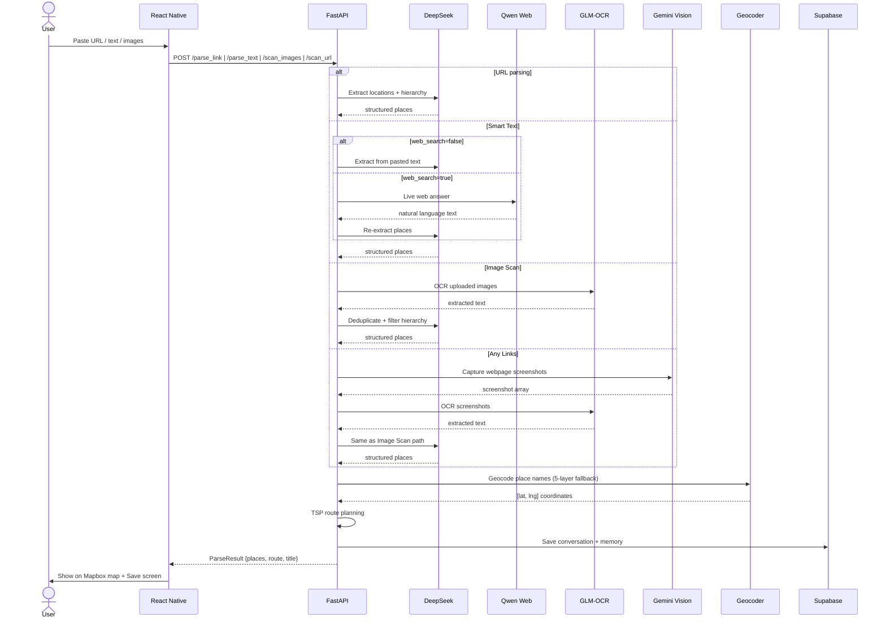
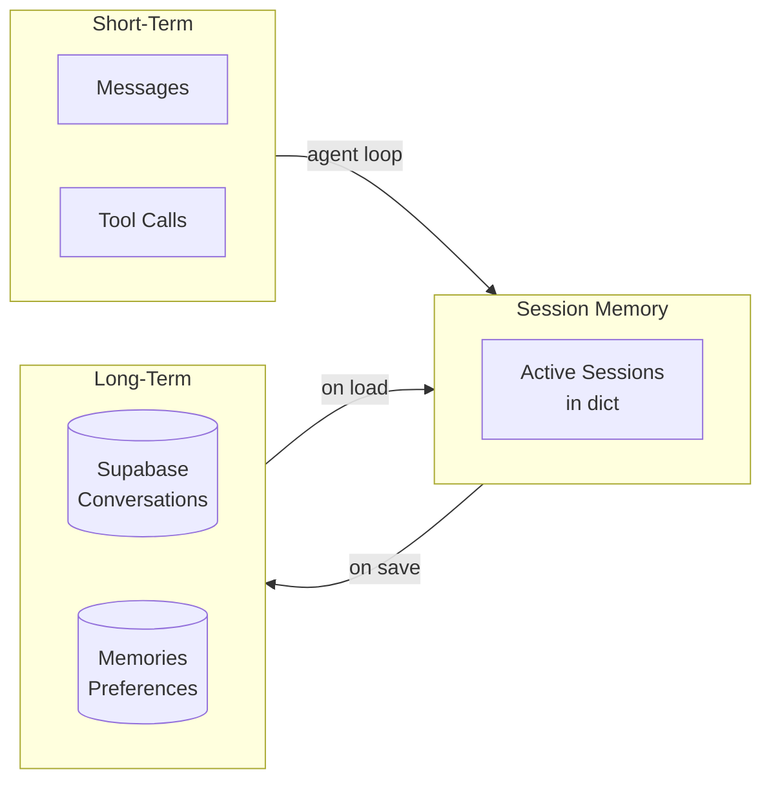

<div align="center">
  
  <h1 align="center">OurAtlas</h1>
  <p align="center"><strong>AI‑Powered Travel Location Intelligence</strong></p>
  <p align="center">
    Turn Reddit threads, screenshots, web pages, and travel notes into <b>geocoded, route‑planned maps</b> — instantly.
  </p>
  <p align="center">
    <a href="#-features"></a>
    <a href="#-tech-stack"></a>
    <a href="#-getting-started"></a>
    <a href="./LICENSE"></a>
  </p>
  <br />
</div>

---

## ✦ Overview

**OurAtlas** is a mobile application that extracts **real‑world places** from unstructured content — Reddit posts, pasted text, web pages, screenshots, and images — then geocodes them and visualizes the result on an interactive **Mapbox** map. It is built on a **multi‑agent AI pipeline** that chains together specialized LLMs (DeepSeek, Qwen, Gemini, GLM-OCR) for classification, extraction, deduplication, and geocoding.

The app centers on a single home screen: a full‑screen Mapbox map, a draggable bottom panel for saved places and plans, and four import modes accessible from a single `+` button.

| | | |
|---|---|---|
|  | → | **URL / Smart Text / Image Scan / Any Links** → geocoded, route‑planned places on an interactive map |

---

## ✦ The Problem It Solves

Travel planning is scattered across dozens of tabs — a Reddit thread here, a screenshot there, a Xiaohongshu note, a friend's text message. **OurAtlas** collates them all:

- 🧵 **Reddit threads** → places with coordinates
- 📸 **Screenshots** → OCR'd and parsed
- 📝 **Pasted notes & itineraries** → structured location lists
- 🌐 **Any web page** → vision‑based extraction via Gemini Computer Use
- 💬 **Natural‑language queries** → "What are the best Game of Thrones filming locations in Croatia?"

---

## ✦ Features

### 🧠 Multi‑Agent AI Pipeline

A **supervisor orchestrator** (`agent_orchestrator.py`) coordinates seven sub‑agents and services:

| Agent | Role | Model / Service |
|---|---|---|
| **Supervisor Orchestrator** | Coordinates import pipelines, chat, session state, persistence | [`agent_orchestrator.py`](backend/services/agent_orchestrator.py) |
| **Content Classifier** | Routes text to the best parser (POI vs. address‑heavy) | [`content_classifier.py`](backend/services/content_classifier.py) + LLM |
| **Smart Text** | Parses freeform travel notes → structured places | [`smart_text_service.py`](backend/services/smart_text_service.py) + **DeepSeek** |
| **Smart Text Web** | Live web‑backed natural‑language answers → re‑parse | **Qwen 3.5 Flash** + **DeepSeek** |
| **Image Scanner** | OCR + classify + route to extraction/discovery | [`image_scanner.py`](backend/services/image_scanner.py) + **GLM-OCR** |
| **Any Links** | Vision‑first: Gemini captures page screenshots → OCR → parse | **Gemini 3.5 Flash** + [`gemini_computer_use.py`](backend/services/gemini_computer_use.py) |
| **Extraction Pipeline** | Two‑stage: LLM extracts → rule‑based hierarchy filtering | [`extraction_pipeline.py`](backend/services/extraction_pipeline.py) |
| **Geocoder** | 5‑layer fallback chain (Google Maps → Geoapify → LocationIQ → Nominatim → Photon) | [`geocoder.py`](backend/services/geocoder.py) |
| **Route Planner** | Haversine distance + greedy TSP + 2‑opt optimization | [`route_planner.py`](backend/services/route_planner.py) |
| **Memory System** | Three‑tier: short‑term context → session memory → Supabase persistence | [`conversation_manager.py`](backend/services/conversation_manager.py) |

### 📱 Mobile App

- **Mapbox** map as the primary canvas — markers, route polylines, animated camera
- **Bottom sheet** panel with two tabs: **My Places** (saved locations) | **My Plan** (trip planning)
- **Atlas AI** chat sidebar — ask follow‑ups, compare places, refine your map
- **4 import modes** in a single bottom sheet with live progress tracking

### 🎨 Design System

- **SPARC Figma**‑driven design tokens (`tokens.css`): emerald brand, 8 atlas category colors, light/dark mode
- **NativeWind v5** + Tailwind CSS v4 for styling
- **shadcn/ui**‑inspired component library
- **@expo/ui** native iOS components (segmented control, blur, glass)

---

## ✦ Architecture

### Import Flow

```mermaid
flowchart TB
    subgraph Mobile["📱 React Native App"]
        HS[HomeScreen]
        IS[ImportScreen]
        AS[AnalyzingScreen]
        SS[SaveScreen]
        HS --> IS
        IS -->|submit| AS
        AS -->|result| SS
    end

    subgraph Backend["⚡ FastAPI Backend"]
        direction LR
        PL[parse_link]
        PT[parse_text]
        SI[scan_images]
        SU[scan_url]
        AD[atlas_ai/discover]
        CHAT[/chat]
    end

    subgraph Pipeline["🧠 AI Pipeline"]
        direction LR
        OC[GLM-OCR]
        GCU[Gemini Computer Use]
        DE[DeepSeek Extraction]
        QW[Qwen Web Search]
        CL[Content Classifier]
        GEO[Geocoder<br/>5-layer fallback]
        RT[Route Planner<br/>TSP + 2-opt]
    end

    subgraph Storage["💾 Persistence"]
        SUPA[(Supabase)]
        CACHE[(LRU Cache)]
        MEM[(Three-tier Memory)]
    end

    Mobile -->|HTTP| Backend
    Backend --> PL
    Backend --> PT
    Backend --> SI
    Backend --> SU
    Backend --> AD
    Backend --> CHAT

    PL -->|webpage| DE
    PT -->|text| DE
    PT -->|web_search=true| QW
    QW --> DE
    SI --> OC
    SU --> GCU
    GCU --> OC
    OC --> CL
    CL --> DE
    DE --> GEO
    GEO --> RT
    RT --> Storage
```

### Data Flow


```mermaid
sequenceDiagram
    actor U as User
    participant RN as React Native
    participant API as FastAPI
    participant LLM as DeepSeek
    participant WEB as Qwen Web
    participant OCR as GLM-OCR
    participant VISION as Gemini Vision
    participant GEO as Geocoder
    participant DB as Supabase

    U->>RN: Paste URL / text / images
    RN->>API: POST /parse_link | /parse_text | /scan_images | /scan_url

    alt URL parsing
        API->>LLM: Extract locations + hierarchy
        LLM-->>API: structured places
    else Smart Text
        alt web_search=false
            API->>LLM: Extract from pasted text
        else web_search=true
            API->>WEB: Live web answer
            WEB-->>API: natural language text
            API->>LLM: Re-extract places
        end
        LLM-->>API: structured places
    else Image Scan
        API->>OCR: OCR uploaded images
        OCR-->>API: extracted text
        API->>LLM: Deduplicate + filter hierarchy
        LLM-->>API: structured places
    else Any Links
        API->>VISION: Capture webpage screenshots
        VISION-->>API: screenshot array
        API->>OCR: OCR screenshots
        OCR-->>API: extracted text
        API->>LLM: Same as Image Scan path
        LLM-->>API: structured places
    end

    API->>GEO: Geocode place names (5-layer fallback)
    GEO-->>API: [lat, lng] coordinates
    API->>API: TSP route planning
    API->>DB: Save conversation + memory
    API-->>RN: ParseResult {places, route, title}

    RN->>U: Show on Mapbox map + Save screen
```

### Three‑Tier Memory System


```mermaid
flowchart LR
    subgraph ST["Short‑Term"]
        direction LR
        MS[Messages]
        TC[Tool Calls]
    end
    subgraph SM["Session Memory"]
        direction LR
        SESS[Active Sessions<br/>in dict]
    end
    subgraph LT["Long‑Term"]
        direction LR
        SUP[(Supabase<br/>Conversations)]
        MEMS[(Memories<br/>Preferences)]
    end

    ST -->|agent loop| SM
    SM -->|on save| LT
    LT -->|on load| SM
```

---

## ✦ Tech Stack

### Frontend

| Technology | Purpose |
|---|---|
| [React Native](https://reactnative.dev/) 0.85 | Mobile framework |
| [Expo SDK 56](https://docs.expo.dev/versions/v56.0.0/) | Build & deploy toolchain |
| [NativeWind v5](https://nativewind.dev/) | Tailwind CSS in RN |
| [Tailwind CSS v4](https://tailwindcss.com/) | Utility‑first styling |
| [@rnmapbox/maps](https://github.com/rnmapbox/maps) v10 | Mapbox GL maps |
| [@gorhom/bottom-sheet](https://github.com/gorhom/react-native-bottom-sheet) v5 | Draggable bottom panel |
| [@react-navigation](https://reactnavigation.org/) v7 | Navigation |
| [@supabase/supabase-js](https://supabase.com/docs/reference/javascript) v2 | Database client |
| [@expo/ui](https://docs.expo.dev/ui/) | Native iOS components |
| [shadcn/ui](https://ui.shadcn.com/) | Component primitives (adapted) |

### Backend

| Technology | Purpose |
|---|---|
| [FastAPI](https://fastapi.tiangolo.com/) | Python web framework |
| [Uvicorn](https://www.uvicorn.org/) | ASGI server |
| [httpx](https://www.python-httpx.org/) | Async HTTP client |
| [Playwright](https://playwright.dev/) | Browser automation |
| [BeautifulSoup](https://www.crummy.com/software/BeautifulSoup/) + [trafilatura](https://trafilatura.readthedocs.io/) | Web scraping |
| [Supabase Python client](https://supabase.com/docs/reference/python) | DB persistence |

### AI Models

| Model | Role |
|---|---|
| **DeepSeek V4 Flash** (`deepseek-chat`) | Primary LLM: extraction, classification, entity linking |
| **Qwen 3.5 Flash** (`qwen3.5-flash`) | Live web search natural language answers |
| **Gemini 3.5 Flash** (`gemini-3.5-flash`) | Computer Use browser automation + screenshots |
| **GLM‑OCR** (Zhipu AI) | OCR: image → text extraction |
| **Tencent Hunyuan** (`hy3-preview`) | Optional web search model fallback |

### Infrastructure

| Service | Purpose |
|---|---|
| [Supabase](https://supabase.com/) | PostgreSQL database, auth, REST API |
| [Mapbox](https://www.mapbox.com/) | Maps, geocoding (optional) |
| [Google Maps Geocoding API](https://developers.google.com/maps/documentation/geocoding) | Primary geocoding |
| [Geoapify](https://www.geoapify.com/) | Geocoding fallback #1 |
| [LocationIQ](https://locationiq.com/) | Geocoding fallback #2 |
| [Nominatim](https://nominatim.org/) | Geocoding fallback #3 |
| [Photon](https://photon.komoot.io/) | Geocoding fallback #4 |

---

## ✦ Project Structure

```
atlas-mobile/
├── App.tsx                          # Root component with overlay routing
├── app.config.js                    # Expo configuration
├── global.css                       # Global styles + NativeWind imports
├── components.json                  # shadcn/ui config
│
├── src/
│   ├── components/                  # Reusable UI components
│   │   ├── top-nav/                 # Top navigation bar
│   │   ├── content-panel/           # Bottom sheet content wrapper
│   │   ├── place-card/              # Place list card
│   │   ├── plan-card/               # Plan grid card
│   │   ├── search-bar/              # Search input
│   │   └── ui/                      # shadcn-inspired primitives
│   │
│   ├── features/                    # Screen-level feature modules
│   │   ├── home/                    # HomeScreen, panels, AIChatBox
│   │   ├── import-places/           # Import → Analyzing → Save flow
│   │   ├── map/                     # MapboxMap component
│   │   ├── my-places/               # Saved places list + Atlas
│   │   ├── my-plan/                 # Trip planning (create, detail)
│   │   └── place-detail/            # Place detail view
│   │
│   ├── services/                    # API & data services
│   │   ├── api/                     # FastAPI backend client
│   │   ├── import/                  # Import orchestration
│   │   ├── place/                   # Place CRUD
│   │   ├── ai/                      # AI chat service
│   │   └── supabase/                # Supabase client
│   │
│   ├── types/                       # TypeScript type definitions
│   ├── theme/                       # Design tokens + typography
│   └── lib/                         # Utility functions
│
├── backend/
│   ├── main.py                      # FastAPI app entry point
│   ├── requirements.txt
│   └── services/                    # Backend service modules
│       ├── agent_orchestrator.py    # Supervisor agent
│       ├── atlas_ai_discovery.py    # Address-first discovery
│       ├── cache.py                 # LRU cache
│       ├── content_classifier.py    # Text routing classifier
│       ├── conversation_manager.py  # Three-tier memory
│       ├── extraction_pipeline.py   # Two-stage extraction
│       ├── geocoder.py              # 5-layer geocoding (1146 lines)
│       ├── gemini_computer_use.py   # Gemini browser automation
│       ├── glm_ocr.py               # GLM-OCR integration
│       ├── image_scanner.py         # Image → OCR → classify → route
│       ├── llm_client.py            # DeepSeek LLM client
│       ├── performance_logger.py    # Pipeline metrics
│       ├── progress.py              # Real-time progress tracking
│       ├── route_planner.py         # TSP route planner
│       ├── smart_text_service.py    # Smart text pipeline
│       ├── supabase_service.py      # Supabase persistence
│       ├── web_scraper.py           # Web scraping
│       └── web_search_router.py     # Web search heuristics
│
├── docs/                            # Architecture documentation
├── plans/                           # Feature plans & design docs
├── mock-data/                       # Development mock data
└── assets/                          # Icons, splash, images
```

---

## ✦ API Endpoints

| Method | Endpoint | Description |
|---|---|---|
| `POST` | `/parse_link` | Parse a URL → locations + route |
| `POST` | `/parse_text` | Parse pasted text with optional `web_search` |
| `POST` | `/scan_images_base64` | Parse base64 image payloads (max 3) |
| `POST` | `/scan_images` | Parse uploaded image files (max 3) |
| `POST` | `/scan_url` | Gemini vision captures webpage → OCR → parse |
| `POST` | `/scrape_url` | Gemini text extraction → parse |
| `POST` | `/atlas_ai/discover` | Research exact addresses → geocode |
| `POST` | `/chat` | Continue a session conversation |
| `GET` | `/sessions` | List active sessions |
| `POST` | `/sessions` | Create a session |
| `POST` | `/sessions/{id}/save` | Persist session to Supabase |
| `GET` | `/conversations` | List saved conversations |
| `GET` | `/conversations/{id}` | Load one conversation |
| `DELETE` | `/conversations/{id}` | Delete a conversation |
| `GET` | `/memories` | List long-term memories |
| `POST` | `/memories` | Add a memory item |
| `GET` | `/parse_progress/{request_id}` | Poll live progress events |
| `GET` | `/health` | Health check |
| `GET` | `/api/performance` | Pipeline metrics (token usage, timing) |
| `POST` | `/cache/invalidate` | Invalidate URL cache |
| `GET` | `/cache/status` | Cache statistics |

---

## ✦ Getting Started

### Prerequisites

- **Python** 3.10+
- **Node.js** 18+
- **Xcode** 16+ (iOS development) / Android Studio
- **CocoaPods** (for iOS native dependencies)
- API keys configured in `.env`:

```bash
# Required
MAPBOX_ACCESS_TOKEN=...
DEEPSEEK_API_KEY=...
SUPABASE_URL=...
SUPABASE_ANON_KEY=...

# For Image Scan / Any Links
GLM_API_KEY=...
GEMINI_API_KEY=...  # or GOOGLE_API_KEY

# For Smart Text Web Search
QWEN_API_KEY=...

# Geocoding (at least one)
GOOGLE_MAPS_API_KEY=...
GEOAPIFY_API_KEY=...
LOCATIONIQ_API_KEY=...
```

### Installation

```bash
# Backend
cd backend
pip install -r requirements.txt
playwright install chromium
cd ..

# Frontend
npm install
cp .env.example .env            # Fill in your API keys
npx expo prebuild                # Generate native projects
```

### Run

```bash
# Terminal 1: Backend
uvicorn backend.main:app --reload --reload-dir backend --port 8000

# Terminal 2: Frontend (iOS)
npx expo run:ios

# Or with dev client
npx expo start --dev-client
```

### Verify

```bash
curl http://localhost:8000/health
# → {"status": "ok"}
```

---

## ✦ Import Pipelines

### 1. URL Parse (`POST /parse_link`)
Cache lookup → source fetching → DeepSeek extraction → entity linking → geocoding → TSP route → memory persistence. Results cached in‑memory (LRU, 100 entries).

### 2. Smart Text (`POST /parse_text`)
- **`web_search=false`**: DeepSeek parses text directly (covers Xiaohongshu, WeChat, copied notes).
- **`web_search=true`**: Qwen 3.5 Flash first produces a live web‑backed answer, then DeepSeek re‑parses it.

### 3. Image Scan (`POST /scan_images` / `POST /scan_images_base64`)
GLM-OCR extracts text → `content_classifier.py` routes it (POI vs. address‑heavy) → extraction/discovery pipeline → geocode → route.

### 4. Any Links (`POST /scan_url`)
Gemini Computer Use opens the webpage in a browser, dismisses interstitials, and captures top‑to‑bottom screenshots → GLM‑OCR reads screenshots → reuses Image Scan extraction path.

### 5. Atlas Discovery (`POST /atlas_ai/discover`)
For queries needing exact addresses directly: "Where did Taylor Swift marry?" → DeepSeek researches addresses → address‑first geocoding → return coordinates.

---

## ✦ Design System

The app follows a **SPARC Figma** design foundation:

- **Brand color**: Emerald (`#12C170`) — used for primary actions, active states
- **8 atlas category colors**: coral, amber, indigo, purple, teal, rose, olive — each for a place category
- **Light + Dark mode** support via CSS custom properties in [`tokens.css`](src/theme/tokens.css)
- **Typography** system in [`typography.ts`](src/theme/typography.ts)
- **Component library** built on shadcn/ui primitives (button, card, badge, avatar, input, alert‑dialog)

Native iOS **blur** and **glass** effects via `expo-blur` and `expo-glass-effect` — used in the SaveScreen for a premium look.

---

## ✦ Key Decisions

### Why a multi‑model AI pipeline?

Different tasks need different models:
- **DeepSeek** for structured extraction (best JSON adherence, fast)
- **Qwen** for web search (native web grounding)
- **Gemini Computer Use** for visual browser interactions (handles anti‑bot pages, interstitials)
- **GLM‑OCR** for Chinese‑capable OCR with layout parsing

### Why no agent loop for initial parse?

The initial parse pipeline is a **deterministic sequence** (not an LLM agent loop) for speed and reliability. The agent loop is reserved for follow‑up chat sessions where dynamic tool calling is needed.

### 5‑layer geocoding fallback

Starting with Google Maps (best global POI coverage) → Geoapify → LocationIQ → Nominatim → Photon. Each provider has different coverage and rate limits; the fallback chain ensures maximum geocoding success rate.

---

## ✦ Troubleshooting

### Backend not responding

```bash
curl http://localhost:8000/health
```

### Mapbox rendering issues

Ensure the parent view has explicit dimensions. Rebuild native dependencies after config changes:

```bash
npx expo prebuild --clean
npx expo run:ios
```

### OCR / vision parsing fails

Verify environment variables:

```bash
echo $GLM_API_KEY
echo $GEMINI_API_KEY
echo $GEMINI_COMPUTER_USE_MODEL   # gemini-3.5-flash
```

### Progress tracking not showing

The frontend polls `/parse_progress/{request_id}` every second. Make sure the backend is reachable and CORS is configured (allowed by default for `*` in development).

---

## ✦ License

[MIT](./LICENSE)

---

<div align="center">
  <sub>Built with React Native · FastAPI · DeepSeek · Qwen · Gemini · GLM-OCR · Mapbox · Supabase</sub>
  <br />
  <sub><a href="https://docs.expo.dev/versions/v56.0.0/">Expo SDK 56</a> · <a href="./AGENTS.md">Agent Rules</a></sub>
</div>
