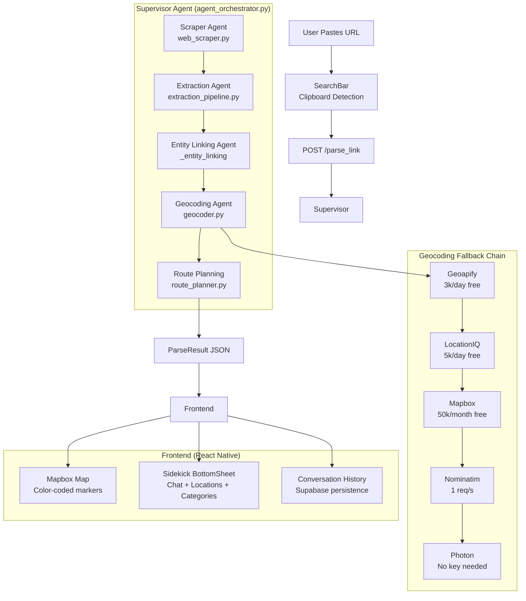

# OurAtlas — AI-Powered Travel Itinerary Extractor

Automatically extract travel locations from Reddit posts and web URLs, plan optimal routes, and visualize them on a map.

Built with **React Native (Expo SDK 56)** + **FastAPI (Python)** + **DeepSeek V4 Flash LLM** + **Mapbox**.

> **Expo SDK v56**: This project targets the latest Expo SDK. Always consult the [official Expo v56 docs](https://docs.expo.dev/versions/v56.0.0/) before making build/config changes.

---

## Demo

[Demonstration Video](./demo.mp4)

---

## Multi-Agent Workflow


```mermaid
graph TD
    User[User Pastes URL] --> SearchBar[SearchBar<br/>Clipboard Detection]
    SearchBar --> API[POST /parse_link]

    subgraph "Supervisor Agent (agent_orchestrator.py)"
        Scraper[Scraper Agent<br/>web_scraper.py]
        Extraction[Extraction Agent<br/>extraction_pipeline.py]
        EntityLink[Entity Linking Agent<br/>_entity_linking]
        Geocoding[Geocoding Agent<br/>geocoder.py]
        Route[Route Planning<br/>route_planner.py]

        Scraper --> Extraction
        Extraction --> EntityLink
        EntityLink --> Geocoding
        Geocoding --> Route
    end

    API --> Supervisor

    subgraph "Geocoding Fallback Chain"
        G1[Geoapify<br/>3k/day free]
        G2[LocationIQ<br/>5k/day free]
        G3[Mapbox<br/>50k/month free]
        G4[Nominatim<br/>1 req/s]
        G5[Photon<br/>No key needed]

        G1 --> G2 --> G3 --> G4 --> G5
    end

    Geocoding --> G1

    Route --> Response[ParseResult JSON]
    Response --> Frontend

    subgraph "Frontend (React Native)"
        Map[Mapbox Map<br/>Color-coded markers]
        Sidekick[Sidekick BottomSheet<br/>Chat + Locations + Categories]
        History[Conversation History<br/>Supabase persistence]
    end

    Frontend --> Map
    Frontend --> Sidekick
    Frontend --> History
```

---

## Architecture Overview

```
┌─────────────────────────────────────────────────────┐
│              React Native App (Expo)                 │
│                                                      │
│  ┌───────────────────────────────────────────────┐  │
│  │  HomeScreen                                    │  │
│  │  ┌─────────┐  ┌──────────┐  ┌──────────────┐ │  │
│  │  │SearchBar│  │MapboxMap │  │   Sidekick    │ │  │
│  │  │         │  │Green     │  │ Chat          │ │  │
│  │  │         │  │Blue Red  │  │ Location      │ │  │
│  │  │         │  │ Markers  │  │ Locations     │ │  │
│  │  └─────────┘  └──────────┘  │  by Category  │ │  │
│  │                             └──────────────┘ │  │
│  └───────────────────────────────────────────────┘  │
│                        │                            │
│              HTTP POST /parse_link                   │
│                        │                            │
└────────────────────────┼────────────────────────────┘
                         │
┌────────────────────────┼────────────────────────────┐
│              FastAPI Backend (Python)                │
│                                                      │
│  Supervisor Agent Orchestrator                       │
│  ┌───────────────────────────────────────────────┐  │
│  │ 1. Scraper Agent  (Reddit/Web)               │  │
│  │ 2. Extraction Agent (LLM + Hierarchy Filter) │  │
│  │ 3. Entity Linking Agent (LLM Disambiguation) │  │
│  │ 4. Geocoding Agent (5-layer fallback)        │  │
│  │ 5. Route Planning (TSP + 2-opt)              │  │
│  │ 6. Conversation Manager (Memory)             │  │
│  └───────────────────────────────────────────────┘  │
│                                                      │
│  API Endpoints:                                      │
│  POST /parse_link  POST /chat  GET /sessions         │
│  POST /sessions/{id}/save  GET /conversations        │
└──────────────────────────────────────────────────────┘
```

---

## Features

### Multi-Agent AI Pipeline

| Agent | Responsibility | Technology |
|-------|---------------|------------|
| **Supervisor** | Orchestrates all agents, manages session context | DeepSeek V4 Flash |
| **Scraper** | Fetches content from Reddit/any webpage | Reddit JSON API + trafilatura |
| **Extraction** | Extracts geographic entities with hierarchy filtering | DeepSeek + Rule Engine |
| **Entity Linking** | Disambiguates names (ROM→Royal Ontario Museum) | DeepSeek + Category Rules |
| **Geocoding** | Converts place names to coordinates | 5-layer fallback chain |
| **Route Planning** | Computes shortest path | TSP + 2-opt |
| **Conversation** | Follow-up chat with tool calling | Agent Loop |

### Smart Geocoding

| Layer | Service | Free Tier | Coverage |
|-------|---------|-----------|----------|
| 1 | Geoapify | 3,000 req/day | Best POI |
| 2 | LocationIQ | 5,000 req/day | Excellent |
| 3 | Mapbox | 50,000 req/month | POI (fallback) |
| 4 | Nominatim | 1 req/s | OSM data |
| 5 | Photon | Unlimited | OSM data |

### Map Visualization

- **Color-coded markers**: Green Recommended / Blue Neutral / Red Not Recommended
- **Category grouping**: Tourist Attractions, Dining, Museums, etc.
- **Smart clustering**: Centers on densest area, ignores outlier coordinates
- **Location descriptions**: One-sentence summary from Reddit comments

### Conversational AI

- Follow-up chat after extraction to refine, add, or remove locations
- Tool-calling loop for dynamic map/route operations
- Session memory across conversations (in-memory + Supabase)

### Save Conversation Persistence

- Save sessions to Supabase for later retrieval
- Load past conversations with full message history
- Multi-device access via cloud storage

---

## Performance Metrics

| Metric | Paris Dataset | Toronto Dataset | Washington DC |
|--------|--------------|----------------|---------------|
| Recall | ~44% | ~95% | ~85% |
| Precision | ~91% | ~95% | ~90% |
| Geocoding Accuracy | ~80% | ~75% | ~70% |
| End-to-end time | ~15-25s | ~15-25s | ~15-25s |

---

## Getting Started

### Prerequisites

- **Python 3.10+**
- **Node.js 18+**
- **Xcode 16+** (iOS Simulator)
- **CocoaPods** >= 1.16
- **Mapbox, Geoapify, LocationIQ API keys** (in `.env`)

### Installation & Setup

```bash
# 1. Install backend dependencies
cd backend
pip install -r requirements.txt
cd ..

# 2. Install frontend dependencies
npm install

# 3. Configure .env
# Copy from .env.example and fill in your API keys
cp .env.example .env
```

> **Note**: The project uses `@rnmapbox/maps@10.3.1` (Mapbox v11). A Mapbox public access token (`pk.`) is required in `.env` under `MAPBOX_ACCESS_TOKEN`.

### Start the App

**Terminal 1 — Backend:**
```bash
cd /path/to/atlas-mobile
uvicorn backend.main:app --reload --port 8000
```

**Terminal 2 — Frontend:**
```bash
cd /path/to/atlas-mobile
npx expo run:ios
```

For subsequent runs after the initial build:
```bash
npx expo start --dev-client
```

### Usage

1. Copy a Reddit post URL (or any travel webpage)
2. Tap the search bar — clipboard is auto-detected
3. Tap **Paste** — Press send button
4. Wait **15-25 seconds** for AI processing
5. Sidekick appears with extracted locations
6. Explore: Chat, Locations by Category, Color-coded map markers

> **Tip**: Press `r` in the terminal to reload the JS bundle. Press `d` to open the developer menu on device/simulator.

---

## API Endpoints

| Method | Endpoint | Description |
|--------|----------|-------------|
| POST | `/parse_link` | Parse URL → extract locations → plan route |
| POST | `/chat` | Continue conversation with AI agent |
| GET | `/sessions` | List active sessions |
| POST | `/sessions/{id}/save` | Persist session to Supabase |
| GET | `/conversations` | List saved conversations |
| GET | `/conversations/{id}` | Load full conversation |
| DELETE | `/conversations/{id}` | Delete conversation |
| GET | `/health` | Health check |

---

## Project Structure

```
atlas-mobile/
├── app.config.js              # Expo configuration (plugins, env vars)
├── App.tsx                    # Root component with error boundary
├── backend/                   # FastAPI parse/fetch backend
│   ├── main.py                # FastAPI app entry point
│   ├── requirements.txt       # Python dependencies
│   └── services/
│       ├── agent_orchestrator.py  # Supervisor Agent (pipeline + chat loop)
│       ├── web_scraper.py         # Multi-source scraper (Reddit + generic)
│       ├── extraction_pipeline.py # Hierarchical extraction (LLM + rules)
│       ├── geocoder.py            # 5-layer geocoding fallback chain
│       ├── route_planner.py       # TSP + 2-opt route optimizer
│       ├── llm_client.py          # DeepSeek V4 Flash client
│       ├── tool_definitions.py    # Tool schemas + registry
│       ├── conversation_manager.py# Three-tier memory system
│       ├── supabase_service.py    # Supabase persistence
│       ├── reddit_fetcher.py      # Reddit JSON API fetcher
│       └── cache.py               # In-memory TTL cache
├── src/
│   ├── features/
│   │   ├── home/
│   │   │   ├── HomeScreen.tsx  # Main screen (map + search + sidekick)
│   │   │   ├── SearchBar.tsx   # Search bar with clipboard detection
│   │   │   └── Sidekick.tsx    # Bottom-sheet panel with chat
│   │   ├── map/
│   │   │   └── MapboxMap.tsx   # Mapbox map with markers + route
│   │   ├── collections/        # Saved collections
│   │   ├── import/             # Import screens
│   │   └── place/              # Place detail screens
│   ├── services/
│   │   ├── apiService.ts       # Backend API client
│   │   ├── aiService.ts        # AI service helpers
│   │   └── ...
│   ├── types/
│   │   └── route.ts            # TypeScript types
│   └── utils/
│       └── constants.ts        # API URL, map defaults
├── .env                       # Local environment variables
├── assets/                    # App icons & splash screen
├── docs/                      # Documentation & schema
└── demo.mp4                   # Demo video
```

---

## Tech Stack

| Component | Library |
|-----------|---------|
| Framework | React Native 0.85 + Expo SDK 56 |
| Map SDK | `@rnmapbox/maps@10.3.1` (Mapbox v11) |
| Navigation | `@react-navigation/native` v7 |
| Gestures | `react-native-gesture-handler` |
| Animations | `react-native-reanimated` |
| Bottom Sheet | `@gorhom/bottom-sheet` |
| Backend | FastAPI (Python 3.10+) |
| LLM | DeepSeek V4 Flash |
| Geocoding | Geoapify / LocationIQ / Mapbox / Nominatim / Photon |
| Database | Supabase (PostgreSQL) |

---

## Changelog

### v2.0.0 — Multi-Agent Pipeline

#### New Features

| Change | Description |
|--------|-------------|
| **Supervisor Agent** | [`agent_orchestrator.py`](backend/services/agent_orchestrator.py) coordinates all sub-agents in a deterministic pipeline for speed & reliability |
| **Multi-source scraper** | [`web_scraper.py`](backend/services/web_scraper.py) supports Reddit + any webpage via trafilatura + httpx fallback |
| **Hierarchical extraction** | [`extraction_pipeline.py`](backend/services/extraction_pipeline.py): two-stage LLM+rule pipeline with hierarchy level filtering (0=POI → 4=Country) |
| **Entity Linking** | Dedicated LLM call to disambiguate abbreviations (ROM→Royal Ontario Museum) and generic terms ("the bridge"→"Golden Gate Bridge") |
| **5-layer geocoding fallback** | Geoapify → LocationIQ → Mapbox → Nominatim → Photon, with confidence scoring and city-context proximity bias |
| **TSP route optimization** | Greedy nearest-neighbor + 2-opt improvement in [`route_planner.py`](backend/services/route_planner.py) |
| **Conversation memory** | Three-tier system (short-term context → session memory → Supabase persistence) |
| **Chat agent loop** | Follow-up chat with tool calling (add/remove pins, re-route, geocode new locations) |
| **Supabase persistence** | Save/load conversations, messages, and locations across sessions |

#### Performance Improvements

| Area | Before (v1) | After (v2) |
|------|------------|------------|
| **Geocoding accuracy** | Single Mapbox API (~60%) | 5-layer chain (~75-80%) |
| **Recall** | ~30-50% (LLM only) | ~44-95% (hierarchical extraction) |
| **Precision** | ~85% | ~90-95% (entity linking + validation) |
| **Outlier detection** | None | 500km cluster-based validation |
| **Deduplication** | Post-geocode only | Pre-geocode + post-geocode (by name) |

#### Bug Fixes & Improvements

| Fix | Detail |
|-----|--------|
| **Geocoding query bloat** | Simplified queries to just place name (removed redundant context that caused 403 errors) |
| **Duplicate locations** | Pre-geocode name dedup + post-geocode name dedup |
| **Cross-country errors** | Added 500km outlier threshold from cluster median center |
| **Region inference** | LLM now infers primary region + geocodes it for proximity bias |
| **Cache** | Separate TTL for geocoding (24h) vs pipeline results (1h) |
| **Error handling** | Graceful degradation: if one geocoder fails, fall through to the next |

---

## Troubleshooting

### `pod install` fails

```bash
cd ios && pod install --repo-update
```

### Build fails with stale cache errors

```bash
rm -rf node_modules/expo-modules-jsi/apple/.DerivedData
rm -rf ~/Library/Developer/Xcode/DerivedData
npx expo run:ios
```

### Map shows a blank or 64×64 area

This indicates the Mapbox `MapView` couldn't measure its container. The component uses `useWindowDimensions` to set explicit dimensions — ensure the parent view has proper layout constraints.

### Backend not responding

Ensure the backend is running on port 8000:
```bash
curl http://localhost:8000/health
# → {"status": "ok"}
```

---

## Production Build

```bash
npm install -g eas-cli
eas build --platform ios
```

---

## License

MIT
