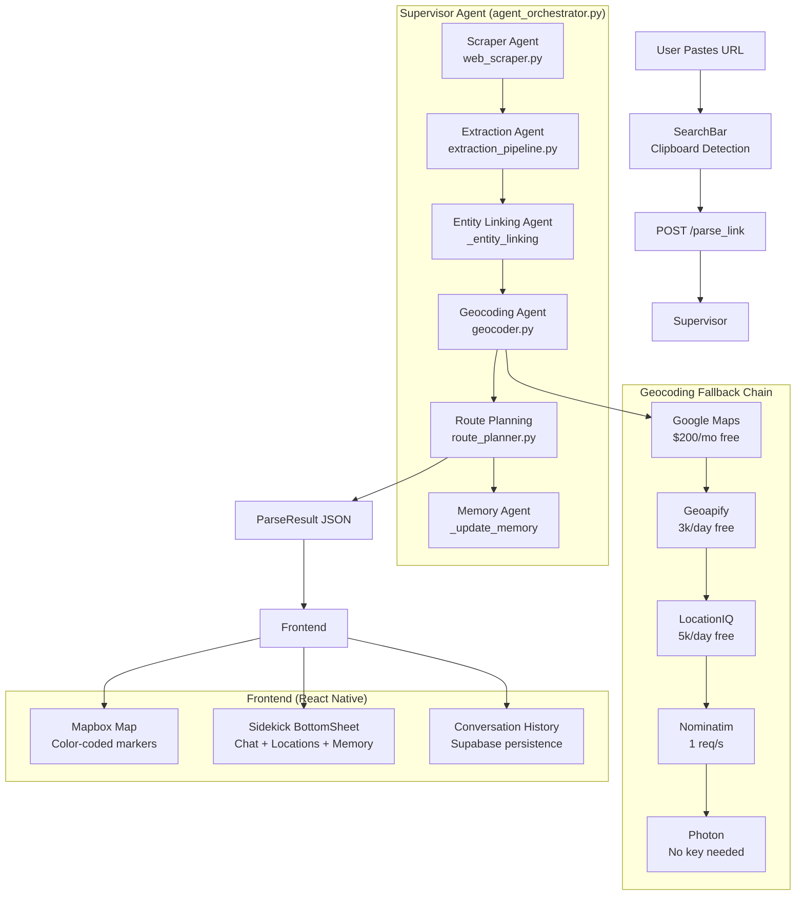
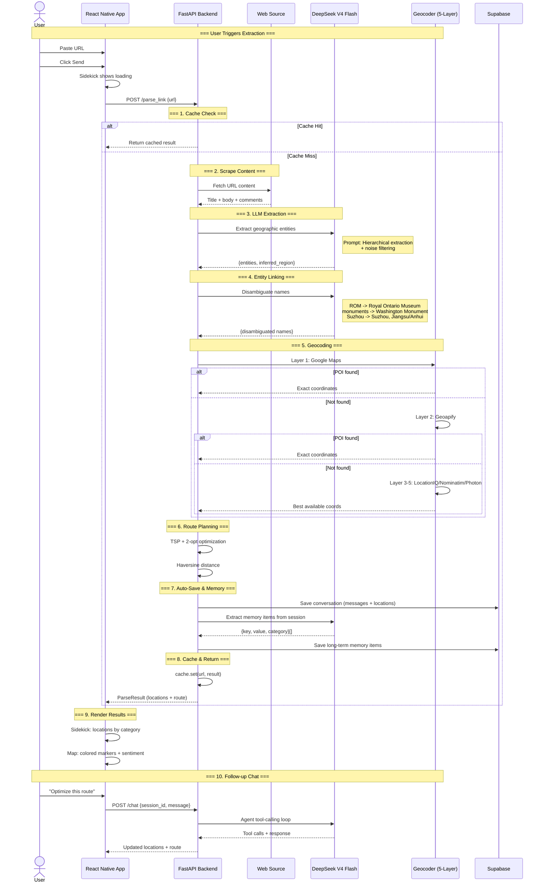

# OurAtlas — AI-Powered Travel Itinerary Extractor

Automatically extract travel locations from Reddit posts and web URLs, plan optimal routes, and visualize them on a map.

Built with **React Native (Expo SDK 56)** + **FastAPI (Python)** + **DeepSeek V4 Flash LLM** + **Mapbox**.

> **Expo SDK v56**: This project targets the latest Expo SDK. Always consult the [official Expo v56 docs](https://docs.expo.dev/versions/v56.0.0/) before making build/config changes.

---

## Demo

[Demonstration Video](./demo.mp4)

---

## Multi-Agent Workflow


```mermaid
graph TD
    User[User Pastes URL] --> SearchBar[SearchBar<br/>Clipboard Detection]
    SearchBar --> API[POST /parse_link]

    subgraph "Supervisor Agent (agent_orchestrator.py)"
        Scraper[Scraper Agent<br/>web_scraper.py]
        Extraction[Extraction Agent<br/>extraction_pipeline.py]
        EntityLink[Entity Linking Agent<br/>_entity_linking]
        Geocoding[Geocoding Agent<br/>geocoder.py]
        Route[Route Planning<br/>route_planner.py]
        Memory[Memory Agent<br/>_update_memory]

        Scraper --> Extraction
        Extraction --> EntityLink
        EntityLink --> Geocoding
        Geocoding --> Route
        Route --> Memory
    end

    API --> Supervisor

    subgraph "Geocoding Fallback Chain"
        G1[Google Maps<br/>$200/mo free]
        G2[Geoapify<br/>3k/day free]
        G3[LocationIQ<br/>5k/day free]
        G4[Nominatim<br/>1 req/s]
        G5[Photon<br/>No key needed]

        G1 --> G2 --> G3 --> G4 --> G5
    end

    Geocoding --> G1

    Route --> Response[ParseResult JSON]
    Response --> Frontend

    subgraph "Frontend (React Native)"
        Map[Mapbox Map<br/>Color-coded markers]
        Sidekick[Sidekick BottomSheet<br/>Chat + Locations + Memory]
        History[Conversation History<br/>Supabase persistence]
    end

    Frontend --> Map
    Frontend --> Sidekick
    Frontend --> History
```

---

## Architecture Overview

```
┌─────────────────────────────────────────────────────┐
│              React Native App (Expo)                 │
│                                                      │
│  ┌───────────────────────────────────────────────┐  │
│  │  HomeScreen                                    │  │
│  │  ┌─────────┐  ┌──────────┐  ┌──────────────┐ │  │
│  │  │SearchBar│  │MapboxMap │  │   Sidekick    │ │  │
│  │  │         │  │Green     │  │ Chat          │ │  │
│  │  │         │  │Blue Red  │  │ Location      │ │  │
│  │  │         │  │ Markers  │  │ Locations     │ │  │
│  │  │         │  │Click to  │  │ by Category   │ │  │
│  │  │         │  │highlight │  │               │ │  │
│  │  │         │  │list item │  │ Memory Tab    │ │  │
│  │  └─────────┘  └──────────┘  └──────────────┘ │  │
│  └───────────────────────────────────────────────┘  │
│                        │                            │
│              HTTP POST /parse_link                   │
│                        │                            │
└────────────────────────┼────────────────────────────┘
                         │
┌────────────────────────┼────────────────────────────┐
│              FastAPI Backend (Python)                │
│                                                      │
│  Supervisor Agent Orchestrator                       │
│  ┌───────────────────────────────────────────────┐  │
│  │ 1. Scraper Agent  (Reddit/Web)               │  │
│  │ 2. Extraction Agent (LLM + Hierarchy Filter) │  │
│  │ 3. Entity Linking Agent (LLM Disambiguation) │  │
│  │ 4. Geocoding Agent (5-layer fallback)        │  │
│  │ 5. Route Planning (TSP + 2-opt)              │  │
│  │ 6. Conversation Manager (Memory - Supabase)  │  │
│  └───────────────────────────────────────────────┘  │
│                                                      │
│  API Endpoints:                                      │
│  POST /parse_link  POST /chat  GET /sessions         │
│  POST /sessions/{id}/save  GET /conversations        │
│  GET /memories  POST /memories                       │
└──────────────────────────────────────────────────────┘
```

---

## Data Flow


```mermaid
sequenceDiagram
    actor User
    participant App as React Native App
    participant Backend as FastAPI Backend
    participant Source as Web Source
    participant LLM as DeepSeek V4 Flash
    participant Geo as Geocoder (5-Layer)
    participant DB as Supabase

    Note over User,Geo: === User Triggers Extraction ===
    
    User->>App: Paste URL
    User->>App: Click Send
    
    App->>App: Sidekick shows loading
    App->>Backend: POST /parse_link {url}
    
    Note over Backend: === 1. Cache Check ===
    alt Cache Hit
        Backend-->>App: Return cached result
    else Cache Miss
        Note over Backend,Source: === 2. Scrape Content ===
        Backend->>Source: Fetch URL content
        Source-->>Backend: Title + body + comments
        
        Note over Backend,LLM: === 3. LLM Extraction ===
        Backend->>LLM: Extract geographic entities
        Note right of LLM: Prompt: Hierarchical extraction<br/>+ noise filtering
        LLM-->>Backend: {entities, inferred_region}
        
        Note over Backend,LLM: === 4. Entity Linking ===
        Backend->>LLM: Disambiguate names
        Note right of LLM: ROM -> Royal Ontario Museum<br/>monuments -> Washington Monument<br/>Suzhou -> Suzhou, Jiangsu/Anhui
        LLM-->>Backend: {disambiguated names}
        
        Note over Backend,Geo: === 5. Geocoding ===
        Backend->>Geo: Layer 1: Google Maps
        alt POI found
            Geo-->>Backend: Exact coordinates
        else Not found
            Geo->>Geo: Layer 2: Geoapify
            alt POI found
                Geo-->>Backend: Exact coordinates
            else Not found
                Geo->>Geo: Layer 3-5: LocationIQ/Nominatim/Photon
                Geo-->>Backend: Best available coords
            end
        end
        
        Note over Backend: === 6. Route Planning ===
        Backend->>Backend: TSP + 2-opt optimization
        Backend->>Backend: Haversine distance
        
        Note over Backend: === 7. Auto-Save & Memory ===
        Backend->>DB: Save conversation (messages + locations)
        Backend->>LLM: Extract memory items from session
        LLM-->>Backend: {key, value, category}[]
        Backend->>DB: Save long-term memory items
        
        Note over Backend: === 8. Cache & Return ===
        Backend->>Backend: cache.set(url, result)
        Backend-->>App: ParseResult (locations + route)
    end
    
    Note over App: === 9. Render Results ===
    App->>App: Sidekick: locations by category
    App->>App: Map: colored markers + sentiment
    
    Note over User,Geo: === 10. Follow-up Chat ===
    User->>App: "Optimize this route"
    App->>Backend: POST /chat {session_id, message}
    Backend->>LLM: Agent tool-calling loop
    LLM-->>Backend: Tool calls + response
    Backend-->>App: Updated locations + route
```

---

## Features

### Multi-Agent AI Pipeline

| Agent | Responsibility | Technology |
|-------|---------------|------------|
| **Supervisor** | Orchestrates all agents, manages session context | DeepSeek V4 Flash |
| **Scraper** | Fetches content from Reddit/any webpage | Reddit JSON API + trafilatura |
| **Extraction** | Extracts geographic entities with hierarchy filtering | DeepSeek + Rule Engine |
| **Entity Linking** | Disambiguates names (ROM→Royal Ontario Museum, Suzhou→Suzhou, Jiangsu) | DeepSeek + Category Rules |
| **Geocoding** | Converts place names to coordinates | 5-layer fallback chain |
| **Route Planning** | Computes shortest path | TSP + 2-opt |
| **Memory** | Auto-extracts user preferences/interests from session | DeepSeek + Supabase |
| **Conversation** | Follow-up chat with tool calling | Agent Loop |

### Smart Geocoding

| Layer | Service | Free Tier | Coverage |
|-------|---------|-----------|----------|
| 1 | Google Maps | $200/mo free credit | Best global POI |
| 2 | Geoapify | 3,000 req/day | Best POI |
| 3 | LocationIQ | 5,000 req/day | Excellent |
| 4 | Nominatim | 1 req/s | OSM data |
| 5 | Photon | Unlimited | OSM data |

### Map Visualization

- **Color-coded markers**: Green Recommended / Blue Neutral / Red Not Recommended
- **Category grouping**: Tourist Attractions, Dining, Museums, etc.
- **Smart clustering**: Centers on densest area, ignores outlier coordinates
- **Location descriptions**: One-sentence summary from Reddit comments
- **Marker–List linkage**: Tap a map marker → Sidekick switches to Locations tab & highlights the item
- **Map re-focus**: Loading a saved conversation resets map center/zoom to fit restored locations

### Conversational AI

- Follow-up chat after extraction to refine, add, or remove locations
- Tool-calling loop for dynamic map/route operations
- Session memory across conversations (in-memory + Supabase)

### Long-Term Memory

- **Auto-extraction**: After each `parse_link` or chat, the LLM analyzes the session and saves user preferences/interests to Supabase
- **Memory tab**: View all saved memories in the Sidekick bottom sheet
- **Manual add**: Users can add custom memory items (e.g. "cuisine_preference: loves street food")
- **Categories**: preference, visited_place, interest, disliked, plan
- **Persistence**: Memories survive server restarts (stored in Supabase `long_term_memory` table)

### Save Conversation Persistence

- Auto-save sessions to Supabase after each successful `parse_link`
- Load past conversations with full message history
- Multi-device access via cloud storage
- Supabase RLS policies configured for anonymous read/write

---

## Performance Metrics

| Metric | Paris Dataset | Toronto Dataset | Washington DC |
|--------|--------------|----------------|---------------|
| Recall | ~44% | ~95% | ~85% |
| Precision | ~91% | ~95% | ~90% |
| Geocoding Accuracy | ~80% | ~75% | ~70% |
| End-to-end time | ~15-25s | ~15-25s | ~15-25s |

---

## Getting Started

### Prerequisites

- **Python 3.10+**
- **Node.js 18+**
- **Xcode 16+** (iOS Simulator)
- **CocoaPods** >= 1.16
- **Mapbox, Geoapify, LocationIQ, Google Maps API keys** (in `.env`)

### Installation & Setup

```bash
# 1. Install backend dependencies
cd backend
pip install -r requirements.txt
cd ..

# 2. Install frontend dependencies
npm install

# 3. Configure .env
# Copy from .env.example and fill in your API keys
cp .env.example .env
```

> **Note**: The project uses `@rnmapbox/maps@10.3.1` (Mapbox v11). A Mapbox public access token (`pk.`) is required in `.env` under `MAPBOX_ACCESS_TOKEN`.

### Start the App

**Terminal 1 — Backend:**
```bash
cd /path/to/atlas-mobile
uvicorn backend.main:app --reload --port 8000
```

**Terminal 2 — Frontend:**
```bash
cd /path/to/atlas-mobile
npx expo run:ios
```

For subsequent runs after the initial build:
```bash
npx expo start --dev-client
```

### Usage

1. Copy a Reddit post URL (or any travel webpage)
2. Tap the search bar — clipboard is auto-detected
3. Tap **Paste** — Press send button
4. Wait **15-25 seconds** for AI processing
5. Sidekick appears with extracted locations
6. Explore: Chat, Locations by Category, Color-coded map markers, Memory tab

> **Tip**: Press `r` in the terminal to reload the JS bundle. Press `d` to open the developer menu on device/simulator.

---

## API Endpoints

| Method | Endpoint | Description |
|--------|----------|-------------|
| POST | `/parse_link` | Parse URL → extract locations → plan route |
| POST | `/chat` | Continue conversation with AI agent |
| GET | `/sessions` | List active sessions |
| POST | `/sessions/{id}/save` | Persist session to Supabase |
| GET | `/conversations` | List saved conversations |
| GET | `/conversations/{id}` | Load full conversation |
| DELETE | `/conversations/{id}` | Delete conversation |
| **GET** | **`/memories`** | **List all long-term memories** |
| **POST** | **`/memories`** | **Add a memory item (key/value/category)** |
| GET | `/health` | Health check |

---

## Project Structure

```
atlas-mobile/
├── app.config.js              # Expo configuration (plugins, env vars)
├── App.tsx                    # Root component with error boundary
├── backend/                   # FastAPI parse/fetch backend
│   ├── main.py                # FastAPI app entry point
│   ├── requirements.txt       # Python dependencies
│   └── services/
│       ├── agent_orchestrator.py  # Supervisor Agent (pipeline + chat loop + memory update)
│       ├── web_scraper.py         # Multi-source scraper (Reddit + generic)
│       ├── extraction_pipeline.py # Hierarchical extraction (LLM + rules)
│       ├── geocoder.py            # 5-layer geocoding fallback chain (Google Maps→Geoapify→...)
│       ├── route_planner.py       # TSP + 2-opt route optimizer
│       ├── llm_client.py          # DeepSeek V4 Flash client
│       ├── tool_definitions.py    # Tool schemas + registry
│       ├── conversation_manager.py# Three-tier memory system
│       ├── supabase_service.py    # Supabase persistence (conversations + memories)
│       ├── reddit_fetcher.py      # Reddit JSON API fetcher
│       └── cache.py               # In-memory TTL cache
├── src/
│   ├── features/
│   │   ├── home/
│   │   │   ├── HomeScreen.tsx  # Main screen (map + search + sidekick)
│   │   │   ├── SearchBar.tsx   # Search bar with clipboard detection
│   │   │   └── Sidekick.tsx    # Bottom-sheet panel with chat + locations + memory
│   │   ├── map/
│   │   │   └── MapboxMap.tsx   # Mapbox map with markers + route + marker selection
│   │   ├── collections/        # Saved collections
│   │   ├── import/             # Import screens
│   │   └── place/              # Place detail screens
│   ├── services/
│   │   ├── apiService.ts       # Backend API client (parse, chat, sessions, memories)
│   │   ├── aiService.ts        # AI service helpers
│   │   └── ...
│   ├── types/
│   │   ├── route.ts            # TypeScript types (incl. MemoryItem)
│   │   └── ...
│   └── utils/
│       └── constants.ts        # API URL, map defaults
├── .env                       # Local environment variables
├── assets/                    # App icons & splash screen
├── docs/                      # Documentation & schema
│   ├── schema.sql             # Database schema
│   ├── supabase-rls-policies.sql  # RLS policies for anon access
│   └── erd.dbml               # Entity relationship diagram
└── demo.mp4                   # Demo video
```

---

## Tech Stack

| Component | Library |
|-----------|---------|
| Framework | React Native 0.85 + Expo SDK 56 |
| Map SDK | `@rnmapbox/maps@10.3.1` (Mapbox v11) |
| Navigation | `@react-navigation/native` v7 |
| Gestures | `react-native-gesture-handler` |
| Animations | `react-native-reanimated` |
| Bottom Sheet | `@gorhom/bottom-sheet` |
| Backend | FastAPI (Python 3.10+) |
| LLM | DeepSeek V4 Flash |
| Geocoding | Google Maps / Geoapify / LocationIQ / Nominatim / Photon |
| Database | Supabase (PostgreSQL) |

---

## Changelog

### v2.1.0 — Long-Term Memory & Marker–List Linkage

#### New Features

| Change | Description |
|--------|-------------|
| **Long-Term Memory** | [`agent_orchestrator.py`](backend/services/agent_orchestrator.py) `_update_memory` auto-extracts user preferences/interests from each session using LLM, saves to Supabase `long_term_memory` table |
| **Memory API** | [`GET /memories`](backend/main.py:264) and [`POST /memories`](backend/main.py:271) endpoints for listing/adding memory items |
| **Memory Tab in Sidekick** | [`Sidekick.tsx`](src/features/home/Sidekick.tsx) new "Memory" tab with load/add UI for viewing and creating memory items |
| **Marker–List Linkage** | [`MapboxMap.tsx`](src/features/map/MapboxMap.tsx) `selectedMarkerId`/`onSelectedMarkerChange` props — tapping a marker switches Sidekick to Locations tab and highlights the item |
| **Map Re-focus on Load** | [`HomeScreen.tsx`](src/features/home/HomeScreen.tsx) `loadConversation` resets `customCenter`/`customZoom`/`selectedMarkerId` so restored locations fit the viewport |
| **Auto-Save After Parse** | [`HomeScreen.tsx`](src/features/home/HomeScreen.tsx) calls `saveSession` automatically after successful `parse_link` |
| **Auto-Save + Memory in Pipeline** | [`agent_orchestrator.py`](backend/services/agent_orchestrator.py) `run_pipeline` now auto-saves conversation and updates memory after extraction |

#### Geocoding Improvements

| Change | Detail |
|--------|--------|
| **Google Maps as Layer 1** | [`geocoder.py`](backend/services/geocoder.py) replaced Mapbox geocoding with Google Maps Geocoding API as the primary layer ($200/mo free credit, best global POI coverage) |
| **Geoapify becomes Layer 2** | Shifted to second position in the fallback chain |
| **Simplified confidence scoring** | Removed Mapbox-specific confidence computation; simplified to pass-through from upstream API |
| **Dynamic outlier threshold** | [`agent_orchestrator.py`](backend/services/agent_orchestrator.py) `_validate_coordinates` uses dynamic threshold (median distance × 8, clamped to 200-2000km) instead of fixed 500km |

#### Entity Linking Enhancements

| Change | Detail |
|--------|--------|
| **Geographic context appending** | Entity Linking now appends region/province/state to ambiguous names (e.g. "Suzhou, Jiangsu" vs "Suzhou, Anhui", "Cambridge, UK" vs "Cambridge, Massachusetts") |
| **Chinese location disambiguation** | Added examples for Chinese cities (Suzhou in Jiangsu vs Anhui) |
| **Generic term resolution** | Resolves "monuments"→"Washington Monument", "the bridge"→"Golden Gate Bridge" etc. |

#### Bug Fixes & Improvements

| Fix | Detail |
|-----|--------|
| **Memory JSON parsing** | [`agent_orchestrator.py`](backend/services/agent_orchestrator.py) `_update_memory` f-string `{}` escaped to `{{}}` for JSON prompt; added robust markdown code fence stripping + unwrap logic |
| **Supabase memory schema** | [`supabase_service.py`](backend/services/supabase_service.py) removed `session_id` column from insert (table doesn't have the column) |
| **Memory without session** | [`conversation_manager.py`](backend/services/conversation_manager.py) `add_memory` now persists to Supabase even without an active in-memory session |
| **Sidekick save button removed** | Save is now automatic after parse; removed manual save button from Sidekick |
| **Supabase RLS policies** | Added [`docs/supabase-rls-policies.sql`](docs/supabase-rls-policies.sql) for anonymous read/write on all tables |
| **Map center offset** | [`HomeScreen.tsx`](src/features/home/HomeScreen.tsx) applies latitude offset to prevent markers from being hidden behind the Sidekick bottom sheet |

---

## Troubleshooting

### `pod install` fails

```bash
cd ios && pod install --repo-update
```

### Build fails with stale cache errors

```bash
rm -rf node_modules/expo-modules-jsi/apple/.DerivedData
rm -rf ~/Library/Developer/Xcode/DerivedData
npx expo run:ios
```

### Map shows a blank or 64×64 area

This indicates the Mapbox `MapView` couldn't measure its container. The component uses `useWindowDimensions` to set explicit dimensions — ensure the parent view has proper layout constraints.

### Backend not responding

Ensure the backend is running on port 8000:
```bash
curl http://localhost:8000/health
# → {"status": "ok"}
```

---

## Production Build

```bash
npm install -g eas-cli
eas build --platform ios
```

---

## License

MIT
