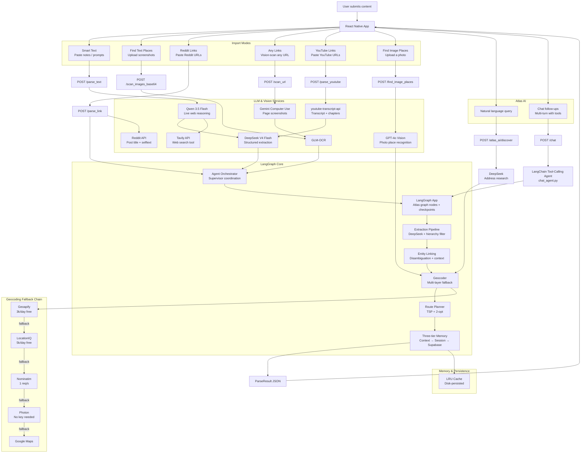
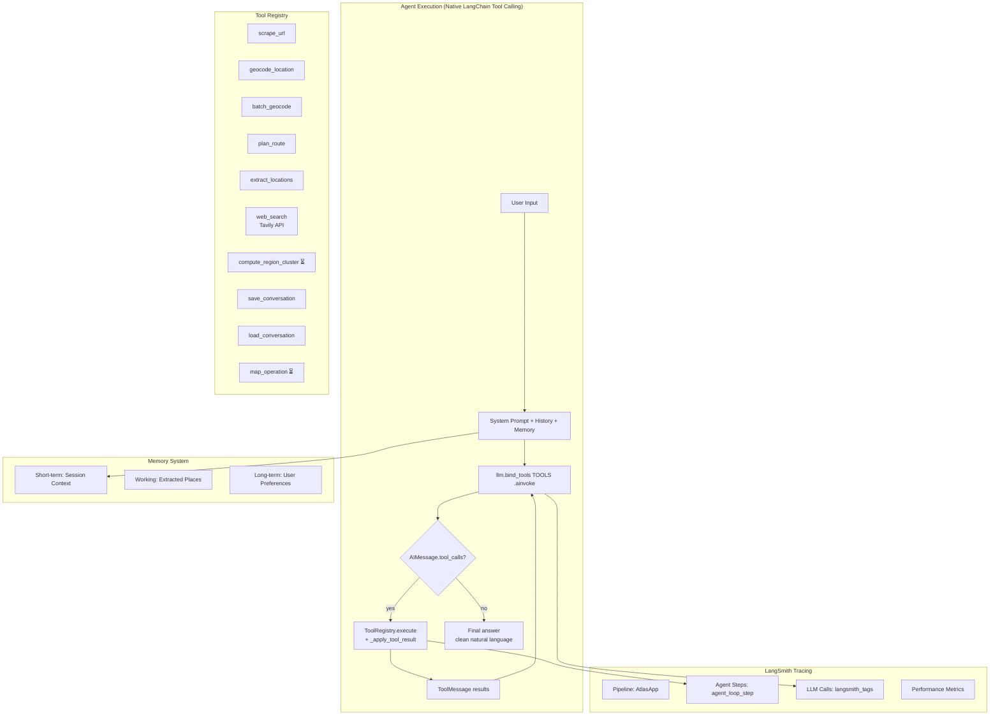
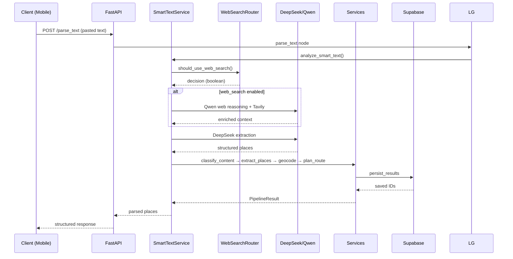
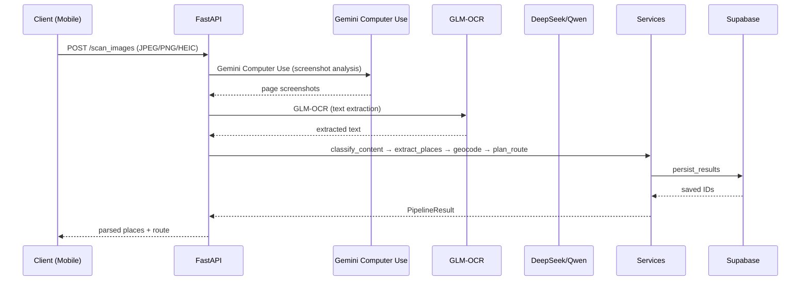
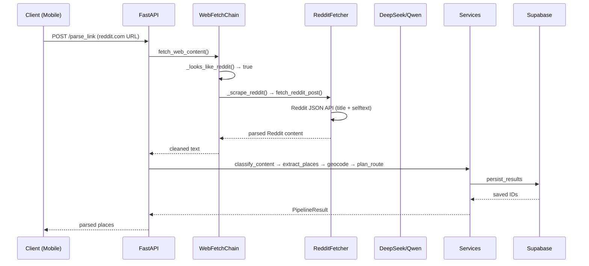
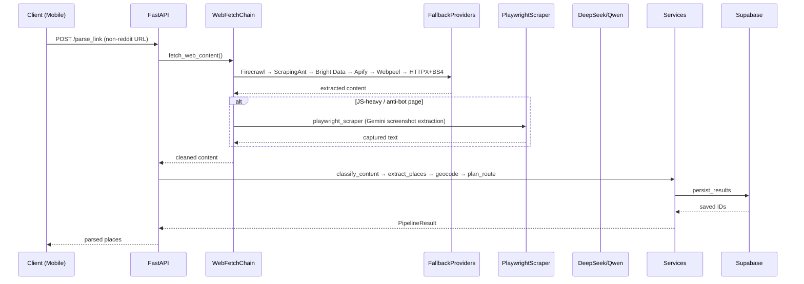
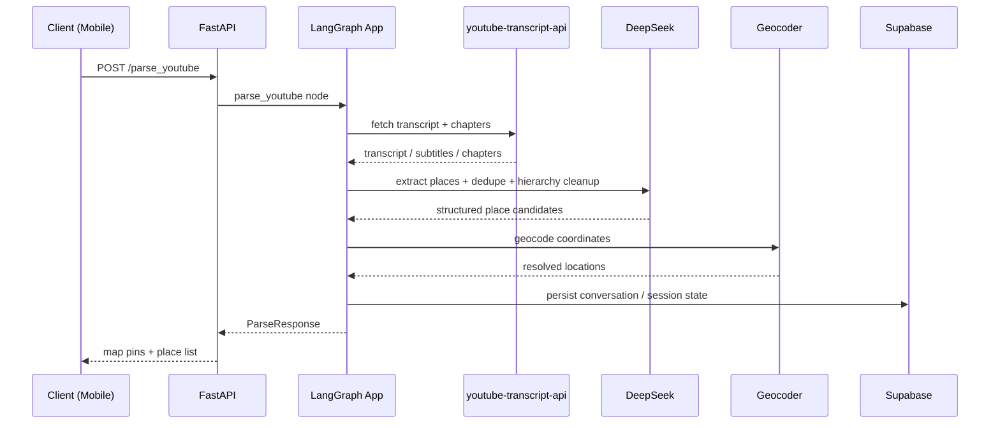
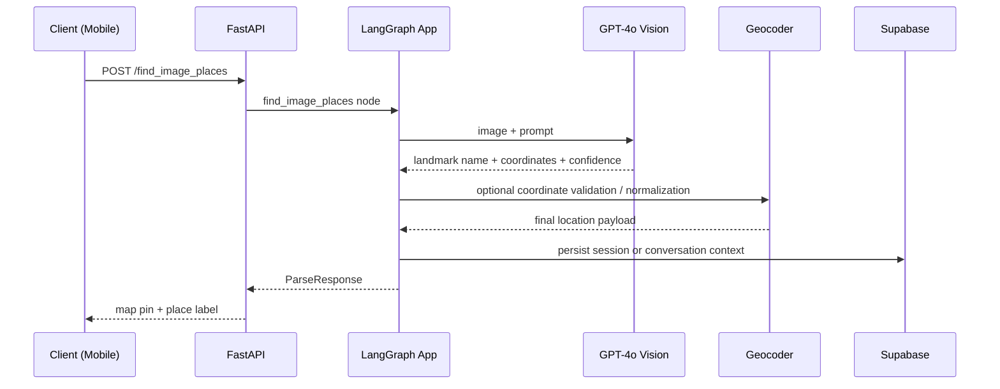
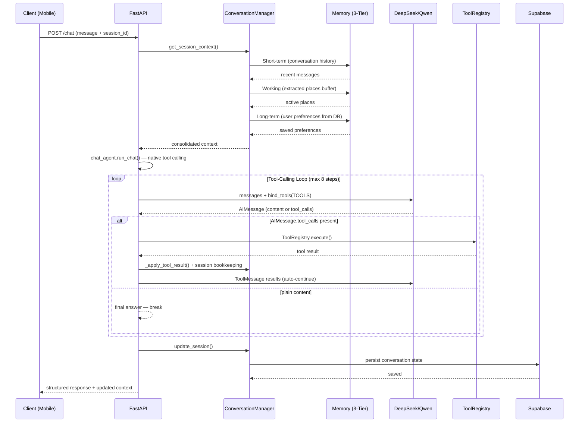

# OurAtlas — AI-Powered Travel Location Extractor

Extract real-world places from Reddit posts, pasted text, web pages, screenshots, YouTube videos, and images — then geocode them, plan optimal routes, and visualize them on an interactive Mapbox map.

Built with **React Native (Expo SDK 56)** + **FastAPI (Python)** + **LangChain 1.0 / LangGraph** + **DeepSeek V4 Flash** + **Qwen 3.5 Flash** + **Gemini 3.5 Flash** + **GLM-OCR** + **Mapbox**.

> **Expo SDK v56**: This project targets the latest Expo SDK. Always consult the [official Expo v56 docs](https://docs.expo.dev/versions/v56.0.0/) before making build/config changes.

---

## Multi-Agent Workflow

The system uses **LangChain 1.0 / LangGraph** to build a multi-agent collaboration system. Import pipelines now run through a Studio-visible LangGraph app, while the FastAPI layer stays as a thin compatibility shell for the mobile app.


```mermaid
graph TD
    User[User submits content] --> App[React Native App]

    subgraph "Import Modes"
        ST[Smart Text<br/>Paste notes / prompts]
        FT[Find Text Places<br/>Upload screenshots]
        RL[Reddit Links<br/>Paste Reddit URLs]
        AL[Any Links<br/>Vision-scan any URL]
        YT[YouTube Links<br/>Paste YouTube URLs]
        IF[Find Image Places<br/>Upload a photo]
    end

    subgraph "Atlas AI"
        AA[Natural language query]
        CH[Chat follow-ups<br/>Multi-turn with tools]
    end

    App --> ST
    App --> FT
    App --> RL
    App --> AL
    App --> YT
    App --> IF
    App --> AA
    App --> CH

    RL --> PL[POST /parse_link]
    ST --> PT[POST /parse_text]
    FT --> SI[POST /scan_images_base64]
    AL --> SU[POST /scan_url]
    YT --> YP[POST /parse_youtube]
    IF --> FP[POST /find_image_places]
    AA --> DA[POST /atlas_ai/discover]
    CH --> CE[POST /chat]
    CE --> LCA[LangChain Tool-Calling Agent<br/>chat_agent.py]
    LCA --> LG

    subgraph "LLM & Vision Services"
        QW[Qwen 3.5 Flash<br/>Live web reasoning]
        DS[DeepSeek V4 Flash<br/>Structured extraction]
        TV[Tavily API<br/>Web search tool]
        YTAPI[youtube-transcript-api<br/>Transcript + chapters]
        RED[Reddit API<br/>Post title + selftext]
        GCU[Gemini Computer Use<br/>Page screenshots]
        OCR[GLM-OCR]
        GPT4O[GPT-4o Vision<br/>Photo place recognition]
    end

    subgraph "LangGraph Core"
        LG[LangGraph App<br/>Atlas graph nodes + checkpoints]
        ORCH[Agent Orchestrator<br/>Supervisor coordination]
        EX[Extraction Pipeline<br/>DeepSeek + hierarchy filter]
        EL[Entity Linking<br/>Disambiguation + context]
        GEO[Geocoder<br/>Multi-layer fallback]
        RT[Route Planner<br/>TSP + 2-opt]
        MEM[Memory / Checkpoints<br/>thread state + session memory]
    end

    PT --> QW
    QW --> DS
    QW --> TV
    DS --> ORCH
    PL --> ORCH

    SI --> OCR
    SU --> GCU
    GCU --> OCR
    OCR --> ORCH

    YP --> YTAPI
    YTAPI --> DS
    PL --> RED
    FP --> GPT4O
    GPT4O --> GEO

    DA --> DS2[DeepSeek<br/>Address research]
    DS2 --> GEO

    ORCH --> LG
    LG --> EX
    EX --> EL
    EL --> GEO
    GEO --> RT
    RT --> MEM

    subgraph "Geocoding Fallback Chain"
        G1[Geoapify<br/>3k/day free]
        G2[LocationIQ<br/>5k/day free]
        G3[Nominatim<br/>1 req/s]
        G4[Photon<br/>No key needed]
        G5[Google Maps]
        G1 -->|fallback| G2 -->|fallback| G3 -->|fallback| G4 -->|fallback| G5
    end

    GEO --> G1

    subgraph "Memory & Persistence"
        MEM[Three-tier Memory<br/>Context → Session → Supabase]
        CACHE[LRU Cache<br/>Disk-persisted]
    end

    MEM --> RESP[ParseResult JSON]
    MEM --> CACHE

    RESP --> App
```

---

## LangChain Agent Runtime

The system uses two complementary AI execution models: a **LangGraph StateGraph** for deterministic pipeline orchestration and a **native LangChain tool-calling agent** for dynamic conversational interactions. Tool calls travel in the API's structured `tool_calls` field (never inside message content), and the loop re-invokes the model with tool results until it produces a plain final answer. Memory is managed in three tiers, graph runs are checkpointed by thread, and all LLM calls are traced via LangSmith.


```mermaid
graph TD
    subgraph "Agent Execution (Native LangChain Tool Calling)"
        UI[User Input] --> CB[System Prompt + History + Memory]
        CB --> LLM[llm.bind_tools TOOLS .ainvoke]
        LLM --> TC{AIMessage.tool_calls?}
        TC -->|yes| TREQ[ToolRegistry.execute<br/>+ _apply_tool_result]
        TREQ --> TM[ToolMessage results]
        TM --> LLM
        TC -->|no| RESP[Final answer<br/>clean natural language]
    end

    subgraph "Tool Registry"
        T1[scrape_url]
        T2[geocode_location]
        T3[batch_geocode]
        T4[plan_route]
        T5[extract_locations]
        T6[web_search<br/>Tavily API]
        T7[compute_region_cluster ⏳]
        T8[save_conversation]
        T9[load_conversation]
        T10[map_operation ⏳]
    end

    subgraph "Memory System"
        M1[Short-term: Session Context]
        M2[Working: Extracted Places]
        M3[Long-term: User Preferences]
    end

    subgraph "LangSmith Tracing"
        LS1[Pipeline: AtlasApp]
        LS2[Agent Steps: agent_loop_step]
        LS3[LLM Calls: langsmith_tags]
        LS4[Performance Metrics]
    end

    CB --> M1
    LLM --> LS3
    TREQ --> LS2
```

**How to view Studio and traces**
1. Start the LangGraph Agent Server locally with the repo's `langgraph.json`.
2. Open Studio from the LangSmith UI and connect it to that local server.
3. Run a flow from `backend/langgraph/atlas_graph.py`.
4. Reuse the same `thread_id` to inspect one run across multiple steps.
5. Open a checkpoint to inspect state, replay from that point, or fork a new branch.

**How to view LangSmith Evaluation**
1. Open [smith.langchain.com](https://smith.langchain.com).
2. Create a dataset with input examples and optional reference outputs.
3. Run an experiment against your graph or chain.
4. Inspect each row to see the run output, evaluator scores, and latency/cost.
5. Compare multiple experiments to understand whether a prompt or graph change improved results.

**Architecture Reference**:
- **LangGraph App**: [`backend/langgraph/atlas_graph.py`](backend/langgraph/atlas_graph.py) is the Studio-facing entry point. It dispatches `parse_link`, `parse_text`, `scan_url`, `parse_youtube`, `find_image_places`, `atlas_ai_discover`, and `chat` into graph nodes.
- **StateGraph (DAG Pipeline)**: The parse path still runs as a deterministic graph, but now it is visible to Studio as a graph run with checkpoints and thread state.
- **Chat Agent**: Defined in [`backend/langgraph/chat_agent.py`](backend/langgraph/chat_agent.py). Native LangChain tool calling: the model is bound to the OpenAI-format `TOOLS` schemas via `bind_tools()`, tool calls arrive in `AIMessage.tool_calls` (never in content), each is executed through `ToolRegistry` with side-effects applied to the session, and results are fed back as `ToolMessage`s until the model returns a plain final answer. Runs up to 8 steps per turn with per-tool and total timeouts. Provider/model configurable via `CHAT_PROVIDER` / `CHAT_MODEL` (default DeepSeek).
- **Memory**: [`conversation_manager.py`](backend/services/conversation_manager.py) — Short-term (session messages), working (extracted places), and long-term (user preferences via Supabase). Checkpoints give you thread-scoped time travel during runs.
- **Tracing**: [`observability.py`](backend/services/observability.py) — LangSmith tracing is enabled through environment config, with graph runs, agent loop steps, and LLM calls visible in LangSmith.
- **Studio Entry Point**: [`backend/langgraph_app.py`](backend/langgraph_app.py) + [`langgraph.json`](langgraph.json) expose the graph to LangGraph Studio without changing the FastAPI compatibility layer.

---

## Architecture Overview

| Layer | Technology | Purpose |
|-------|-----------|---------|
| **Mobile Framework** | Expo SDK 56 + React Native | Cross-platform mobile app |
| **Backend Framework** | FastAPI (Python) | REST API server |
| **LLM Orchestration** | LangChain 1.0 / LangGraph | StateGraph pipeline + Agent Loop |
| **LLM Providers** | DeepSeek V4 Flash | Primary: structured extraction, classification, entity linking |
| | Qwen 3.5 Flash | Secondary: web search decision, smart text reasoning |
| | Gemini 3.5 Flash | Vision/OCR: Computer Use, screenshot analysis |
| | GPT-4o | Vision: single-image place recognition |
| **LLM Observability** | LangSmith | Full-stack tracing for LangGraph pipelines & agent calls |
| **OCR** | GLM-OCR | Chinese text extraction from images |
| **Geocoding** | Geoapify → LocationIQ → Google Maps (5-tier fallback) | Address → coordinates resolution |
| **Web Scraping** | Playwright + Trafilatura + HTTPX | Content extraction from URLs |
| **Web Search** | Tavily API | Real-time web search for agent queries |
| **Database** | Supabase (PostgreSQL) | Places, plans, conversations, user data |
| **Maps** | Mapbox GL | Interactive map rendering |

---

## Data Flow

Data flows are split into seven independent pipelines, each with a dedicated processing path.

### Scenario A: Smart Text Pipeline

```
POST /parse_text
→ backend/langgraph/atlas_graph.py: parse_text node
  → smart_text_service.py: analyze_smart_text()
    → web_search_router.py: should_use_web_search()
    → (optional) web_search() via Tavily
    → LLM (Qwen for web reasoning, DeepSeek for extraction)
  → content_classifier.py: classify_content()
  → extraction_pipeline.py: extract_places()
  → geocoder.py: geocode()
  → route_planner.py: plan_route()
  → supabase_service.py: persist()
```


```mermaid
sequenceDiagram
    participant C as Client (Mobile)
    participant API as FastAPI
    participant STS as SmartTextService
    participant WSR as WebSearchRouter
    participant LLM as DeepSeek/Qwen
    participant S as Services
    participant DB as Supabase

    C->>API: POST /parse_text (pasted text)
    API->>LG: parse_text node
    LG->>STS: analyze_smart_text()
    STS->>WSR: should_use_web_search()
    WSR-->>STS: decision (boolean)
    alt web_search enabled
        STS->>LLM: Qwen web reasoning + Tavily
        LLM-->>STS: enriched context
    end
    STS->>LLM: DeepSeek extraction
    LLM-->>STS: structured places
    STS->>S: classify_content → extract_places → geocode → plan_route
    S->>DB: persist_results
    DB-->>S: saved IDs
    S-->>STS: PipelineResult
    STS-->>API: parsed places
    API-->>C: structured response
```

**Key files**: [`smart_text_service.py`](backend/services/smart_text_service.py), [`web_search_router.py`](backend/services/web_search_router.py), [`content_classifier.py`](backend/services/content_classifier.py), [`extraction_pipeline.py`](backend/services/extraction_pipeline.py), [`geocoder.py`](backend/services/geocoder.py), [`route_planner.py`](backend/services/route_planner.py), [`supabase_service.py`](backend/services/supabase_service.py)

### Scenario B: Find Text Places Pipeline

```
POST /scan_images or POST /scan_images_base64
→ backend/langgraph/atlas_graph.py: scan_url / scan_images_base64 path
  → image_scanner.py: scan_images()
    → gemini_computer_use.py: Gemini screenshot analysis
    → glm_ocr.py: OCR text extraction
  → content_classifier.py: classify_content()
  → extraction_pipeline.py: extract_places()
  → geocoder.py: geocode()
  → route_planner.py: plan_route()
  → supabase_service.py: persist()
```


```mermaid
sequenceDiagram
    participant C as Client (Mobile)
    participant API as FastAPI
    participant GCU as Gemini Computer Use
    participant OCR as GLM-OCR
    participant LLM as DeepSeek/Qwen
    participant S as Services
    participant DB as Supabase

    C->>API: POST /scan_images (JPEG/PNG/HEIC)
    API->>GCU: Gemini Computer Use (screenshot analysis)
    GCU-->>API: page screenshots
    API->>OCR: GLM-OCR (text extraction)
    OCR-->>API: extracted text
    API->>S: classify_content → extract_places → geocode → plan_route
    S->>DB: persist_results
    DB-->>S: saved IDs
    S-->>API: PipelineResult
    API-->>C: parsed places + route
```

**Key files**: [`image_scanner.py`](backend/services/image_scanner.py), [`gemini_computer_use.py`](backend/services/gemini_computer_use.py), [`glm_ocr.py`](backend/services/glm_ocr.py), [`content_classifier.py`](backend/services/content_classifier.py), [`extraction_pipeline.py`](backend/services/extraction_pipeline.py), [`geocoder.py`](backend/services/geocoder.py), [`route_planner.py`](backend/services/route_planner.py), [`supabase_service.py`](backend/services/supabase_service.py)

### Scenario C: Reddit Links Pipeline

```
POST /parse_link (reddit.com URL)
→ backend/langgraph/atlas_graph.py: parse_link node
  → agent_orchestrator.py: run_pipeline()
  → web_fetch_chain.py: fetch_web_content()
    → _looks_like_reddit() → true
    → _scrape_reddit() → reddit_fetcher.py: fetch_reddit_post()
    → Reddit JSON API (title + selftext)
  → content_classifier.py → extraction_pipeline.py → geocoder.py → route_planner.py → persist
```


```mermaid
sequenceDiagram
    participant C as Client (Mobile)
    participant API as FastAPI
    participant WFC as WebFetchChain
    participant RF as RedditFetcher
    participant LLM as DeepSeek/Qwen
    participant S as Services
    participant DB as Supabase

    C->>API: POST /parse_link (reddit.com URL)
    API->>WFC: fetch_web_content()
    WFC->>WFC: _looks_like_reddit() → true
    WFC->>RF: _scrape_reddit() → fetch_reddit_post()
    RF->>RF: Reddit JSON API (title + selftext)
    RF-->>WFC: parsed Reddit content
    WFC-->>API: cleaned text
    API->>S: classify_content → extract_places → geocode → plan_route
    S->>DB: persist_results
    DB-->>S: saved IDs
    S-->>API: PipelineResult
    API-->>C: parsed places
```

**Key files**: [`web_fetch_chain.py`](backend/services/web_fetch_chain.py), [`reddit_fetcher.py`](backend/services/reddit_fetcher.py), [`content_classifier.py`](backend/services/content_classifier.py), [`extraction_pipeline.py`](backend/services/extraction_pipeline.py), [`geocoder.py`](backend/services/geocoder.py), [`route_planner.py`](backend/services/route_planner.py), [`supabase_service.py`](backend/services/supabase_service.py)

### Scenario D: Any Links Pipeline (Generic URL)

```
POST /parse_link (non-reddit URL) or POST /scrape_url
→ backend/langgraph/atlas_graph.py: parse_link / scan_url path
  → web_fetch_chain.py: fetch_web_content()
    → Firecrawl → ScrapingAnt → Bright Data → Apify → Webpeel → HTTPX + BeautifulSoup (fallback chain)
  → (optional) playwright_scraper.py or web_scraper.py for Gemini screenshot extraction
  → content_classifier.py → extraction_pipeline.py → geocoder.py → route_planner.py → persist
```


```mermaid
sequenceDiagram
    participant C as Client (Mobile)
    participant API as FastAPI
    participant WFC as WebFetchChain
    participant FP as FallbackProviders
    participant PS as PlaywrightScraper
    participant LLM as DeepSeek/Qwen
    participant S as Services
    participant DB as Supabase

    C->>API: POST /parse_link (non-reddit URL)
    API->>WFC: fetch_web_content()
    WFC->>FP: Firecrawl → ScrapingAnt → Bright Data → Apify → Webpeel → HTTPX+BS4
    FP-->>WFC: extracted content
    alt JS-heavy / anti-bot page
        WFC->>PS: playwright_scraper (Gemini screenshot extraction)
        PS-->>WFC: captured text
    end
    WFC-->>API: cleaned content
    API->>S: classify_content → extract_places → geocode → plan_route
    S->>DB: persist_results
    DB-->>S: saved IDs
    S-->>API: PipelineResult
    API-->>C: parsed places
```

**Key files**: [`web_fetch_chain.py`](backend/services/web_fetch_chain.py), [`playwright_scraper.py`](backend/services/playwright_scraper.py), [`web_scraper.py`](backend/services/web_scraper.py), [`content_classifier.py`](backend/services/content_classifier.py), [`extraction_pipeline.py`](backend/services/extraction_pipeline.py), [`geocoder.py`](backend/services/geocoder.py), [`route_planner.py`](backend/services/route_planner.py), [`supabase_service.py`](backend/services/supabase_service.py)

### Scenario E: YouTube Links Pipeline

```
POST /parse_youtube
→ backend/langgraph/atlas_graph.py: parse_youtube node
  → youtube-transcript-api: transcript / subtitles / chapters
  → DeepSeek extraction: place extraction + dedupe + hierarchy cleanup
  → geocoder.py: geocode()
  → route_planner.py: plan_route()
  → supabase_service.py: persist()
```


```mermaid
sequenceDiagram
    participant C as Client (Mobile)
    participant API as FastAPI
    participant LG as LangGraph App
    participant YT as youtube-transcript-api
    participant DS as DeepSeek
    participant GEO as Geocoder
    participant DB as Supabase

    C->>API: POST /parse_youtube
    API->>LG: parse_youtube node
    LG->>YT: fetch transcript + chapters
    YT-->>LG: transcript / subtitles / chapters
    LG->>DS: extract places + dedupe + hierarchy cleanup
    DS-->>LG: structured place candidates
    LG->>GEO: geocode coordinates
    GEO-->>LG: resolved locations
    LG->>DB: persist conversation / session state
    LG-->>API: ParseResponse
    API-->>C: map pins + place list
```

**Key files**: [`youtube_places_service.py`](backend/services/youtube_places_service.py), [`extraction_pipeline.py`](backend/services/extraction_pipeline.py), [`geocoder.py`](backend/services/geocoder.py)

### Scenario F: Find Image Places Pipeline

```
POST /find_image_places
→ backend/langgraph/atlas_graph.py: find_image_places node
  → GPT-4o Vision: landmark / place recognition
  → geocoder.py: optional coordinate validation / normalization
  → supabase_service.py: persist()
```


```mermaid
sequenceDiagram
    participant C as Client (Mobile)
    participant API as FastAPI
    participant LG as LangGraph App
    participant GPT as GPT-4o Vision
    participant GEO as Geocoder
    participant DB as Supabase

    C->>API: POST /find_image_places
    API->>LG: find_image_places node
    LG->>GPT: image + prompt
    GPT-->>LG: landmark name + coordinates + confidence
    LG->>GEO: optional coordinate validation / normalization
    GEO-->>LG: final location payload
    LG->>DB: persist session or conversation context
    LG-->>API: ParseResponse
    API-->>C: map pin + place label
```

**Key files**: [`find_image_places_service.py`](backend/services/find_image_places_service.py), [`langchain_runtime.py`](backend/services/langchain_runtime.py)

### Scenario G: Conversation Management

```
POST /chat (with session_id)
→ backend/langgraph/atlas_graph.py: chat node
  → backend/langgraph/chat_agent.py: run_chat()
  → conversation_manager.py: session lookup + memory injection
    → Short-term: current conversation history
    → Working: extracted places buffer
    → Long-term: user preferences from DB
  → LangChain tool-calling loop: llm.bind_tools(TOOLS).ainvoke()
    → AIMessage.tool_calls → ToolRegistry.execute()
    → agent_orchestrator._apply_tool_result() (map/route side-effects)
    → ToolMessage results fed back → model re-invoked
  → Plain final answer + rolling summary + memory update
  → Structured response (same shape as before)
```

On the mobile side, the Atlas AI home screen now merges the old chat-history entry point and the Atlas AI conversation entry point into one history-driven flow:
- `GET /conversations` populates the Atlas AI history list.
- Tapping a history item opens `GET /conversations/:id` and hydrates the chat transcript plus saved places.
- The active chat keeps its own `session_id` for turn-by-turn continuation, while the persisted `conversation_id` is used for restore/reload.


```mermaid
sequenceDiagram
    participant C as Client (Mobile)
    participant API as FastAPI
    participant CM as ConversationManager
    participant MEM as Memory (3-Tier)
    participant LLM as DeepSeek/Qwen
    participant TR as ToolRegistry
    participant DB as Supabase

    C->>API: POST /chat (message + session_id)
    API->>CM: get_session_context()
    CM->>MEM: Short-term (conversation history)
    MEM-->>CM: recent messages
    CM->>MEM: Working (extracted places buffer)
    MEM-->>CM: active places
    CM->>MEM: Long-term (user preferences from DB)
    MEM-->>CM: saved preferences
    CM-->>API: consolidated context

    API->>API: chat_agent.run_chat() — native tool calling
    loop Tool-Calling Loop (max 8 steps)
        API->>LLM: messages + bind_tools(TOOLS)
        LLM-->>API: AIMessage (content or tool_calls)
        alt AIMessage.tool_calls present
            API->>TR: ToolRegistry.execute()
            TR-->>API: tool result
            API->>CM: _apply_tool_result() + session bookkeeping
            API->>LLM: ToolMessage results (auto-continue)
        else plain content
            API-->>API: final answer — break
        end
    end

    API->>CM: update_session()
    CM->>DB: persist conversation state
    DB-->>CM: saved
    API-->>C: structured response + updated context
```

**Key files**: [`chat_agent.py`](backend/langgraph/chat_agent.py), [`conversation_manager.py`](backend/services/conversation_manager.py), [`tool_definitions.py`](backend/services/tool_definitions.py)

---

## LangSmith & Observability
| Feature | Implementation | Status |
|---------|---------------|--------|
| **Tracing** | LangSmith via [`configure_langsmith()`](backend/services/observability.py) | ✅ Configured via environment |
| **Pipeline Tracing** | `AtlasApp` graph in LangGraph + `AtlasParseGraph` legacy inner graph | ✅ Active |
| **Agent Loop Tracing** | `agent_loop_step` run metadata | ✅ Active |
| **LLM Call Tracing** | Model metadata with `langsmith_tags` | ✅ Active |
| **Performance Metrics** | Custom [`performance_logger.py`](backend/services/performance_logger.py) | ✅ Active |
| **Real-time Progress** | [`progress.py`](backend/services/progress.py) SSE stream | ✅ Active |

Configuration in [`observability.py`](backend/services/observability.py) reads `LANGSMITH_API_KEY` from the environment and sets `LANGSMITH_TRACING=true`, `LANGCHAIN_TRACING_V2=true`, and `LANGSMITH_PROJECT=atlas-mobile`. The system degrades gracefully when the key is absent.

**How to use LangGraph Studio**
1. Start the LangGraph Agent Server locally with the repo's `langgraph.json`.
2. Open Studio from the LangSmith UI and connect it to that local server.
3. Run a flow from `backend/langgraph/atlas_graph.py`.
4. Reuse the same `thread_id` to inspect one run across multiple steps.
5. Open a checkpoint to inspect state, replay from that point, or fork a new branch.

**How to use LangSmith Evaluation**
1. Open [smith.langchain.com](https://smith.langchain.com).
2. Create a dataset with input examples and optional reference outputs.
3. Run an experiment against your graph or chain.
4. Inspect each row to see the run output, evaluator scores, and latency/cost.
5. Compare multiple experiments to see whether a prompt or graph change improved results.

## Chat History & Memory

The conversation system has two layers that work together:

1. **Frontend conversation history** powers the Atlas AI home screen history list and chat restore flow.
2. **Backend session memory + long-term memory** powers the active chat, rolling summaries, tool side-effects, and durable preferences.

```mermaid
graph TD
    UI[Atlas AI Home<br/>History list + active chat] --> LIST[Load history list<br/>GET /conversations]
    LIST --> DETAIL[Hydrate a full chat<br/>GET /conversations/:id]
    DETAIL --> CHAT[AIChatBox<br/>Restored messages + places]

    CHAT --> POSTCHAT[POST /chat<br/>session_id + message + conversation_id]
    POSTCHAT --> RECOVER[ConversationManager<br/>session recovery]
    RECOVER --> SHORT[Short-term session memory<br/>session.messages]
    RECOVER --> WORK[Working chat state<br/>session.locations + pending_place_action]
    RECOVER --> LONG[Long-term memory preload<br/>load durable memories]

    SHORT --> PROMPT[Build chat system prompt<br/>history + rolling summary + user memory]
    WORK --> PROMPT
    LONG --> PROMPT
    PROMPT --> AGENT[LangChain tool-calling loop<br/>chat agent]

    AGENT --> TOOL{Tool call?}
    TOOL -->|map_operation| MAP[Pin in Chat / Save to My Places]
    TOOL -->|other current/future tools| REG[ToolRegistry execute]
    REG --> AGENT
    MAP --> STATE[Update session.locations<br/>and pending_place_action]
    AGENT --> MSG[Append assistant/user/tool messages]

    MSG --> SUMMARY[Rolling summary<br/>compress every ~10 new messages]
    SUMMARY --> SUMDB[(conversation_summaries)]
    MSG --> MEMORY[Long-term memory update<br/>extract durable preferences]
    MEMORY --> MEMDB[(long_term_memory)]
    MSG --> SAVE[conversation_manager.save_conversation()]
    SAVE --> CONV[(conversations)]
    SAVE --> MSGDB[(conversation_messages)]
    SAVE --> LOCDB[(conversation_locations)]
    SAVE --> CHAT
```

**What happens in a single chat**
- Each turn starts from the active `session_id`; if needed, the backend can recover the session from the saved `conversation_id`.
- `chat_agent.py` builds the prompt from recent chat messages, the rolling `conversation_summary`, and the cached `user_memory_summary`.
- If the model emits tool calls, the agent loop executes them through `ToolRegistry`, applies side-effects to the session, and continues until a plain final answer is produced.
- When the assistant suggests new places, the backend can attach place-action cards so the UI can show `Pin in Chat` / `Save to My Places` inside the chat bubble.

**How chat history is persisted**
- `conversation_manager.save_conversation()` writes the current session snapshot to Supabase.
- `supabase_service.py` persists:
  - `conversations` for the summary row,
  - `conversation_messages` for the full chat transcript,
  - `conversation_locations` for the place list and map pins.
- The front-end history list reads from `src/services/supabase/supabaseClient.ts` via `loadChatHistory()` and `fetchConversation()`.
- `ChatHistoryPanel` opens a saved conversation, and `AIChatBox` rehydrates the message list plus locations from the conversation detail endpoint.

**How rolling summary and long-term memory work**
- `agent_orchestrator._maybe_roll_conversation_summary()` compresses roughly every 10 new messages into `conversation_summaries`.
- `agent_orchestrator._update_memory()` extracts durable facts such as preferences, visited places, dislikes, and constraints.
- Those memory items are stored in Supabase `long_term_memory` and also cached back into the active session as `user_memory_summary`.
- On the next chat turn, the backend reloads the latest long-term memory and injects it into the system prompt so the assistant can adapt to the user consistently.

**Tool events in chat**
- When the assistant identifies a new place the user may want to add, the current implementation uses the `map_operation` tool.
- The tool can:
  - Pin the place in the current chat map.
  - Save the place to My Places.
  - Keep the chat UI open and continue the conversation.
- Future tool events can be added to the same tool-calling loop without changing the front-end chat contract.

---

## Import Pipelines

### 1. URL / Reddit Links — `POST /parse_link`

Fetches web/Reddit content, extracts geographic entities with two-stage (LLM + rule) hierarchy filtering, resolves ambiguous names via entity linking, geocodes through a multi-layer fallback chain, plans an optimal TSP route, and persists everything to the three-tier memory system. Results are cached in-memory with LRU eviction (100 entries, disk-persisted across restarts).

**Key files**: [`agent_orchestrator.py`](backend/services/agent_orchestrator.py), [`extraction_pipeline.py`](backend/services/extraction_pipeline.py)

### 2. Smart Text — `POST /parse_text`

The smart-text pipeline runs a `qwen3.5-flash → deepseek-chat` cascade, then geocodes the structured output. The `web_search` flag is still accepted for API compatibility but no longer changes the pipeline behavior.

**Key files**: [`smart_text_service.py`](backend/services/smart_text_service.py), [`web_search_router.py`](backend/services/web_search_router.py), [`backend/langchain/runtime.py`](backend/langchain/runtime.py)

### 3. Find Text Places — `POST /scan_images_base64` / `POST /scan_images`

Upload up to 3 images (JPEG/PNG, or HEIC converted to JPEG). GLM-OCR extracts text, then an LLM-based [`content_classifier.py`](backend/services/content_classifier.py) routes the content: named POI → extraction pipeline, address-heavy → address-first geocoding via Atlas AI Discovery.

**Key files**: [`image_scanner.py`](backend/services/image_scanner.py), [`glm_ocr.py`](backend/services/glm_ocr.py), [`content_classifier.py`](backend/services/content_classifier.py)

### 4. Any Links (Vision) — `POST /scan_url`

For anti-bot, JavaScript-heavy, or login-walled pages: Gemini Computer Use opens the page in a Playwright browser, dismisses interstitials, scrolls top-to-bottom, and captures up to 8 screenshots. GLM-OCR reads the screenshots, then reuses the Find Text Places extraction path downstream.

**Key files**: [`gemini_computer_use.py`](backend/services/gemini_computer_use.py), [`glm_ocr.py`](backend/services/glm_ocr.py)

### 5. YouTube Links — `POST /parse_youtube`

See `Data Flow` Scenario G for the live call chain and diagram.

### 6. Find Image Places — `POST /find_image_places`

See `Data Flow` Scenario F for the live call chain and diagram.

### 7. Atlas AI Discovery — `POST /atlas_ai/discover`

For natural-language queries that need exact addresses: DeepSeek researches addresses directly (e.g. "Where did Taylor Swift get married?" → Church of St. Patrick, Killarney), then address-first geocoding returns coordinates without going through the full extraction pipeline.

**Key files**: [`atlas_ai_discovery.py`](backend/services/atlas_ai_discovery.py)

---

## AI Agent & LLM Architecture

### Multi-Agent Pipeline

| Agent | Responsibility | Implementation |
|-------|---------------|----------------|
| **Supervisor Orchestrator** | Routes each import through the LangGraph app, manages session context, handles follow-up chat with tool-calling | [`agent_orchestrator.py`](backend/services/agent_orchestrator.py), [`backend/langgraph/atlas_graph.py`](backend/langgraph/atlas_graph.py) |
| **Extraction Agent** | Two-stage pipeline: LLM extracts all geographic entities with hierarchy classification → rule engine filters out redundant high-level entities (countries, states, cities) while preserving POIs, neighborhoods, and landmarks | [`extraction_pipeline.py`](backend/services/extraction_pipeline.py) |
| **Entity Linking Agent** | DeepSeek-based disambiguation: resolves ambiguous names by appending geographic context (ROM → Royal Ontario Museum, Suzhou → Suzhou, Jiangsu, Cambridge → Cambridge, UK), resolves generic terms (monuments → Washington Monument) | Integrated in orchestrator |
| **Content Classifier** | LLM routes OCR/pasted text to the correct pipeline: named POI content → entity extraction, address-heavy content → address-first geocoding | [`content_classifier.py`](backend/services/content_classifier.py) |
| **Smart Text Agent** | Parses freeform travel notes, prompts, and itineraries via a fixed Qwen 3.5 Flash → DeepSeek V4 Flash cascade | [`smart_text_service.py`](backend/services/smart_text_service.py) |
| **Web Search Router** | Retained for compatibility; smart text no longer branches on the toggle | [`web_search_router.py`](backend/services/web_search_router.py) |
| **Find Text Places** | Orchestrates GLM-OCR → content classification → extraction/discovery pipeline | [`image_scanner.py`](backend/services/image_scanner.py) |
| **YouTube Links Parser** | Extracts transcript/subtitles + chapters, then runs DeepSeek extraction and geocoding | [`youtube_places_service.py`](backend/services/youtube_places_service.py) |
| **Find Image Places** | Uses GPT-4o vision to identify a landmark from a single photo | [`find_image_places_service.py`](backend/services/find_image_places_service.py) |
| **Vision Browser Agent** | Gemini Computer Use for visual page capture — handles anti-bot, JS-heavy, and login-walled pages | [`gemini_computer_use.py`](backend/services/gemini_computer_use.py) |
| **OCR Service** | GLM-OCR integration via Zhipu AI's Layout Parsing API, with HEIC → JPEG conversion for iOS compatibility | [`glm_ocr.py`](backend/services/glm_ocr.py) |
| **Atlas Discovery Agent** | DeepSeek-based direct address research for natural-language queries, bypassing the extraction pipeline | [`atlas_ai_discovery.py`](backend/services/atlas_ai_discovery.py) |

### Geocoding Engine

A multi-layer geocoding fallback chain that maximizes coordinate resolution rate:

| Layer | Service | Free Tier | Coverage |
|-------|---------|-----------|----------|
| 1 | Geoapify | 3,000 req/day | Best supplementary POI |
| 2 | LocationIQ | 5,000 req/day | Excellent OSM-based |
| 3 | Nominatim (OSM) | 1 req/s | Global OSM data |
| 4 | Photon (OSM) | Unlimited | Complementary coverage |
| 5 | Google Maps | Pay-as-you-go | Best global POI (final fallback) |

Each layer includes country bounding-box validation to reject out-of-country results, rate limiting with per-provider async locks, and coordinate deduplication to avoid redundant lookups.

**Key file**: [`geocoder.py`](backend/services/geocoder.py)

### Route Planning

A zero-cost TSP solver using Haversine great-circle distance, greedy nearest-neighbor construction, and 2-opt local search optimization — no external API calls required.

**Key file**: [`route_planner.py`](backend/services/route_planner.py)

### Three-Tier Memory System

1. **Short-term**: Current agent loop iteration messages + tool results
2. **Session memory**: Active chat sessions in backend runtime (dict-based)
3. **Long-term memory**: Persisted conversations + auto-extracted user preferences in Supabase

**Key file**: [`conversation_manager.py`](backend/services/conversation_manager.py)

### Real-Time Progress Tracking

An in-memory progress event system (`start` → `mark` → `finish` / `fail` lifecycle) that the frontend polls via `/parse_progress/{request_id}` at 1s intervals, enabling live status updates during the 30-45s processing window.

**Key file**: [`progress.py`](backend/services/progress.py)

### Multi-Model LLM Client

A unified LLM client supporting three model providers with tool-calling support, token usage tracking, and model-specific prompt engineering:

- **DeepSeek V4 Flash** (`deepseek-chat`) — primary structured extraction and classification
- **Qwen 3.5 Flash** (`qwen3.5-flash`) — live web-backed natural language answers
- **Gemini 3.5 Flash** — vision/OCR: Computer Use, screenshot analysis

**Key file**: [`llm_client.py`](backend/services/llm_client.py)

### Pipeline Performance Metrics

The [`PipelineMetrics`](backend/services/performance_logger.py) dataclass tracks end-to-end timing and per-LLM-call token usage for every pipeline run, queryable via `GET /api/performance`.

| Metric | Value |
|--------|-------|
| **End-to-end time** | ~30-45s per parse (varies by source type, geocoding fallback depth) |
| **LLM calls per parse** | 2-3 (extraction + entity linking + optional memory extraction) |
| **Cache hit time** | ~50ms (in-memory LRU, disk-persisted) |
| **Geocoding success rate** | ~85-95% with multi-layer fallback chain |
| **Pipeline monitoring** | Exposed via `GET /api/performance` with per-run token usage and timing |

---

## API Endpoints

| Method | Endpoint | Description |
|--------|----------|-------------|
| `POST` | `/parse_link` | Parse a URL → extract locations → plan route |
| `POST` | `/parse_text` | Parse pasted text with optional `web_search` |
| `POST` | `/scan_images_base64` | Parse base64 image payloads (max 3) |
| `POST` | `/scan_images` | Parse uploaded image files (max 3) |
| `POST` | `/scan_url` | Gemini vision captures webpage → OCR → parse |
| `POST` | `/scrape_url` | Gemini text extraction from page → parse |
| `POST` | `/atlas_ai/discover` | Research exact addresses → geocode directly |
| `POST` | `/chat` | Continue conversation with AI agent |
| `GET` | `/sessions` | List active sessions |
| `POST` | `/sessions` | Create a session |
| `POST` | `/sessions/{id}/save` | Persist session to Supabase |
| `GET` | `/conversations` | List saved conversations |
| `GET` | `/conversations/{id}` | Load full conversation |
| `DELETE` | `/conversations/{id}` | Delete a conversation |
| `GET` | `/memories` | List long-term memories |
| `POST` | `/memories` | Add a memory item |
| `GET` | `/parse_progress/{request_id}` | Poll live progress events |
| `GET` | `/health` | Health check |
| `GET` | `/api/performance` | Pipeline metrics (token usage, timing) |
| `POST` | `/cache/invalidate` | Invalidate URL cache entry |
| `GET` | `/cache/status` | Cache statistics (hits, misses, size, hit rate) |

---

## Getting Started

### Prerequisites

- **Python 3.10+**
- **Node.js 18+**
- **Xcode 16+** (iOS Simulator) / Android Studio
- **CocoaPods** >= 1.16
- API keys for services configured in `.env`

### Installation & Setup

```bash
# 1. Install backend dependencies
cd backend
pip install -r requirements.txt
playwright install chromium        # For Gemini Computer Use
cd ..

# 2. Install frontend dependencies
npm install

# 3. Configure .env
cp .env.example .env
```

> **Required API keys**: `MAPBOX_ACCESS_TOKEN`, `DEEPSEEK_API_KEY`, `SUPABASE_URL`, `SUPABASE_ANON_KEY`. Optional: `GLM_API_KEY` (OCR), `GEMINI_API_KEY` (vision), `QWEN_API_KEY` (web search), and at least one geocoding key.

### Start the App

**Terminal 1 — Backend:**
```bash
uvicorn backend.main:app --reload --reload-dir backend --port 8000
```

**Terminal 2 — Frontend:**
```bash
npx expo run:ios
```

For subsequent runs:
```bash
npx expo start --dev-client
```

### Verify

```bash
curl http://localhost:8000/health
# → {"status": "ok"}
```

### Usage

1. Tap the **+** button → choose an import mode
2. Paste input (URL / text) or select up to 3 images
3. Wait ~30-45s on the Analyzing Screen with live progress
4. Review extracted places on the Save Screen (map + list)
5. Save places or explore via Atlas AI chat

---

## Project Structure

```
atlas-mobile/
├── app.config.js                   # Expo configuration
├── App.tsx                         # Root component with overlay routing
├── package.json                    # Expo SDK 56 + React Native 0.85
│
├── backend/
│   ├── main.py                     # FastAPI app entry point (18 endpoints)
│   ├── requirements.txt
│   └── services/                   # All backend services
│       ├── agent_orchestrator.py   # Supervisor Agent — coordinates pipelines + chat tool-calling loop
│       ├── atlas_ai_discovery.py   # Address-first discovery via DeepSeek
│       ├── cache.py                # LRU disk-persistent cache (parse + geocoding namespaces)
│       ├── content_classifier.py   # LLM-based POI vs address content routing
│       ├── conversation_manager.py # Three-tier memory system (Session dataclass)
│       ├── extraction_pipeline.py  # Two-stage: LLM extraction → rule hierarchy filtering
│       ├── geocoder.py             # Multi-layer geocoding fallback chain
│       ├── gemini_computer_use.py  # Gemini Computer Use browser automation
│       ├── glm_ocr.py              # GLM-OCR via Zhipu AI Layout Parsing API
│       ├── image_scanner.py        # Image → OCR → classify → route pipeline
│       ├── llm_client.py           # DeepSeek / Qwen / Gemini LLM clients
│       ├── performance_logger.py   # PipelineMetrics tracking + query API
│       ├── progress.py             # Real-time progress event lifecycle
│       ├── route_planner.py        # TSP + 2-opt route optimizer
│       ├── smart_text_service.py   # Smart text pipeline with web search routing
│       ├── supabase_service.py     # Supabase persistence layer
│       ├── tool_definitions.py     # Tool schemas + registry for agent loop
│       ├── web_fetch_chain.py      # Chained web fetching strategy
│       ├── web_scraper.py          # Multi-source web scraper
│       └── web_search_router.py    # Web search heuristics + Qwen integration
│
├── src/
│   ├── features/
│   │   ├── home/                   # HomeScreen, panels, AIChatBox, SearchPanel
│   │   ├── import-places/          # Import → Analyzing → Save screens
│   │   ├── map/                    # MapboxMap with markers + routes + camera
│   │   ├── my-places/              # Saved places list / atlas view
│   │   ├── my-plan/                # Trip planning (create, detail, DnD)
│   │   └── place-detail/           # Place detail (hours, tags, visit strategy)
│   ├── components/                 # Reusable UI components
│   ├── services/                   # API / import / place / supabase clients
│   ├── types/                      # TypeScript type definitions
│   ├── theme/                      # Design tokens + typography
│   └── lib/                        # Utilities
│
├── docs/                           # Database schema, RLS policies, ERD
├── plans/                          # Feature plans
├── mock-data/                      # Development mock data
└── assets/                         # Icons, splash, tab bar icons
```

---

## Technical Stack

| Component | Library |
|-----------|---------|
| **Mobile Framework** | React Native 0.85 + Expo SDK 56 |
| **Maps** | `@rnmapbox/maps@10.3.1` (Mapbox v11) |
| **Backend** | FastAPI (Python 3.10+) + Uvicorn |
| **HTTP Client** | httpx |
| **Browser Automation** | Playwright |
| **LLM Framework** | LangChain (`langchain`, `langchain-core`, `langgraph`) — StateGraph pipelines and Agent loop |
| **LLM Observability** | LangSmith (`langsmith`) — LLM observability and tracing platform |
| **LLM Providers** | DeepSeek V4 Flash (primary structured extraction), Qwen 3.5 Flash (web reasoning), Gemini 3.5 Flash (vision/OCR) |
| **OCR** | GLM-OCR (Zhipu AI Layout Parsing) |
| **Database** | Supabase (PostgreSQL) |
| **Geocoding** | Geoapify / LocationIQ / Nominatim / Photon / Google Maps |

---

## Troubleshooting

### Backend not responding

```bash
curl http://localhost:8000/health
# → {"status": "ok"}
```

### Mapbox rendering issues

If the map appears blank or clipped, ensure the parent view has explicit dimensions and rebuild native dependencies:

```bash
npx expo prebuild --clean
npx expo run:ios
```

### `pod install` fails

```bash
cd ios && pod install --repo-update
```

### OCR or vision parsing fails

Verify environment variables:

```bash
echo $GLM_API_KEY
echo $GEMINI_API_KEY
echo $GEMINI_COMPUTER_USE_MODEL   # Should be gemini-3.5-flash
echo $GEMINI_COMPUTER_USE_IMAGE_SIZE  # Should be 512
```

### Progress tracking not showing

Ensure the backend is reachable and CORS is configured (allowed for `*` in development).

---

## License

MIT
