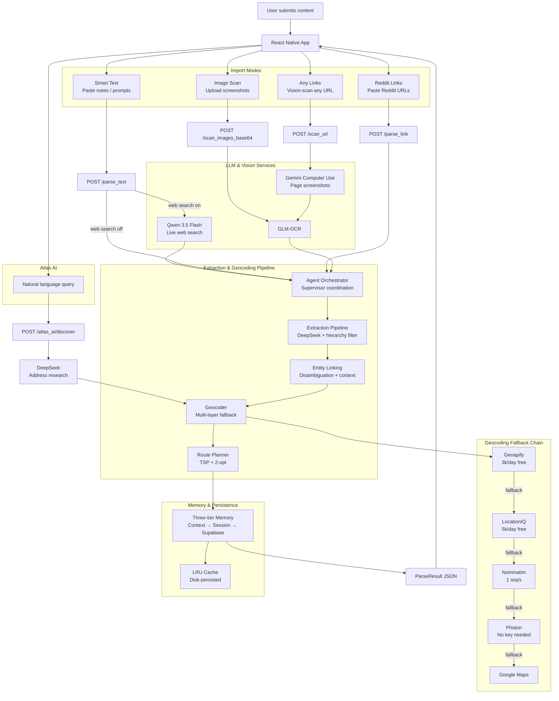
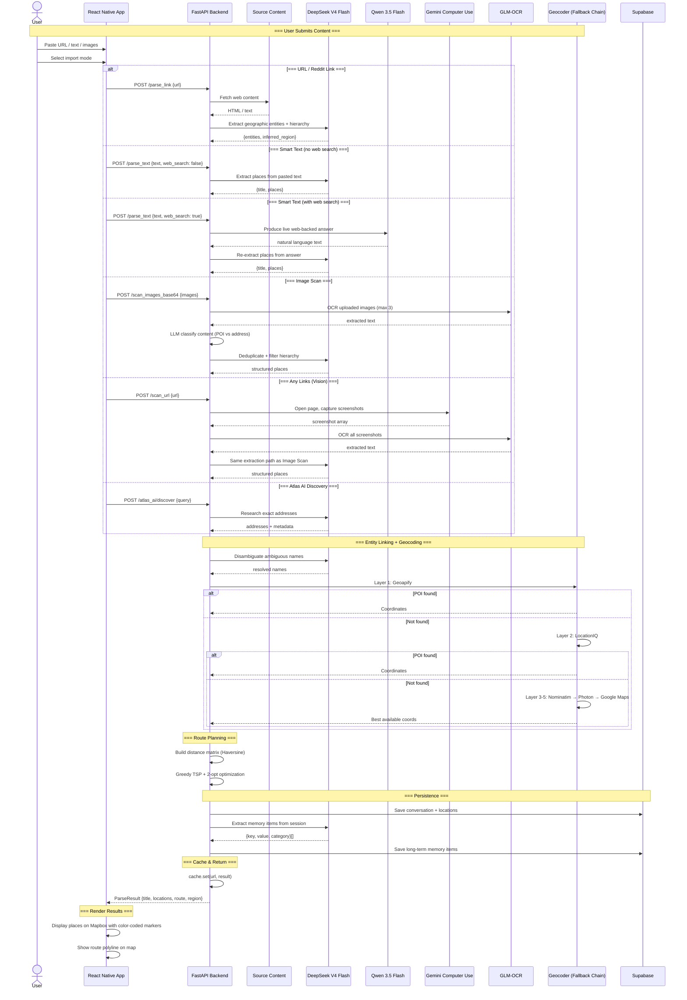

# OurAtlas — AI-Powered Travel Location Extractor

Extract real-world places from Reddit posts, pasted text, web pages, screenshots, and images — then geocode them, plan optimal routes, and visualize them on an interactive Mapbox map.

Built with **React Native (Expo SDK 56)** + **FastAPI (Python)** + **DeepSeek V4 Flash** + **Qwen 3.5 Flash** + **Gemini 3.5 Flash** + **GLM-OCR** + **Mapbox**.

> **Expo SDK v56**: This project targets the latest Expo SDK. Always consult the [official Expo v56 docs](https://docs.expo.dev/versions/v56.0.0/) before making build/config changes.

---

## Multi-Agent Workflow


```mermaid
graph TD
    User[User submits content] --> App[React Native App]

    subgraph "Import Modes"
        ST[Smart Text<br/>Paste notes / prompts]
        IS[Image Scan<br/>Upload screenshots]
        RL[Reddit Links<br/>Paste Reddit URLs]
        AL[Any Links<br/>Vision-scan any URL]
    end

    subgraph "Atlas AI"
        AA[Natural language query]
    end

    App --> ST
    App --> IS
    App --> RL
    App --> AL
    App --> AA

    RL --> PL[POST /parse_link]
    ST --> PT[POST /parse_text]
    IS --> SI[POST /scan_images_base64]
    AL --> SU[POST /scan_url]
    AA --> DA[POST /atlas_ai/discover]

    subgraph "LLM & Vision Services"
        QW[Qwen 3.5 Flash<br/>Live web search]
        GCU[Gemini Computer Use<br/>Page screenshots]
        OCR[GLM-OCR]
    end

    subgraph "Extraction & Geocoding Pipeline"
        ORCH[Agent Orchestrator<br/>Supervisor coordination]
        EX[Extraction Pipeline<br/>DeepSeek + hierarchy filter]
        EL[Entity Linking<br/>Disambiguation + context]
        GEO[Geocoder<br/>Multi-layer fallback]
        RT[Route Planner<br/>TSP + 2-opt]
    end

    PT -->|web search on| QW
    QW --> ORCH
    PT -->|web search off| ORCH
    PL --> ORCH

    SI --> OCR
    SU --> GCU
    GCU --> OCR
    OCR --> ORCH

    DA --> DS[DeepSeek<br/>Address research]
    DS --> GEO

    ORCH --> EX
    EX --> EL
    EL --> GEO
    GEO --> RT

    subgraph "Geocoding Fallback Chain"
        G1[Geoapify<br/>3k/day free]
        G2[LocationIQ<br/>5k/day free]
        G3[Nominatim<br/>1 req/s]
        G4[Photon<br/>No key needed]
        G5[Google Maps]
        G1 -->|fallback| G2 -->|fallback| G3 -->|fallback| G4 -->|fallback| G5
    end

    GEO --> G1

    subgraph "Memory & Persistence"
        MEM[Three-tier Memory<br/>Context → Session → Supabase]
        CACHE[LRU Cache<br/>Disk-persisted]
    end

    RT --> MEM
    MEM --> RESP[ParseResult JSON]
    MEM --> CACHE

    RESP --> App
```

---

## Architecture Overview

```
┌─────────────────────────────────────────────────────────────────────┐
│                     React Native App (Expo SDK 56)                  │
│                                                                     │
│  HomeScreen — full-screen MapboxMap + floating UI layers            │
│    ├─ TopNav (search / history)                                     │
│    ├─ MapboxMap (color-coded markers, route polylines, animations)  │
│    ├─ ContentPanel bottom sheet (My Places / My Plan / History)     │
│    ├─ HomeTabBar (Places / Plan tabs + Add button)                  │
│    ├─ Overlays: ImportSheet → AnalyzingScreen → SaveScreen          │
│    ├─ Atlas AI chat sidebar                                         │
│    ├─ SearchPanel / ChatHistoryPanel / PlaceDetail                  │
│    └─ CreatePlan / PlanDetail / AddPlaceToPlan                      │
│                                                                     │
│  Services layer (calls FastAPI backend):                            │
│    ├─ apiService.ts         — HTTP client (parse, chat, sessions)   │
│    ├─ importService.ts      — Import orchestration + result adapters│
│    ├─ placeService.ts       — Place CRUD                            │
│    └─ supabaseClient.ts     — Supabase persistence                  │
└──────────────────────────────┬──────────────────────────────────────┘
                               │ HTTP
┌──────────────────────────────┴──────────────────────────────────────┐
│                      FastAPI Backend (Python)                       │
│                                                                     │
│  AI Agent & LLM Services (my focus):                                │
│    ├─ agent_orchestrator.py     — Supervisor Agent + tool-calling   │
│    ├─ smart_text_service.py     — Smart text → DeepSeek extraction  │
│    ├─ image_scanner.py          — Image → OCR → classify → parse    │
│    ├─ gemini_computer_use.py    — Gemini vision browser automation   │
│    ├─ glm_ocr.py                — GLM-OCR integration               │
│    ├─ content_classifier.py     — LLM-based POI vs address routing  │
│    ├─ atlas_ai_discovery.py     — DeepSeek address research         │
│    ├─ extraction_pipeline.py    — Two-stage LLM + rule filtering    │
│    ├─ web_search_router.py      — Qwen web search heuristics        │
│    ├── llm_client.py            — DeepSeek / Qwen / Hunyuan clients │
│    ├─ geocoder.py               — Multi-layer fallback geocoding     │
│    ├─ route_planner.py          — TSP + 2-opt route optimization    │
│    ├─ conversation_manager.py   — Three-tier memory system          │
│    ├─ performance_logger.py     — Pipeline timing + token metrics   │
│    └─ progress.py               — Real-time progress tracking       │
│                                                                     │
│  Infrastructure (teammates' work):                                  │
│    ├─ supabase_service.py       — Supabase persistence              │
│    ├─ cache.py                  — LRU disk-persistent cache         │
│    └─ web_scraper.py / web_fetch_chain.py — Web scraping            │
│                                                                     │
│  API Endpoints (18 total):                                          │
│    POST /parse_link  /parse_text  /scan_images  /scan_url           │
│    POST /atlas_ai/discover  /chat  /sessions                        │
│    GET  /sessions  /conversations  /memories  /health               │
│    GET  /parse_progress/{id}  /api/performance  /cache/status       │
└─────────────────────────────────────────────────────────────────────┘
```

---

## Data Flow


```mermaid
sequenceDiagram
    actor User
    participant App as React Native App
    participant Backend as FastAPI Backend
    participant Source as Source Content
    participant LLM as DeepSeek V4 Flash
    participant Qwen as Qwen 3.5 Flash
    participant Vision as Gemini Computer Use
    participant OCR as GLM-OCR
    participant Geo as Geocoder (Fallback Chain)
    participant DB as Supabase

    Note over User,Geo: === User Submits Content ===

    User->>App: Paste URL / text / images
    User->>App: Select import mode

    alt === URL / Reddit Link ===
        App->>Backend: POST /parse_link {url}
        Backend->>Source: Fetch web content
        Source-->>Backend: HTML / text
        Backend->>LLM: Extract geographic entities + hierarchy
        LLM-->>Backend: {entities, inferred_region}

    else === Smart Text (no web search) ===
        App->>Backend: POST /parse_text {text, web_search: false}
        Backend->>LLM: Extract places from pasted text
        LLM-->>Backend: {title, places}

    else === Smart Text (with web search) ===
        App->>Backend: POST /parse_text {text, web_search: true}
        Backend->>Qwen: Produce live web-backed answer
        Qwen-->>Backend: natural language text
        Backend->>LLM: Re-extract places from answer
        LLM-->>Backend: {title, places}

    else === Image Scan ===
        App->>Backend: POST /scan_images_base64 {images}
        Backend->>OCR: OCR uploaded images (max 3)
        OCR-->>Backend: extracted text
        Backend->>Backend: LLM classify content (POI vs address)
        Backend->>LLM: Deduplicate + filter hierarchy
        LLM-->>Backend: structured places

    else === Any Links (Vision) ===
        App->>Backend: POST /scan_url {url}
        Backend->>Vision: Open page, capture screenshots
        Vision-->>Backend: screenshot array
        Backend->>OCR: OCR all screenshots
        OCR-->>Backend: extracted text
        Backend->>LLM: Same extraction path as Image Scan
        LLM-->>Backend: structured places

    else === Atlas AI Discovery ===
        App->>Backend: POST /atlas_ai/discover {query}
        Backend->>LLM: Research exact addresses
        LLM-->>Backend: addresses + metadata
    end

    Note over Backend,Geo: === Entity Linking + Geocoding ===
    Backend->>LLM: Disambiguate ambiguous names
    LLM-->>Backend: resolved names

    Backend->>Geo: Layer 1: Geoapify
    alt POI found
        Geo-->>Backend: Coordinates
    else Not found
        Geo->>Geo: Layer 2: LocationIQ
        alt POI found
            Geo-->>Backend: Coordinates
        else Not found
            Geo->>Geo: Layer 3-5: Nominatim → Photon → Google Maps
            Geo-->>Backend: Best available coords
        end
    end

    Note over Backend: === Route Planning ===
    Backend->>Backend: Build distance matrix (Haversine)
    Backend->>Backend: Greedy TSP + 2-opt optimization

    Note over Backend,DB: === Persistence ===
    Backend->>DB: Save conversation + locations
    Backend->>LLM: Extract memory items from session
    LLM-->>Backend: {key, value, category}[]
    Backend->>DB: Save long-term memory items

    Note over Backend: === Cache & Return ===
    Backend->>Backend: cache.set(url, result)
    Backend-->>App: ParseResult {title, locations, route, region}

    Note over App: === Render Results ===
    App->>App: Display places on Mapbox with color-coded markers
    App->>App: Show route polyline on map
```

---

## Import Pipelines

### 1. URL / Reddit Links — `POST /parse_link`

Fetches web/Reddit content, extracts geographic entities with two-stage (LLM + rule) hierarchy filtering, resolves ambiguous names via entity linking, geocodes through a multi-layer fallback chain, plans an optimal TSP route, and persists everything to the three-tier memory system. Results are cached in-memory with LRU eviction (100 entries, disk-persisted across restarts).

**Key files**: [`agent_orchestrator.py`](backend/services/agent_orchestrator.py), [`extraction_pipeline.py`](backend/services/extraction_pipeline.py)

### 2. Smart Text — `POST /parse_text`

Two modes:
- **`web_search=false`**: DeepSeek parses pasted text (travel notes, Xiaohongshu, WeChat, copied text) directly into structured places. Covers sources that cannot be scraped.
- **`web_search=true`**: Qwen 3.5 Flash first produces a live web-backed natural-language answer, then DeepSeek re-parses that answer through the same extraction pipeline. The web search router uses heuristic keyword matching (English + Chinese) to auto-detect when live search would be beneficial.

**Key files**: [`smart_text_service.py`](backend/services/smart_text_service.py), [`web_search_router.py`](backend/services/web_search_router.py)

### 3. Image Scan — `POST /scan_images_base64` / `POST /scan_images`

Upload up to 3 images (JPEG/PNG, or HEIC converted to JPEG). GLM-OCR extracts text, then an LLM-based [`content_classifier.py`](backend/services/content_classifier.py) routes the content: named POI → extraction pipeline, address-heavy → address-first geocoding via Atlas AI Discovery.

**Key files**: [`image_scanner.py`](backend/services/image_scanner.py), [`glm_ocr.py`](backend/services/glm_ocr.py), [`content_classifier.py`](backend/services/content_classifier.py)

### 4. Any Links (Vision) — `POST /scan_url`

For anti-bot, JavaScript-heavy, or login-walled pages: Gemini Computer Use opens the page in a Playwright browser, dismisses interstitials, scrolls top-to-bottom, and captures up to 8 screenshots. GLM-OCR reads the screenshots, then reuses the Image Scan extraction path downstream.

**Key files**: [`gemini_computer_use.py`](backend/services/gemini_computer_use.py), [`glm_ocr.py`](backend/services/glm_ocr.py)

### 5. Atlas AI Discovery — `POST /atlas_ai/discover`

For natural-language queries that need exact addresses: DeepSeek researches addresses directly (e.g. "Where did Taylor Swift get married?" → Curch of St. Patrick, Killarney), then address-first geocoding returns coordinates without going through the full extraction pipeline.

**Key files**: [`atlas_ai_discovery.py`](backend/services/atlas_ai_discovery.py)

---

## Features (My Focus: AI Agent & LLM Engineering)

### Multi-Agent AI Pipeline

I designed and implemented the AI agent orchestration layer that coordinates specialized LLM sub-agents for each stage of the import pipeline:

| Agent | Responsibility | Implementation |
|-------|---------------|----------------|
| **Supervisor Orchestrator** | Routes each import to the correct sub-agent chain, manages session context, handles follow-up chat with tool-calling loop | [`agent_orchestrator.py`](backend/services/agent_orchestrator.py) — 992 lines |
| **Extraction Agent** | Two-stage pipeline: LLM extracts all geographic entities with hierarchy classification → rule engine filters out redundant high-level entities (countries, states, cities) while preserving POIs, neighborhoods, and landmarks | [`extraction_pipeline.py`](backend/services/extraction_pipeline.py) |
| **Entity Linking Agent** | DeepSeek-based disambiguation: resolves ambiguous names by appending geographic context (ROM→Royal Ontario Museum, Suzhou→Suzhou, Jiangsu, Cambridge→Cambridge, UK), and resolves generic terms (monuments→Washington Monument) | Integrated in orchestrator |
| **Content Classifier** | LLM routes OCR/pasted text to the correct pipeline: named POI content → entity extraction, address-heavy content → address-first geocoding | [`content_classifier.py`](backend/services/content_classifier.py) |
| **Smart Text Agent** | Parses freeform travel notes, prompts, and itineraries via DeepSeek with configurable web search routing | [`smart_text_service.py`](backend/services/smart_text_service.py) |
| **Web Search Router** | Heuristic + keyword matching (English + Chinese) to detect when live web search is beneficial, then routes to Qwen 3.5 Flash | [`web_search_router.py`](backend/services/web_search_router.py) |
| **Image Scanner** | Orchestrates GLM-OCR → content classification → extraction/discovery pipeline | [`image_scanner.py`](backend/services/image_scanner.py) |
| **Vision Browser Agent** | Gemini Computer Use for visual page capture — handles anti-bot, JS-heavy, and login-walled pages | [`gemini_computer_use.py`](backend/services/gemini_computer_use.py) |
| **OCR Service** | GLM-OCR integration via Zhipu AI's Layout Parsing API, with HEIC→JPEG conversion for iOS compatibility | [`glm_ocr.py`](backend/services/glm_ocr.py) |
| **Atlas Discovery Agent** | DeepSeek-based direct address research for natural-language queries, bypassing the extraction pipeline | [`atlas_ai_discovery.py`](backend/services/atlas_ai_discovery.py) |

### Geocoding Engine

I built a multi-layer geocoding fallback chain that maximizes coordinate resolution rate:

| Layer | Service | Free Tier | Coverage |
|-------|---------|-----------|----------|
| 1 | Geoapify | 3,000 req/day | Best supplementary POI |
| 2 | LocationIQ | 5,000 req/day | Excellent OSM-based |
| 3 | Nominatim (OSM) | 1 req/s | Global OSM data |
| 4 | Photon (OSM) | Unlimited | Complementary coverage |
| 5 | Google Maps | Pay-as-you-go | Best global POI (final fallback) |

Each layer includes country bounding-box validation to reject out-of-country results, rate limiting with per-provider async locks, and coordinate deduplication to avoid redundant lookups.

### Route Planning

Implemented a zero-cost TSP solver using Haversine great-circle distance, greedy nearest-neighbor construction, and 2-opt local search optimization — no external API calls required.

**Key file**: [`route_planner.py`](backend/services/route_planner.py)

### Conversational AI (Atlas AI)

Designed the agent tool-calling loop that powers follow-up chat after extraction. The LLM can dynamically call tools to add/remove pins, reorder routes, and optimize paths — all within the same session context.

### Three-Tier Memory System

Architected a memory system that spans:
1. **Short-term**: Current agent loop iteration messages + tool results
2. **Session memory**: Active chat sessions in backend runtime (dict-based)
3. **Long-term memory**: Persisted conversations + auto-extracted user preferences in Supabase

**Key file**: [`conversation_manager.py`](backend/services/conversation_manager.py)

### Real-Time Progress Tracking

Built an in-memory progress event system (`start` → `mark` → `finish` / `fail` lifecycle) that the frontend polls via `/parse_progress/{request_id}` at 1s intervals, enabling live status updates during the 30-45s processing window.

**Key file**: [`progress.py`](backend/services/progress.py)

### Pipeline Performance Metrics

Implemented `PipelineMetrics` dataclass that tracks end-to-end timing and per-LLM-call token usage for every pipeline run, queryable via `GET /api/performance`.

**Key file**: [`performance_logger.py`](backend/services/performance_logger.py)

### Multi-Model LLM Client

Built a unified LLM client supporting three model providers with tool-calling support, token usage tracking, and model-specific prompt engineering:

- **DeepSeek V4 Flash** (`deepseek-chat`) — primary structured extraction and classification
- **Qwen 3.5 Flash** (`qwen3.5-flash`) — live web-backed natural language answers
- **Tencent Hunyuan** (`hy3-preview`) — optional web search fallback

**Key file**: [`llm_client.py`](backend/services/llm_client.py)

### Map Visualization (AI Integration)

From the AI/LLM side, I integrated the following capabilities that flow through to the map:

- **Sentiment analysis**: Each extracted place carries a `sentiment` field (positive/neutral/negative) inferred by the LLM from source content — used for color-coded markers on the map
- **Category classification**: Places are automatically categorized (Tourist Attractions, Dining & Drinking, Entertainment, Museums, etc.) by the LLM during extraction
- **Route optimization**: The TSP solver produces an ordered location list rendered as a route polyline on the map
- **Entity linking output**: Disambiguated names with geographic context ensure accurate map pin placement

### LRU Cache with Disk Persistence

Implemented a dual-namespace LRU cache (parse results + geocoding) that survives backend restarts via JSON serialization, with stats tracking (hits/misses/hit rate) exposed via API.

**Key file**: [`cache.py`](backend/services/cache.py)

---

## Performance Metrics

| Metric | Value |
|--------|-------|
| **End-to-end time** | ~30-45s per parse (varies by source type, geocoding fallback depth) |
| **LLM calls per parse** | 2-3 (extraction + entity linking + optional memory extraction) |
| **Cache hit time** | ~50ms (in-memory LRU, disk-persisted) |
| **Geocoding success rate** | ~85-95% with multi-layer fallback chain |
| **Pipeline monitoring** | Exposed via `GET /api/performance` with per-run token usage and timing |

All pipeline timing and token usage is tracked by [`performance_logger.py`](backend/services/performance_logger.py) and queryable via the performance API endpoint.

---

## Getting Started

### Prerequisites

- **Python 3.10+**
- **Node.js 18+**
- **Xcode 16+** (iOS Simulator) / Android Studio
- **CocoaPods** >= 1.16
- API keys for services configured in `.env`

### Installation & Setup

```bash
# 1. Install backend dependencies
cd backend
pip install -r requirements.txt
playwright install chromium        # For Gemini Computer Use
cd ..

# 2. Install frontend dependencies
npm install

# 3. Configure .env
cp .env.example .env
```

> **Required API keys**: `MAPBOX_ACCESS_TOKEN`, `DEEPSEEK_API_KEY`, `SUPABASE_URL`, `SUPABASE_ANON_KEY`. Optional: `GLM_API_KEY` (OCR), `GEMINI_API_KEY` (vision), `QWEN_API_KEY` (web search), and at least one geocoding key.

### Start the App

**Terminal 1 — Backend:**
```bash
uvicorn backend.main:app --reload --reload-dir backend --port 8000
```

**Terminal 2 — Frontend:**
```bash
npx expo run:ios
```

For subsequent runs:
```bash
npx expo start --dev-client
```

### Verify

```bash
curl http://localhost:8000/health
# → {"status": "ok"}
```

### Usage

1. Tap the **+** button → choose an import mode
2. Paste input (URL / text) or select up to 3 images
3. Wait ~30-45s on the Analyzing Screen with live progress
4. Review extracted places on the Save Screen (map + list)
5. Save places or explore via Atlas AI chat

---

## API Endpoints

| Method | Endpoint | Description |
|--------|----------|-------------|
| `POST` | `/parse_link` | Parse a URL → extract locations → plan route |
| `POST` | `/parse_text` | Parse pasted text with optional `web_search` |
| `POST` | `/scan_images_base64` | Parse base64 image payloads (max 3) |
| `POST` | `/scan_images` | Parse uploaded image files (max 3) |
| `POST` | `/scan_url` | Gemini vision captures webpage → OCR → parse |
| `POST` | `/scrape_url` | Gemini text extraction from page → parse |
| `POST` | `/atlas_ai/discover` | Research exact addresses → geocode directly |
| `POST` | `/chat` | Continue conversation with AI agent |
| `GET` | `/sessions` | List active sessions |
| `POST` | `/sessions` | Create a session |
| `POST` | `/sessions/{id}/save` | Persist session to Supabase |
| `GET` | `/conversations` | List saved conversations |
| `GET` | `/conversations/{id}` | Load full conversation |
| `DELETE` | `/conversations/{id}` | Delete a conversation |
| `GET` | `/memories` | List long-term memories |
| `POST` | `/memories` | Add a memory item |
| `GET` | `/parse_progress/{request_id}` | Poll live progress events |
| `GET` | `/health` | Health check |
| `GET` | `/api/performance` | Pipeline metrics (token usage, timing) |
| `POST` | `/cache/invalidate` | Invalidate URL cache entry |
| `GET` | `/cache/status` | Cache statistics (hits, misses, size, hit rate) |

---

## Project Structure

```
atlas-mobile/
├── app.config.js                   # Expo configuration
├── App.tsx                         # Root component with overlay routing
├── package.json                    # Expo SDK 56 + React Native 0.85
│
├── backend/
│   ├── main.py                     # FastAPI app entry point (18 endpoints)
│   ├── requirements.txt
│   └── services/                   # All backend services
│       ├── agent_orchestrator.py   # Supervisor Agent — coordinates pipelines + chat tool-calling loop
│       ├── atlas_ai_discovery.py   # Address-first discovery via DeepSeek
│       ├── cache.py                # LRU disk-persistent cache (parse + geocoding namespaces)
│       ├── content_classifier.py   # LLM-based POI vs address content routing
│       ├── conversation_manager.py # Three-tier memory system (Session dataclass)
│       ├── extraction_pipeline.py  # Two-stage: LLM extraction → rule hierarchy filtering
│       ├── geocoder.py             # Multi-layer geocoding fallback chain
│       ├── gemini_computer_use.py  # Gemini Computer Use browser automation
│       ├── glm_ocr.py              # GLM-OCR via Zhipu AI Layout Parsing API
│       ├── image_scanner.py        # Image → OCR → classify → route pipeline
│       ├── llm_client.py           # DeepSeek / Qwen / Hunyuan LLM clients
│       ├── performance_logger.py   # PipelineMetrics tracking + query API
│       ├── progress.py             # Real-time progress event lifecycle
│       ├── route_planner.py        # TSP + 2-opt route optimizer
│       ├── smart_text_service.py   # Smart text pipeline with web search routing
│       ├── supabase_service.py     # Supabase persistence layer
│       ├── tool_definitions.py     # Tool schemas + registry for agent loop
│       ├── web_fetch_chain.py      # Chained web fetching strategy
│       ├── web_scraper.py          # Multi-source web scraper
│       └── web_search_router.py    # Web search heuristics + Qwen integration
│
├── src/
│   ├── features/
│   │   ├── home/                   # HomeScreen, panels, AIChatBox, SearchPanel
│   │   ├── import-places/          # Import → Analyzing → Save screens
│   │   ├── map/                    # MapboxMap with markers + routes + camera
│   │   ├── my-places/              # Saved places list / atlas view
│   │   ├── my-plan/                # Trip planning (create, detail, DnD)
│   │   └── place-detail/           # Place detail (hours, tags, visit strategy)
│   ├── components/                 # Reusable UI components
│   ├── services/                   # API / import / place / supabase clients
│   ├── types/                      # TypeScript type definitions
│   ├── theme/                      # Design tokens + typography
│   └── lib/                        # Utilities
│
├── docs/                           # Database schema, RLS policies, ERD
├── plans/                          # Feature plans
├── mock-data/                      # Development mock data
└── assets/                         # Icons, splash, tab bar icons
```

---

## Tech Stack

| Component | Library |
|-----------|---------|
| **Mobile Framework** | React Native 0.85 + Expo SDK 56 |
| **Maps** | `@rnmapbox/maps@10.3.1` (Mapbox v11) |
| **Backend** | FastAPI (Python 3.10+) + Uvicorn |
| **HTTP Client** | httpx |
| **Browser Automation** | Playwright |
| **Primary LLM** | DeepSeek V4 Flash (`deepseek-chat`) |
| **Web Search LLM** | Qwen 3.5 Flash (`qwen3.5-flash`) |
| **Vision LLM** | Gemini 3.5 Flash (`gemini-3.5-flash`) |
| **OCR** | GLM-OCR (Zhipu AI Layout Parsing) |
| **Optional LLM** | Tencent Hunyuan (`hy3-preview`) |
| **Database** | Supabase (PostgreSQL) |
| **Geocoding** | Geoapify / LocationIQ / Nominatim / Photon / Google Maps |

---

## Changelog

### My Contributions — AI Agent & LLM Pipeline

#### Multi-Model Import Pipelines

| Change | Description | Files |
|--------|-------------|-------|
| **Supervisor Orchestrator** | Built the core agent coordination system that routes each import type to the correct sub-agent chain, manages session context, and handles follow-up chat with a tool-calling loop | [`agent_orchestrator.py`](backend/services/agent_orchestrator.py) |
| **Smart Text Pipeline** | Implemented DeepSeek-based extraction from freeform text (travel notes, Xiaohongshu, WeChat), with optional Qwen web search toggle for live-backed answers | [`smart_text_service.py`](backend/services/smart_text_service.py) |
| **Image Scan Pipeline** | Built the GLM-OCR → LLM content classification → extraction/discovery routing pipeline | [`image_scanner.py`](backend/services/image_scanner.py), [`content_classifier.py`](backend/services/content_classifier.py) |
| **Any Links (Vision) Pipeline** | Integrated Gemini Computer Use to capture webpage screenshots, then OCR and parse through the existing extraction path | [`gemini_computer_use.py`](backend/services/gemini_computer_use.py) |
| **Atlas AI Discovery** | Built DeepSeek-based direct address research for natural-language queries, bypassing the extraction pipeline | [`atlas_ai_discovery.py`](backend/services/atlas_ai_discovery.py) |
| **Web Search Router** | Implemented heuristic + keyword matching (English + Chinese) to detect when live web search is beneficial | [`web_search_router.py`](backend/services/web_search_router.py) |

#### Extraction & Entity Linking

| Change | Description | Files |
|--------|-------------|-------|
| **Two-Stage Extraction** | Designed LLM + rule hybrid: LLM extracts all geographic entities with hierarchy levels (0-4), rule engine filters redundant countries/states while preserving POIs, neighborhoods, landmarks | [`extraction_pipeline.py`](backend/services/extraction_pipeline.py) |
| **Entity Linking** | DeepSeek-based disambiguation with geographic context appending for ambiguous names (Suzhou→Suzhou, Jiangsu, Cambridge→Cambridge, UK) | Integrated in orchestrator |
| **Hierarchy & Noise Filtering** | Rule-based removal of high-level entities (countries, states) from the final location list, with detailed reporting of what was removed and why | [`extraction_pipeline.py`](backend/services/extraction_pipeline.py) |

#### Geocoding & Route Planning

| Change | Description | Files |
|--------|-------------|-------|
| **Multi-Layer Geocoding** | Built a 5-provider fallback chain with country bounding-box validation, per-provider async rate limiting, and coordinate deduplication | [`geocoder.py`](backend/services/geocoder.py) |
| **TSP Route Planner** | Implemented Haversine distance + greedy nearest-neighbor + 2-opt optimization — zero external API cost | [`route_planner.py`](backend/services/route_planner.py) |
| **Dynamic Outlier Detection** | Added adaptive coordinate validation using median-distance × 8 threshold (clamped 200-2000km) to filter geocoding outliers | In orchestrator |

#### Conversational AI & Memory

| Change | Description | Files |
|--------|-------------|-------|
| **Agent Tool-Calling Loop** | Built dynamic tool-calling for follow-up chat: add/remove pins, reorder routes, optimize paths — all within session context | [`agent_orchestrator.py`](backend/services/agent_orchestrator.py) |
| **Three-Tier Memory System** | Architected short-term context → session memory → Supabase persistence with auto-extracted user preferences | [`conversation_manager.py`](backend/services/conversation_manager.py) |
| **Long-Term Memory Extraction** | LLM auto-extracts user preferences/interests after each session and persists to Supabase | `_update_memory` in orchestrator |

#### Infrastructure & Observability

| Change | Description | Files |
|--------|-------------|-------|
| **Real-Time Progress Tracking** | Built `start` → `mark` → `finish` / `fail` lifecycle with 1s frontend polling | [`progress.py`](backend/services/progress.py) |
| **Pipeline Performance Metrics** | Implemented `PipelineMetrics` dataclass tracking timing and token usage per run | [`performance_logger.py`](backend/services/performance_logger.py) |
| **Multi-Model LLM Client** | Unified client for DeepSeek / Qwen / Hunyuan with tool-calling support and token usage tracking | [`llm_client.py`](backend/services/llm_client.py) |
| **LRU Cache with Persistence** | Dual-namespace LRU cache (parse + geocoding) that survives backend restarts via JSON serialization | [`cache.py`](backend/services/cache.py) |
| **Tool Definitions & Registry** | Tool schemas + registry for the agent loop, enabling dynamic tool discovery | [`tool_definitions.py`](backend/services/tool_definitions.py) |

### Teammates' Contributions (Frontend + Infrastructure)

The frontend screens, UI components, design system, Supabase schema, and build configuration were implemented by colleagues and are not detailed here. Key files they contributed include the React Native UI layer (`src/features/`, `src/components/`), the design tokens (`src/theme/`), web scraping utilities (`web_scraper.py`, `web_fetch_chain.py`), and Supabase persistence (`supabase_service.py`, `docs/schema.sql`).

---

## Troubleshooting

### Backend not responding

```bash
curl http://localhost:8000/health
# → {"status": "ok"}
```

### Mapbox rendering issues

If the map appears blank or clipped, ensure the parent view has explicit dimensions and rebuild native dependencies:

```bash
npx expo prebuild --clean
npx expo run:ios
```

### `pod install` fails

```bash
cd ios && pod install --repo-update
```

### OCR or vision parsing fails

Verify environment variables:

```bash
echo $GLM_API_KEY
echo $GEMINI_API_KEY
echo $GEMINI_COMPUTER_USE_MODEL   # Should be gemini-3.5-flash
echo $GEMINI_COMPUTER_USE_IMAGE_SIZE  # Should be 512
```

### Progress tracking not showing

Ensure the backend is reachable and CORS is configured (allowed for `*` in development).

---

## License

MIT
