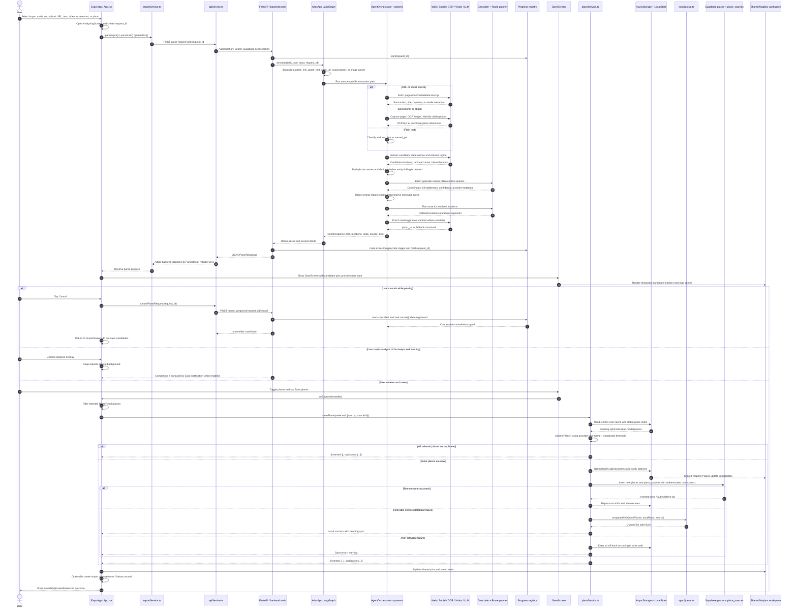
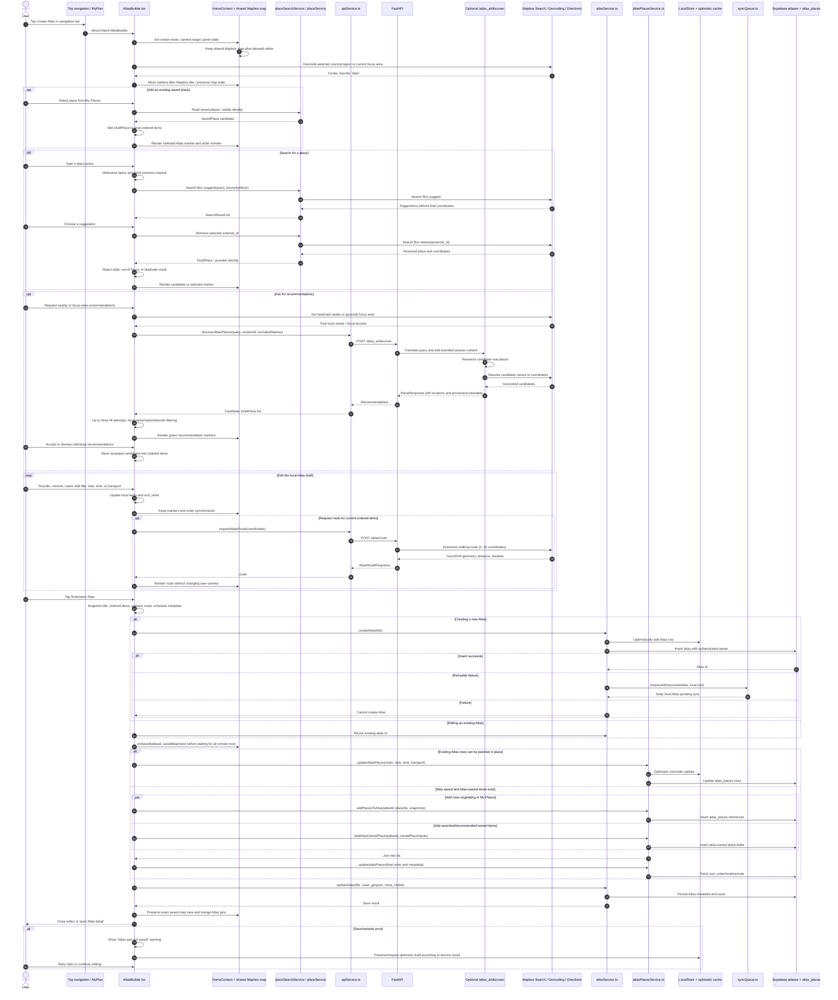
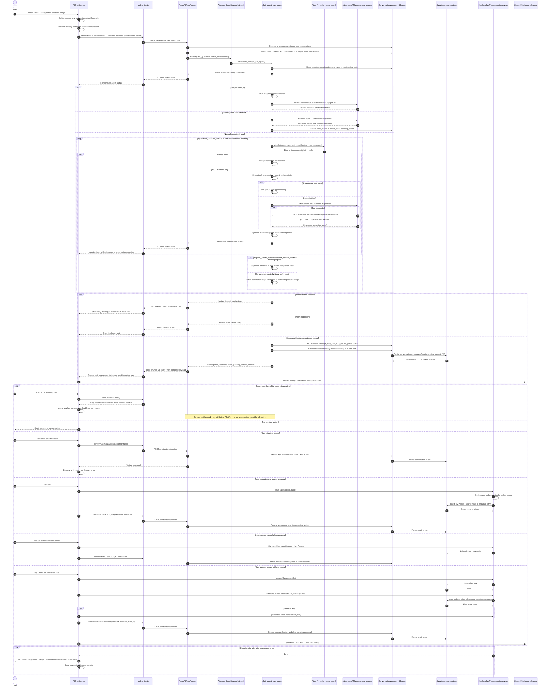

# Atlas 三条核心业务时序

本文提供三个可以直接在 Mermaid 编辑器中渲染的 `sequenceDiagram`，分别描述：

1. **Add Places**：从导入内容得到候选地点，用户审核后保存到 My Places。
2. **Create an Atlas**：用户从导航栏进入 `AtlasBuilder`，搜索/选择地点、排序并保存普通 Atlas。
3. **AI Chat**：Atlas AI 的流式聊天、后端工具调用、待确认 proposal，以及用户确认后实际创建 Atlas 的路径。

前两张图强调传统前后端和数据服务；第三张图只在需要的地方显示 AI 模块，完整工具目录放在文档末尾。图中的 `Supabase` 表示 Supabase Auth + PostgreSQL/RLS，`Mapbox` 表示 Search Box/Geocoding/Directions 以及移动端 Mapbox SDK，`FastAPI` 表示 `backend/main.py`。

---

## 1. Add Places：Import → Review → Save

这是 review-first 流程：解析成功不会自动写入 My Places。用户必须在 `SaveScreen` 勾选地点并点击 Save；已存在的地点会被 `isSamePlace()` 识别为 duplicate，而不是再插入一行。输入可以是普通文本、URL、社交视频、网页截图或照片；下图用“URL/文本/图片”表示共同的客户端入口，具体 source-specific endpoint 在 FastAPI 内部分支。

### Add Places 图中必须保留的语义

- **解析和保存是两个阶段**：`ParseResponse` 只是临时结果；真正的 `places` 持久化从 `savePlaces()` 开始。
- **用户选择是授权点**：未勾选的候选不会进入 My Places；duplicate 不应被画成新的数据库 insert。
- **缓存不是数据库**：`AsyncStorage`/`LocalStore` 的乐观状态可以先更新地图，但同步队列或远端写入才决定最终服务器状态。
- **取消有两种结果**：明确 Cancel 调用后端 progress cancel；关闭分析界面则可能让后台导入继续。

---

## 2. Create an Atlas：导航栏普通编辑器

这张图描述的是 `MyPlan → AtlasBuilder` 的普通创建，不是 Chat proposal。AI Discover 只作为可选的候选推荐来源；它不会替用户提交 Atlas，也不拥有 Supabase 写权限。编辑器同时支持已保存 My Places、Mapbox Search、附近 landmark seeds 和手动添加的 Atlas-owned place。

### Create Atlas 图中必须保留的语义

- `AtlasBuilder` 是状态拥有者；模型不是创建者。`/atlas_ai/discover` 只返回建议地点。
- 创建和保存可先更新本地地图/缓存，之后写 `atlases` 和 `atlas_places`；地图不应等待所有远端订阅重新 hydrate 才显示完成状态。
- `AtlasPlace` 可以引用一个 My Places row，也可以携带 Atlas-owned 的地点字段，因此“加入 Atlas”不一定等于“先保存到 My Places”。
- route 是 Atlas 的派生展示数据；Mapbox Directions 失败不会凭空生成路线。

---

## 3. AI Chat：流式对话、工具调用和确认写入

这张图只展示 Chat 作为产品流程的外部行为。后端 `chat_agent.py` 内部最多 6 个模型步骤、20 条消息上下文和 90 秒总 deadline 的细节，可参考前一份 LLM 架构文档；本图重点是跨越移动端、FastAPI、外部检索和用户确认的数据边界。

### AI Chat 图中必须保留的语义

- `/chat/stream` 的输出是安全 status、完成后的 token chunks 和 complete payload；原始 tool arguments、web query 和隐藏 reasoning 不发给 UI。
- Chat 的模型循环可以返回地图 presentation 和 pending action，但**不能直接写 Atlas 或 My Places**。
- `POST /chat/actions/confirm` 是审计/状态同步接口；实际 Atlas/places 写入由移动端领域服务完成。
- 客户端 Stop 防止旧结果污染当前 UI，但不能保证已经发出的 provider 请求在服务器端立即停止。
- 超时、异常、工具错误和没有安全结果都应保留 `partial/error/timeout` 语义，不应显示成“已创建”。

---

## 4. Atlas AI Chat 的全部 Tool Calling 清单

下面列出当前 `backend/langgraph/chat_agent.py:_agent_tools()` 注册的全部 LangChain tools。托管的 `web_search` 是模型 provider 的额外工具，不是本地 `@tool` 函数，也一并列出。模型可以请求工具，但所有写入型操作只生成 proposal；真正写入必须经移动端用户确认。

| Tool | 类型 | 作用与主要下游 | 成功结果 / 写入边界 |
|---|---|---|---|
| `resolve_special_place` | 地点解析 | 用 Mapbox Search Box `suggest` + 并发 `retrieve`，失败时 fallback 到 address-first geocoder；解析 Home、Office 或 School | 返回精确、可验证地点；不写数据库 |
| `propose_special_place_change` | 确认提案 | 校验地点必须来自同一轮 `resolve_special_place`，处理 special place create/update/delete | 返回 `save_special_place` 或 `delete_special_place` pending action；不写数据库 |
| `find_places_between_special_places` | 空间搜索 | 取两个已保存 special places 的中点，用 Mapbox 搜索类别地点，并生成锚点路线 | 返回 places、anchors、route 和地图 presentation；不写数据库 |
| `find_nearby_places` | 附近搜索 | 以设备 GPS、命名 anchor 或 Home/Office/School 为中心；多类别并发 suggest/retrieve，按半径过滤、去重、排序 | 返回 nearby places、route、presentation；不写数据库 |
| `find_verified_places` | 实时研究 | 针对评分、价格、菜单、饮食、营业状态、通勤等约束做有限 web research，再用 Mapbox 解析候选 | 返回已研究候选和可选路线；不把未经验证的属性写成事实 |
| `find_similar_places` | 相似地点研究 | 区分 local venue 与 destination，按区域/全球范围研究相似场所，再 geocode 候选 | 返回最多受限数量的相似地点；不写数据库 |
| `present_response_places` | 地图呈现 | 把回答中明确的真实 POI 名称解析为可地图化地点；禁止用于城市、国家或泛类别 | 返回普通可选地图 cards/presentation；不写数据库 |
| `extract_pasted_places` | 文本抽取 | 调用 paste-text 的抽取、实体链接和 geocode 路径，处理用户粘贴的行程/笔记 | 返回标准化地点候选；通常需后续 proposal 才能保存 |
| `research_screen_locations` | 影视取景研究 | 对电影、电视或音乐视频的取景地做 Paste Text live research + geocoding | 自己生成一个 Atlas confirmation proposal；不应再次调用 `propose_create_atlas` |
| `propose_add_places` | 保存地点提案 | 标准化、去重用户要求加入 My Places 的地点 | 返回 `save_places` pending action；需客户端确认后由 `savePlaces()` 写入 |
| `propose_create_atlas` | Atlas 提案 | 接收完整、有序、已 geocode 的 itinerary，包含 title、timeline day/time、transport、duration metadata | 返回 `create_atlas` pending action 和 `atlas_draft` presentation；不直接创建 Atlas |
| `web_search` | Provider-hosted tool | OpenAI Responses API 的实时网页搜索，供当前事实和精确地点研究使用 | 搜索结果作为模型工具消息；UI 只看到安全状态，不看到 query；不直接写数据库 |

### 工具调用的共同错误语义

1. 工具名先经过 `_agent_tools()` 白名单；不支持的名称会被转换成 `Unsupported tool` error，不会执行任意函数。
2. 已注册工具抛出的异常会转换成结构化 tool error，再回送给模型；模型可以换工具、缩小请求或结束回答。
3. 工具结果为空、候选无法 geocode、区域不匹配或外部 provider 超时，都不能自动变成已保存地点。
4. 模型循环最多 6 个步骤、总计 90 秒；proposal 形成后立即结束循环。耗尽步骤、超时或异常时返回 partial/error/timeout，而不是无限调用。
5. `pending_action` 不是持久化成功标志。只有 `AIChatBox` 在用户点击确认后调用 `savePlaces()`、`createAtlas()`、`addAtlasOwnedPlaces()` 或 special-place domain service，才会产生真实数据写入；`/chat/actions/confirm` 随后记录审计事实。
