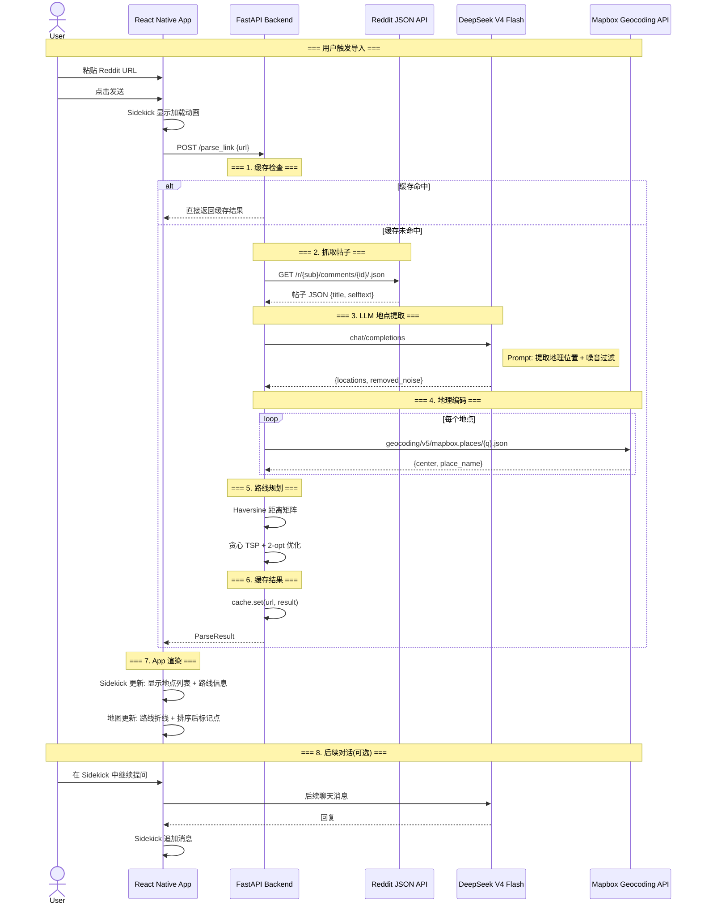

# 系统架构概览 — Reddit Parse & Fetch

> 本文档记录 Reddit 链接导入功能的核心架构与数据流。所有后续架构变更需同步更新此文件。

---

## 一、总体架构

```
┌─────────────────────────────────────────────┐
│           React Native App (Expo)           │
│                                             │
│  ┌───────────────────────────────────────┐  │
│  │  HomeScreen                           │  │
│  │                                       │  │
│  │  ┌─────────────────────────────────┐  │  │
│  │  │ SearchBar                       │  │  │
│  │  │ [历史] [输入框/粘贴] [发送]      │  │  │
│  │  └─────────────────────────────────┘  │  │
│  │                                       │  │
│  │  ┌─────────────────────────────────┐  │  │
│  │  │ MapboxMap + RouteLayer          │  │  │
│  │  │  (地图底图 + 路线折线 + 标记点)   │  │  │
│  │  └─────────────────────────────────┘  │  │
│  │                                       │  │
│  │  ┌─────────────────────────────────┐  │  │
│  │  │ Sidekick (BottomSheet)          │  │  │
│  │  │  snapPoints: [40%, 100%]        │  │  │
│  │  │  [加载动画 / 结果显示 / 聊天]     │  │  │
│  │  └─────────────────────────────────┘  │  │
│  └───────────────────────────────────────┘  │
│                       │                      │
│              HTTP POST /parse_link           │
│                       │                      │
└───────────────────────┼──────────────────────┘
                        │
                        ▼
┌─────────────────────────────────────────────┐
│              FastAPI Backend                 │
│                                             │
│  POST /parse_link                           │
│  ┌───────────────────────────────────────┐  │
│  │ 1. cache.py                           │  │
│  │    → 内存 dict 缓存 (key=URL MD5)      │  │
│  │                                       │  │
│  │ 2. reddit_fetcher.py                  │  │
│  │    → Reddit 官方 JSON API (免认证)      │  │
│  │    → URL: /r/{sub}/comments/{id}/.json │  │
│  │                                       │  │
│  │ 3. llm_client.py                      │  │
│  │    → DeepSeek V4 Flash API            │  │
│  │    → Prompt: 地点提取 + 噪音过滤       │  │
│  │                                       │  │
│  │ 4. geocoder.py                        │  │
│  │    → Mapbox Geocoding API             │  │
│  │    → 地名 → {lat, lng, address}        │  │
│  │                                       │  │
│  │ 5. route_planner.py                   │  │
│  │    → Haversine 距离公式                │  │
│  │    → 贪心最近邻 + 2-opt 优化           │  │
│  └───────────────────────────────────────┘  │
└─────────────────────────────────────────────┘
```

---

## 二、数据流



---

## 三、组件层级

```mermaid
graph TD
    App[App.tsx] --> HOC[GestureHandlerRootView]
    HOC --> SB[StatusBar]
    HOC --> Home[HomeScreen]
    
    subgraph HomeScreen
        SB_COMP[SearchBar]
        Map[MapboxMap]
        SK[Sidekick - BottomSheet]
        
        SB_COMP --> |onSubmit: url| HomeState[HomeScreen State]
        HomeState --> |parseResult| Map
        HomeState --> |parseResult| SK
        HomeState --> |loading| SK
    end
    
    subgraph MapboxMap
        MV[MapboxGL.MapView]
        CAM[MapboxGL.Camera]
        MK[MarkerView[] - 地点标记]
        RL[ShapeSource + LineLayer - 路线折线]
    end
    
    subgraph Sidekick
        H[Handle / Drag Indicator]
        CL[ChatList - FlatList]
        CI[ChatInput - TextInput]
    end
    
    subgraph SearchBar
        HB[History Button - 左侧]
        TI[TextInput - 中间 / 剪贴板检测]
        SendB[Send Button - 右侧]
    end
    
    Map --> MK
    Map --> RL
    Map --> CAM
```

---

## 四、API 合约

### `POST /parse_link`

**Request:**
```json
{
  "url": "https://www.reddit.com/r/AskSF/comments/1127auu/..."
}
```

**Response:**
```json
{
  "title": "What are some touristy things that locals enjoy?",
  "locations": [
    {
      "name": "Golden Gate Bridge",
      "latitude": 37.8199,
      "longitude": -122.4783,
      "full_address": "Golden Gate Bridge, San Francisco, California"
    }
  ],
  "route": {
    "ordered_locations": [
      { "name": "...", "latitude": ..., "longitude": ... }
    ],
    "total_distance_km": 12.5,
    "segments": [
      { "from": "Golden Gate Bridge", "to": "Fisherman's Wharf", "distance_km": 5.2 }
    ]
  },
  "removed_noise": [
    "Statue of Liberty - 不在旧金山湾区范围内，已移除"
  ]
}
```

---

## 五、关键设计决策记录

| 决策 | 选择 | 理由 |
|------|------|------|
| 路线距离计算 | Haversine 公式 | 零成本，不依赖外部 API |
| 路线排序算法 | 贪心最近邻 + 2-opt | 实现简单，对 ≤20 个点效果足够好 |
| LLM 模型 | DeepSeek V4 Flash | $0.28/百万 token，成本极低 |
| 地理编码 | Mapbox Geocoding API | 项目已有 Mapbox token，免费额度足够 |
| 缓存方案 | 内存 dict (非 Redis) | MVP 不需要持久化缓存 |
| Sidekick UI | `@gorhom/bottom-sheet` | 项目中已安装，原生手势支持好 |
| 剪贴板检测 | `expo-clipboard` + 聚焦时检查 | Expo 生态，聚焦触发而非持续轮询 |
| 后端框架 | FastAPI (同步) | 简单快速，DeepSeek+Mapbox 调用约 3-5s |

---

## 六、变更日志

| 日期 | 变更 | 作者 |
|------|------|------|
| 2026-05-31 | 初始架构文档 | - |
