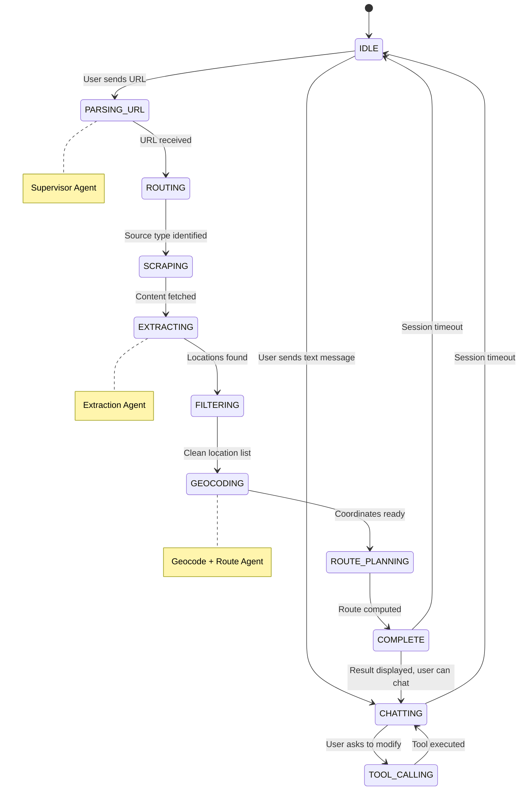
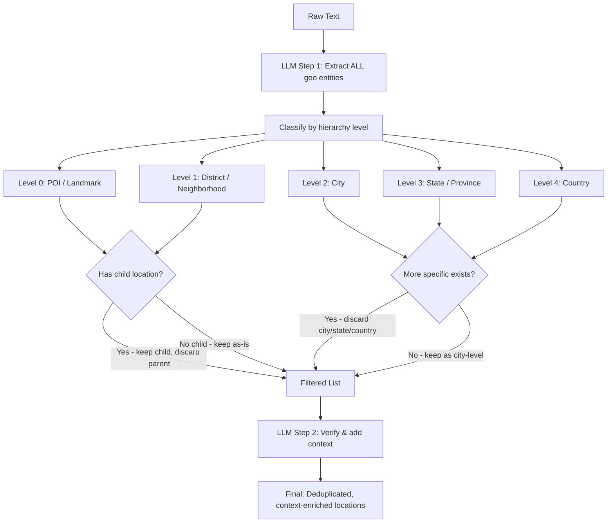
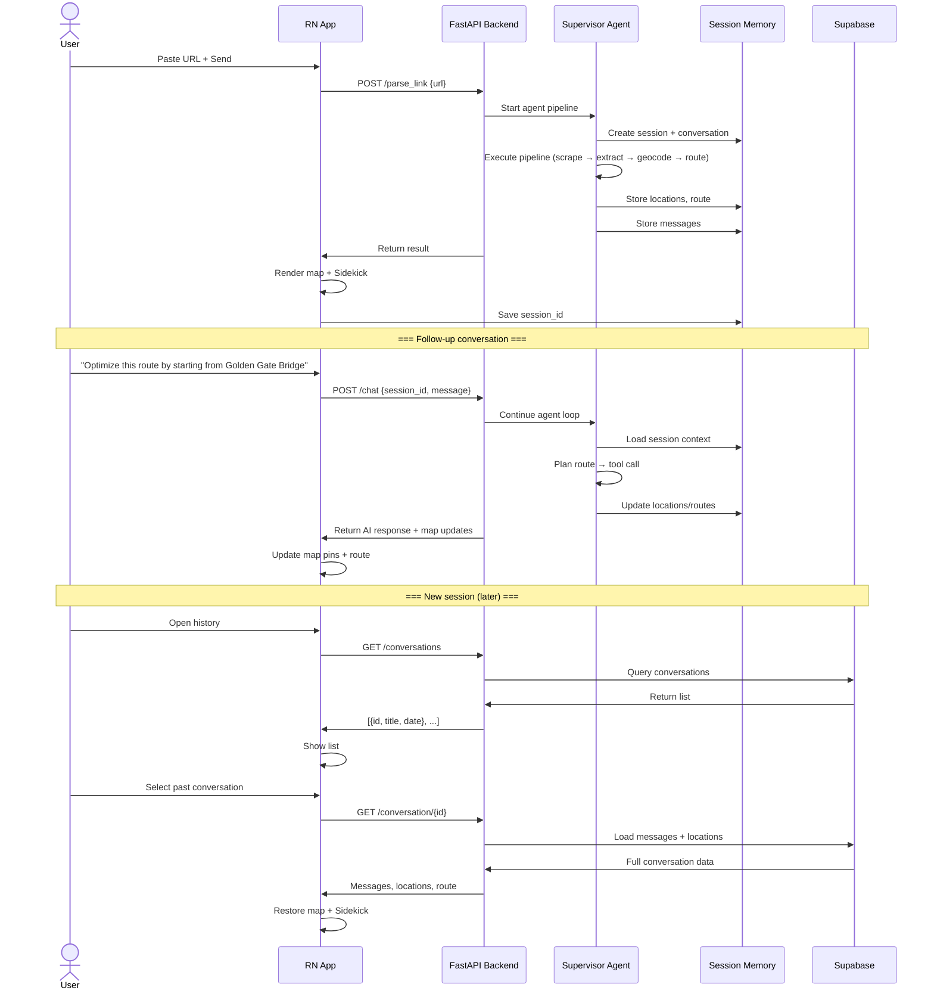

# System Architecture v2 — Agentic Pipeline

> This document defines the multi-agent architecture upgrade for the content parsing and location extraction feature.
> It replaces the linear pipeline with a supervisor-driven agentic workflow that supports hierarchical extraction,
> multi-source content, persistent conversation memory, and tool-calling capabilities.

---

## 1. Multi-Agent Architecture Overview

### Pattern: Supervisor + Worker Agents

```
                         ┌──────────────────────────────┐
                         │       Supervisor Agent        │
                         │  (Orchestrator + Context Mgr) │
                         │  DeepSeek V4 Flash + Tools    │
                         └──────┬───────────────┬───────┘
                                │               │
                     ┌──────────┴───────┐ ┌─────┴──────────────┐
                     │   Router Agent   │ │ Conversation Agent │
                     │  (URL → Source)  │ │ (Chat + Follow-up) │
                     └──────────┬───────┘ └─────┬──────────────┘
                                │               │
                ┌───────────────┼──────────────┐│
                ▼               ▼               ▼▼
        ┌────────────┐ ┌────────────┐ ┌──────────────┐
        │  Scraper   │ │ Extraction │ │ Geocode +    │
        │  Agent     │ │ Agent      │ │ Route Agent  │
        │ (Source)   │ │ (Hierarch) │ │ (Tool-call)  │
        └────────────┘ └────────────┘ └──────────────┘
```

### Agent Roles

| Agent | Responsibility | Model | Temp |
|-------|---------------|-------|------|
| **Supervisor** | Coordinates all sub-agents, maintains conversation context, decides next action, handles error recovery | DeepSeek V4 Flash | 0.3 |
| **Router** | Classifies input URL, determines source type (Reddit, blog, travel site, etc.) | DeepSeek V4 Flash | 0.1 |
| **Scraper** | Fetches content based on source type, extracts text, handles anti-scraping measures | Rule-based + LLM | - |
| **Extraction** | Extracts hierarchical geographic entities with region-aware filtering | DeepSeek V4 Flash | 0.3 |
| **Geocode + Route** | Converts place names to coordinates, plans optimal route using TSP | Tool-based | - |
| **Conversation** | Handles follow-up chat, translates natural language to map operations | DeepSeek V4 Flash | 0.5 |

### Why Supervisor + Workers Pattern?

| Pattern | Pros | Cons | Verdict |
|---------|------|------|---------|
| **Single Agent** | Simple, one LLM call | Cannot handle multi-source, no specialization | ❌ |
| **Sequential Agents** | Clean pipeline, each step independent | Rigid, hard to add branching | ❌ |
| **Supervisor + Workers** | Flexible routing, error recovery, extensible, natural for conversation | Slightly more complex | ✅ |
| **Hierarchical (nested)** | Theoretically powerful | Over-engineered for current needs | ❌ |
| **Debate/Critic** | Better quality control | High token cost, slow | ❌ |

---

## 2. Agent Loop & Tool Calling

### Core Agent Loop

```
function agent_loop(task, context, tools, max_steps=10):
    step = 0
    while step < max_steps:
        step += 1
        
        # 1. Build prompt: system instructions + conversation history + tool results
        prompt = build_prompt(task, context, memory)
        
        # 2. Call LLM
        response = llm(prompt, tools_schema=tools.definitions())
        
        if response.type == "tool_call":
            # 3. Execute tool
            if timeout_check():
                try:
                    result = execute_tool(response.tool_name, response.arguments)
                    context.add_tool_result(response.tool_name, result)
                except Exception as e:
                    context.add_tool_result(response.tool_name, {"error": str(e)})
            else:
                return {"status": "timeout", "partial": context}
        
        elif response.type == "final_answer":
            return {"status": "success", "answer": response.content}
        
        elif response.type == "subtask_complete":
            # Worker agent completed its task
            context.merge_worker_result(response.content)
        
        elif response.type == "needs_clarification":
            return {"status": "needs_input", "question": response.content}
    
    return {"status": "max_steps", "partial": context}
```

### Tool Definitions

```python
# Schema passed to LLM for function calling
TOOLS = [
    {
        "name": "scrape_url",
        "description": "Fetch and extract readable text content from any URL",
        "parameters": {
            "url": {"type": "string", "description": "Target URL"},
            "source_type": {"type": "string", "enum": ["reddit", "generic", "travel_blog", "unknown"]}
        }
    },
    {
        "name": "geocode_location",
        "description": "Convert a place name to geographic coordinates",
        "parameters": {
            "name": {"type": "string", "description": "Place name, e.g. Golden Gate Bridge"},
            "context": {"type": "string", "description": "Geographic context to disambiguate, e.g. San Francisco, California"}
        }
    },
    {
        "name": "batch_geocode",
        "description": "Convert multiple place names to coordinates concurrently",
        "parameters": {
            "locations": {
                "type": "array",
                "items": {
                    "type": "object",
                    "properties": {
                        "name": {"type": "string"},
                        "context": {"type": "string"}
                    }
                }
            }
        }
    },
    {
        "name": "plan_route",
        "description": "Calculate shortest route through a set of locations using TSP",
        "parameters": {
            "locations": {
                "type": "array",
                "items": {
                    "type": "object",
                    "properties": {
                        "name": {"type": "string"},
                        "latitude": {"type": "number"},
                        "longitude": {"type": "number"}
                    }
                }
            },
            "start_index": {"type": "integer", "description": "Starting location index, default 0"}
        }
    },
    {
        "name": "search_places",
        "description": "Search for places or landmarks near a location",
        "parameters": {
            "query": {"type": "string", "description": "Search query"},
            "near": {"type": "string", "description": "Near location, optional"}
        }
    },
    {
        "name": "compute_region_cluster",
        "description": "Cluster locations by geographic region to detect outliers",
        "parameters": {
            "location_names": {
                "type": "array",
                "items": {"type": "string"}
            }
        }
    },
    {
        "name": "save_conversation",
        "description": "Save current conversation to long-term storage",
        "parameters": {
            "conversation_id": {"type": "string"},
            "title": {"type": "string", "description": "Conversation title"}
        }
    },
    {
        "name": "load_conversation",
        "description": "Load a past conversation from long-term storage",
        "parameters": {
            "conversation_id": {"type": "string"}
        }
    },
    {
        "name": "list_conversations",
        "description": "List all saved conversations",
        "parameters": {}
    },
    {
        "name": "map_operation",
        "description": "Perform operations on the map pins and route",
        "parameters": {
            "action": {
                "type": "string",
                "enum": [
                    "add_pin", "remove_pin", "reorder_route",
                    "optimize_route", "clear_all", "update_pin"
                ]
            },
            "params": {"type": "object", "description": "Action-specific parameters"}
        }
    }
]
```

### Agent State Machine



---

## 3. Memory Architecture

### Three-Tier Memory

```
┌──────────────────────────────────────────────────┐
│                   Long-Term Memory                │
│             (Supabase: conversations table)       │
│                                                   │
│  ┌──────────┐  ┌──────────┐  ┌──────────┐       │
│  │ Chat #1  │  │ Chat #2  │  │ Chat #3  │  ...   │
│  │ title    │  │ title    │  │ title    │       │
│  │ messages │  │ messages │  │ messages │       │
│  │ locs     │  │ locs     │  │ locs     │       │
│  └──────────┘  └──────────┘  └──────────┘       │
└───────────────────────┬──────────────────────────┘
                        │ load / save
┌───────────────────────▼──────────────────────────┐
│               Session Memory                      │
│          (Backend runtime: active sessions dict)  │
│                                                   │
│  ┌──────────────────────────────────────────────┐ │
│  │  session_id: {                               │ │
│  │    conversation_id,                          │ │
│  │    messages: ChatMessage[],                  │ │
│  │    locations: GeocodedLocation[],            │ │
│  │    route: RouteResult | null,                │ │
│  │    source_url: string,                       │ │
│  │    created_at: timestamp,                    │ │
│  │    updated_at: timestamp                     │ │
│  │  }                                           │ │
│  └──────────────────────────────────────────────┘ │
└───────────────────────┬──────────────────────────┘
                        │ included in prompt
┌───────────────────────▼──────────────────────────┐
│              Short-Term Context                   │
│       (Within a single agent loop iteration)       │
│                                                   │
│  ┌──────────────────────────────────────────────┐ │
│  │  Current LLM call context:                   │ │
│  │  - System prompt                             │ │
│  │  - Recent messages (last ~10 turns)         │ │
│  │  - Tool call results (this iteration)        │ │
│  │  - Current map state (pins, route)           │ │
│  └──────────────────────────────────────────────┘ │
└──────────────────────────────────────────────────┘
```

### Storage Schema (Supabase)

```sql
-- conversations table (managed by teammate, referenced here for clarity)
CREATE TABLE conversations (
    id UUID PRIMARY KEY DEFAULT gen_random_uuid(),
    user_id UUID REFERENCES users(id),
    title TEXT,
    source_url TEXT,
    created_at TIMESTAMPTZ DEFAULT now(),
    updated_at TIMESTAMPTZ DEFAULT now()
);

-- conversation_messages table
CREATE TABLE conversation_messages (
    id UUID PRIMARY KEY DEFAULT gen_random_uuid(),
    conversation_id UUID REFERENCES conversations(id) ON DELETE CASCADE,
    role TEXT NOT NULL CHECK (role IN ('user', 'assistant', 'system', 'tool')),
    content TEXT NOT NULL,
    tool_calls JSONB,       -- structured tool call data
    tool_results JSONB,     -- structured tool result data
    created_at TIMESTAMPTZ DEFAULT now(),
    message_index INT NOT NULL  -- ordering within a conversation
);

-- conversation_locations table (snapshot of extracted locations)
CREATE TABLE conversation_locations (
    id UUID PRIMARY KEY DEFAULT gen_random_uuid(),
    conversation_id UUID REFERENCES conversations(id) ON DELETE CASCADE,
    name TEXT NOT NULL,
    latitude DOUBLE PRECISION,
    longitude DOUBLE PRECISION,
    full_address TEXT,
    hierarchy_level INT,      -- 0=POI, 1=district, 2=city, 3=state, 4=country
    is_active BOOLEAN DEFAULT true,  -- false if filtered out
    created_at TIMESTAMPTZ DEFAULT now()
);
```

> **Note:** These are design references for the AI module. Actual schema creation and migration is handled by the teammate responsible for databases. The AI module only needs to read/write through the API layer.

---

## 4. Hierarchical Geographic Extraction

### The Problem

Reddit posts (and web content generally) contain locations at multiple granularities:

```
Text: "I visited the Golden Gate Bridge in San Francisco, California, USA.
       Also went to Chinatown in SF. Later I went to Los Angeles."
       
Bad extraction:  ["Golden Gate Bridge", "San Francisco", "California", "USA", "Chinatown", "SF", "Los Angeles"]
                 ↑ These are too broad - maps would be useless with state/country pins

Good extraction:  ["Golden Gate Bridge, San Francisco", "Chinatown, San Francisco", "Los Angeles, California"]
```

### Solution: Hierarchical Extraction + Deduplication



### Implementation: Two-Stage Extraction

**Stage 1 — Raw Extraction with Hierarchy:**
```json
{
  "entities": [
    {"name": "Golden Gate Bridge", "hierarchy_level": 0, "context": "San Francisco, California"},
    {"name": "San Francisco", "hierarchy_level": 2, "context": null},
    {"name": "California", "hierarchy_level": 3, "context": null},
    {"name": "USA", "hierarchy_level": 4, "context": null},
    {"name": "Chinatown", "hierarchy_level": 0, "context": "San Francisco"},
    {"name": "Los Angeles", "hierarchy_level": 2, "context": "California"}
  ]
}
```

**Stage 2 — Filter & Deduplicate:**
```python
def filter_hierarchical(entities):
    """
    Rules:
    1. If a Level 0 POI exists WITHIN a city level, keep the POI, discard the city
    2. If multiple POIs exist in same city, keep all POIs, discard the city
    3. If a city has no specific POIs, keep the city
    4. Always discard state/province when city or POI exists within it
    5. Always discard country when anything exists within it
    6. Context from removed parents is attached to remaining children
    
    Examples:
    - ["GGB, SF", "SF", "CA", "USA"] → ["Golden Gate Bridge, San Francisco"]
    - ["Tokyo", "Osaka", "Jeju Island", "South Korea"] → ["Tokyo", "Osaka", "Jeju Island"]
    - ["GGB, SF", "Chinatown, SF", "LA", "CA"] → ["Golden Gate Bridge", "Chinatown", "Los Angeles"]
    """
    # ... filtering logic
```

### Region-Aware Outlier Detection

```python
def detect_outliers(locations, threshold_km=500):
    """
    Cluster locations by proximity. If >=60% of locations fall in one cluster,
    remove locations outside that cluster as noise.
    
    For travel itineraries (e.g., "7-day Europe trip"), use looser clustering:
    - Multi-country: cluster at continent level
    - Multi-city single country: cluster at country level
    - Single city: cluster at city level (default, threshold ~50km)
    """
```

---

## 5. Multi-Source Content Scraping

### Source Router Logic

```python
def route_source(url: str) -> str:
    """Classify URL by domain and path pattern."""
    patterns = {
        "reddit": [
            r"reddit\.com/r/.*/comments/",
            r"redd\.it/",
            r"old\.reddit\.com/r/",
        ],
        "travel_blog": [
            r"medium\.com/",
            r"travelblog\.org/",
            r"nomadicmatt\.com/",
            r"cntraveler\.com/",
        ],
        "generic": [
            r".*",  # fallback
        ]
    }
    # Return matched source type
```

### Scraper Strategy Matrix

| Source | Strategy | Rate Limit | Key Method |
|--------|----------|------------|------------|
| Reddit | JSON API → HTML fallback | 60 req/min | `requests.get` + headers |
| Travel Blog | Readability/BeautifulSoup | Respect robots.txt | `trafilatura` |
| Generic Page | Readability extraction | Respect robots.txt | `trafilatura` |
| Wikipedia | REST API | None documented | `wikipedia-api` |

### Dependency: `trafilatura`

For generic web scraping, `trafilatura` is superior to raw BeautifulSoup:

```python
import trafilatura

def scrape_generic(url: str) -> str:
    """Extract main readable content from any webpage."""
    downloaded = trafilatura.fetch_url(url)
    if downloaded:
        result = trafilatura.extract(downloaded, 
            include_comments=False,
            include_tables=False,
            no_fallback=False)
        return result or ""
    return ""
```

---

## 6. Conversation & Chat Memory Flow

### Conversation Lifecycle



### API Endpoints (New)

| Method | Endpoint | Purpose |
|--------|----------|---------|
| `POST` | `/parse_link` | Existing - parse URL, extract, route |
| `POST` | `/chat` | Send message to active session |
| `GET` | `/conversations` | List all saved conversations |
| `GET` | `/conversation/{id}` | Load full conversation |
| `POST` | `/conversation/{id}/save` | Save current session |
| `DELETE` | `/conversation/{id}` | Delete conversation |

---

## 7. Error Handling & Stability

### Error Recovery Strategy

| Failure Point | Detection | Recovery | User Impact |
|---------------|-----------|----------|-------------|
| URL unreachable | Timeout / HTTP 5xx | Retry 2x, then fallback message | "Couldn't fetch content" |
| LLM times out | 30s timeout | Return partial results | "Analysis incomplete" |
| LLM returns bad JSON | JSON parse error | Re-prompt with correction | Slight delay |
| Geocoding fails | Empty response | Skip location, continue | Missing 1-2 pins |
| Route fails | No valid path | Return unoptimized order | "Couldn't optimize" |
| Supabase unavailable | Connection error | Use in-memory only | No persistence |

### Agent Step Guardrails

```python
MAX_STEPS = 10           # Max tool calls per agent loop
STEP_TIMEOUT = 15        # Seconds per step
TOTAL_TIMEOUT = 60       # Total seconds for entire pipeline
MAX_CONTEXT_TOKENS = 32000  # Truncate if exceeded
STABILITY_TEMPERATURE = 0.3  # Low temp for extraction tasks
```

---

## 8. Implementation Plan

### Phase 1: Core Agent Infrastructure

| Step | Files | Description |
|------|-------|-------------|
| 1.1 | `backend/services/agent_orchestrator.py` | Supervisor agent loop, state machine, step guardrails |
| 1.2 | `backend/services/tool_definitions.py` | Tool schemas, tool execution registry |
| 1.3 | `backend/services/web_scraper.py` | Multi-source scraper with trafilatura |
| 1.4 | `backend/services/extraction_pipeline.py` | Two-stage hierarchical extraction + filtering |
| 1.5 | `backend/services/conversation_manager.py` | Three-tier memory: short-term, session, long-term |

### Phase 2: API & Frontend Integration

| Step | Files | Description |
|------|-------|-------------|
| 2.1 | `backend/main.py` | New endpoints: `/chat`, `/conversations`, `/conversation/{id}` |
| 2.2 | `src/services/apiService.ts` | New API methods: `chat()`, `getConversations()`, `loadConversation()`, `saveConversation()` |
| 2.3 | `src/types/route.ts` | New types: `Conversation`, `SessionState`, `AgentToolCall` |
| 2.4 | `src/features/home/Sidekick.tsx` | Persistent chat with tool call display, conversation restore |
| 2.5 | `src/features/home/HomeScreen.tsx` | History list integration, session management |

### Phase 3: Conversation History (Supabase Integration)

| Step | Files | Description |
|------|-------|-------------|
| 3.1 | `src/services/supabaseClient.ts` | Implement Supabase CRUD for conversations |
| 3.2 | `backend/services/supabase_service.py` | Backend Supabase client for long-term memory |

---

## 9. Key Decisions

| Decision | Choice | Rationale |
|----------|--------|-----------|
| Multi-agent pattern | Supervisor + Workers | Best balance of flexibility and complexity |
| Tool calling | JSON-in-prompt (no native FC) | DeepSeek supports structured JSON output natively |
| Long-term memory | Supabase (teammate-managed) | Avoids creating separate DB, aligns with project stack |
| Session memory | In-memory dict | Fast, no DB round-trip for active conversations |
| Generic web scraping | `trafilatura` | Better text extraction than raw BeautifulSoup |
| Hierarchy filtering | Two-stage LLM + rules | LLM for understanding, rules for precision |
| Max agent steps | 10 | Prevents runaway loops, sufficient for all scenarios |
| Error recovery | Retry → degrade gracefully | Don't crash, show partial results and explain |

---

## 10. Change Log

| Date | Change | Author |
|------|--------|--------|
| 2026-06-29 | Initial v2 architecture with multi-agent workflow | - |
